# mini-sql

A SQLite-style database engine, built from scratch in C — one layer at a time.

> Small. Schema-driven. Honest about what it isn't (yet).

`mini-sql` is a teaching/learning implementation that follows the spirit of
[cstack's *Let's Build a Simple Database*](https://cstack.github.io/db_tutorial/),
but **deliberately diverges in one important way**: where the tutorial hardcodes
a single `Row` struct and compile-time byte offsets, `mini-sql` is **schema-driven
from the first commit**. The layout of a row is *computed at runtime* from a
`Schema`, not frozen by the C compiler. That single decision is what keeps the
door open to `CREATE TABLE`, `ALTER TABLE`, and multiple tables without a rewrite.

Today it is a **persistent, single-table store**: rows are serialized into 4 KiB
pages, cached in memory by a pager, and flushed to a database file so they survive
across runs. Reads and writes go through a cursor abstraction — the seam the
B-tree will slot into next.

---

## Table of contents

- [Quick start](#quick-start)
- [What works today](#what-works-today)
- [Architecture at a glance](#architecture-at-a-glance)
- [How it maps to SQLite](#how-it-maps-to-sqlite)
- [Module dependency graph](#module-dependency-graph)
- [The data model](#the-data-model)
- [Row layout & storage](#row-layout--storage)
- [Command lifecycle](#command-lifecycle)
- [The REPL state machine](#the-repl-state-machine)
- [Insert validation](#insert-validation)
- [Memory ownership](#memory-ownership)
- [Build system](#build-system)
- [Testing](#testing)
- [Design decisions](#design-decisions)
- [Roadmap](#roadmap)
- [Project layout](#project-layout)
- [Limitations & non-goals](#limitations--non-goals)

---

## Quick start

```sh
cmake -S . -B build           # configure
cmake --build build           # compile
./build/mini_sql mydb.db      # run the REPL against a database file
ctest --test-dir build        # run the test suite
```

The binary takes the database filename as an argument. Insert some rows, exit,
then reopen the **same file** — the data is still there:

```text
$ ./build/mini_sql mydb.db
db > insert 1 alice alice@example.com
Executed. (0.004 ms)
db > insert 2 bob bob@example.com
Executed. (0.003 ms)
db > .exit

$ ./build/mini_sql mydb.db
db > select
(1, alice, alice@example.com)
(2, bob, bob@example.com)
Executed. (0.002 ms)
db > .exit
```

Requirements: a C11 compiler (Apple Clang / GCC), CMake ≥ 3.20, and `bash` for the
tests. No third-party libraries.

---

## What works today

| Capability | Status |
| --- | --- |
| Interactive REPL with `db >` prompt | ✅ |
| Meta-commands (`.exit`) | ✅ |
| `insert <id> <username> <email>` into a fixed `users` schema | ✅ |
| `select` (full scan, prints all rows) | ✅ |
| Input validation (syntax, negative id, over-length text, table full) | ✅ |
| Schema-driven row (de)serialization | ✅ |
| **Persistence to disk** (pager + backing file) | ✅ |
| **Cursor abstraction** (start / end / value / advance) | ✅ |
| Per-statement execution timing | ✅ |
| Black-box test suite via CTest | ✅ |
| B-tree / ordered access | ⛔ append-only, flushed as an array of pages |
| `CREATE TABLE` / multiple tables | ⛔ single hardcoded schema |
| Crash safety (journal / WAL) | ⛔ flush happens only on clean `.exit` |

---

## Architecture at a glance

The engine is a classic **front-end / back-end** split. The front end turns text
into a validated `Statement`; the back end executes it against storage through a
cursor. Durable state lives in a file, reached through the pager.

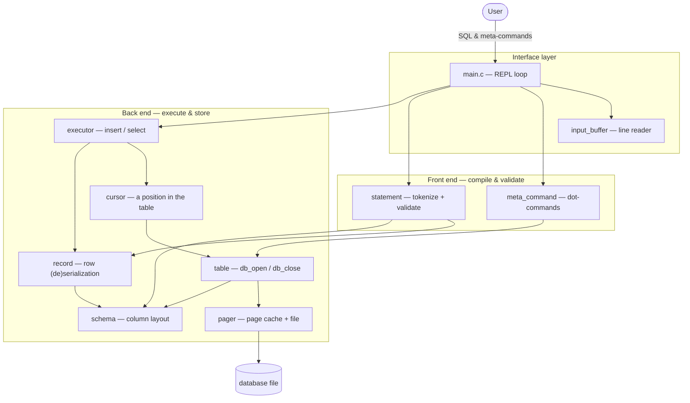

The guiding principle: **`schema` sits at the bottom of the dependency graph and
everything reads its layout decisions.** `record` knows *how to move bytes*;
`schema` knows *where the bytes go*; the `pager` knows *how bytes reach disk*. The
`cursor` lets the executor address rows without knowing any of that — which is why
swapping the storage engine for a B-tree won't touch the executor.

---

## How it maps to SQLite

SQLite compiles SQL to bytecode and runs it on a virtual machine over a B-tree /
pager stack. `mini-sql` is building that stack **bottom-up**: the pager is now a
genuine match; the B-tree is the next block; the SQL-compiler half stays
intentionally trivial (no bytecode VM — the executor runs the statement directly).

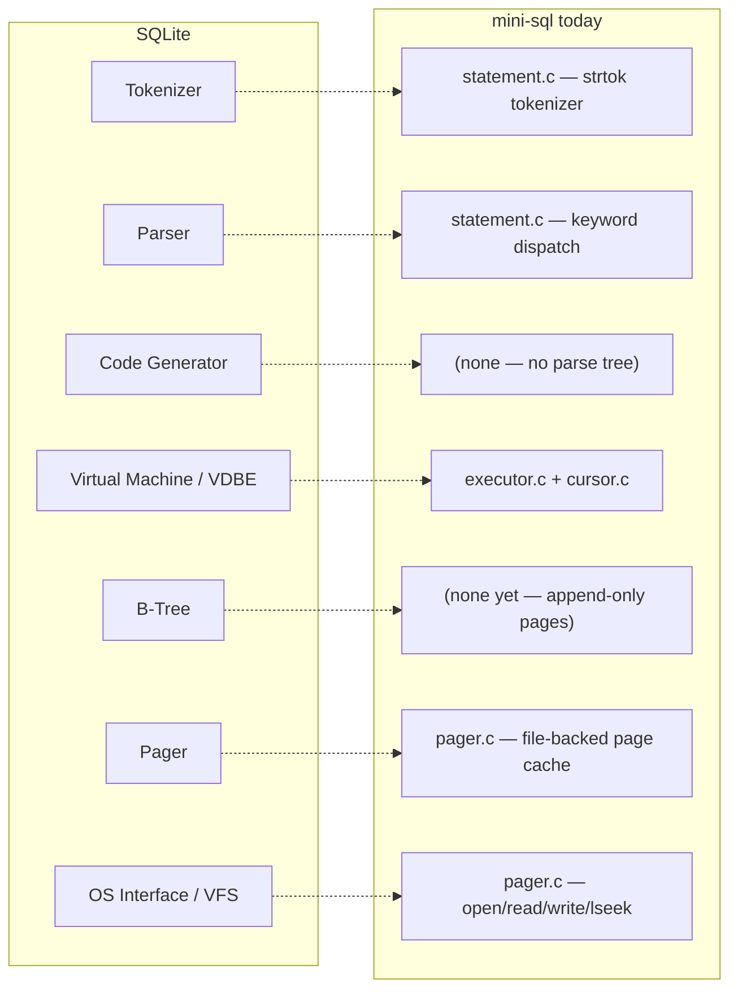

The `pager` and `OS interface` rows are now real; the dotted lines that still land
on `(none)` are the honest gaps — see the [roadmap](#roadmap).

---

## Module dependency graph

Each `.c` includes only the headers it truly needs; `pager`, `schema`, and
`input_buffer` are the leaves. The static library `mini_sql_lib` contains every
module except `main`, so tests and future benchmarks link against it without
recompiling sources.

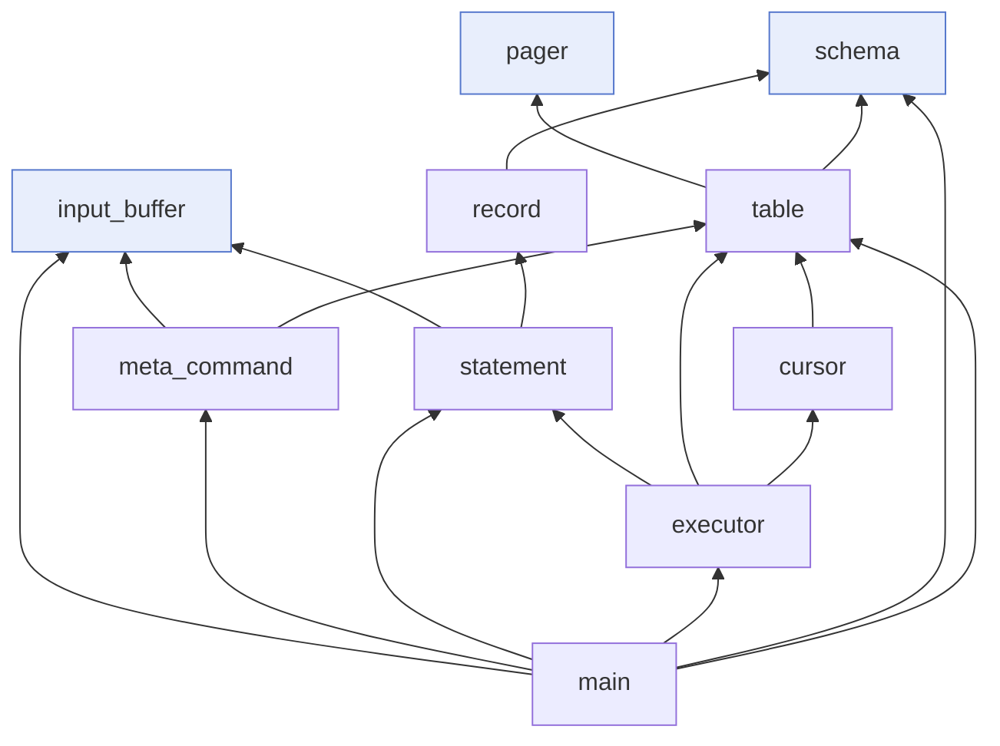

| Module | Responsibility | Key entry points |
| --- | --- | --- |
| `input_buffer` | Read a line of stdin into a growable buffer | `new_input_buffer`, `read_input`, `close_input_buffer` |
| `meta_command` | Handle `.`-prefixed commands; teardown on `.exit` | `do_meta_command` |
| `schema` | Runtime column layout: types, sizes, **computed offsets** | `schema_create`, `schema_find_column_by_id/name`, `schema_free` |
| `record` | An opaque row payload + schema-keyed get/set + (de)serialize | `record_init`, `record_set_int/text`, `serialize_record`, `print_record` |
| `pager` | Page cache backed by a file; reads on miss, flushes on close | `pager_open`, `pager_get_page`, `pager_flush`, `pager_close` |
| `table` | Opens/closes a database connection over the pager | `db_open`, `db_close` |
| `cursor` | A position within a table; abstracts row addressing | `table_start`, `table_end`, `cursor_value`, `cursor_advance` |
| `statement` | Tokenize + validate input into a `Statement` | `prepare_statement`, `statement_set_default_schema` |
| `executor` | Run a prepared `Statement` against a `Table` via a cursor | `execute_statement` |
| `main` | REPL loop + wiring + lifetime management | — |

---

## The data model

The core structs and their ownership relationships (these encode the rules the
code actually follows):

- `Schema` **owns** its `ColumnDefinition` array (deep copy, including names).
- `Table` **holds** a `Pager` (owns it) and a `Schema` (borrowed at open, freed by
  `db_close`).
- `Pager` **owns** the page cache and the open file descriptor.
- `Cursor` **points into** a `Table`; it owns nothing.
- `Statement` **holds** a `Record` inline; `Record` is just bytes, **interpreted by**
  a `Schema`.

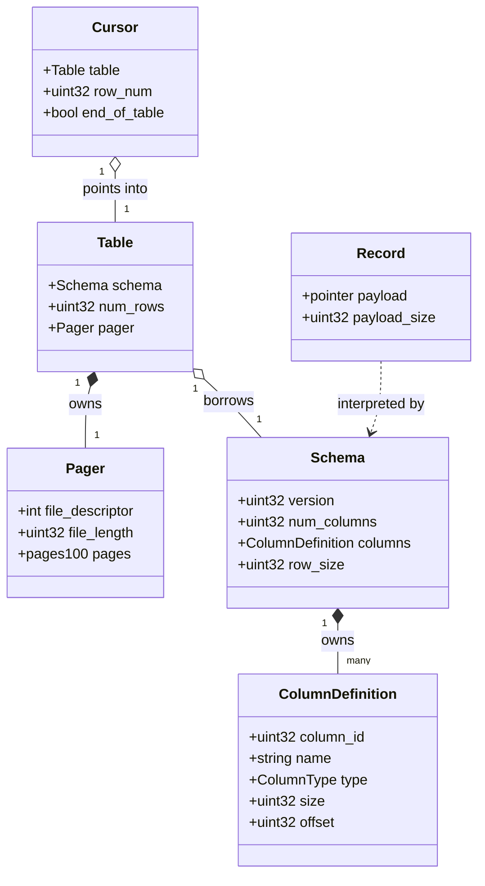

The pivotal field is `ColumnDefinition.column_id` — a **stable identity** assigned
once and never reused. Every read/write addresses a column by `column_id`, never by
its position or its name. That indirection is what will make `ALTER TABLE RENAME
COLUMN` a one-line metadata change instead of a code-wide find-and-replace.

---

## Row layout & storage

`schema_create` walks the column list once, assigning each column a byte `offset`
and accumulating `row_size`. For the built-in `users` schema:

| Column | Type | Size (bytes) | Offset |
| --- | --- | ---: | ---: |
| `id` | `INT` | 4 | 0 |
| `username` | `TEXT` | 32 | 4 |
| `email` | `TEXT` | 255 | 36 |
| **`row_size`** | | **291** | |

A `Record`'s `payload` is exactly that 291-byte block:

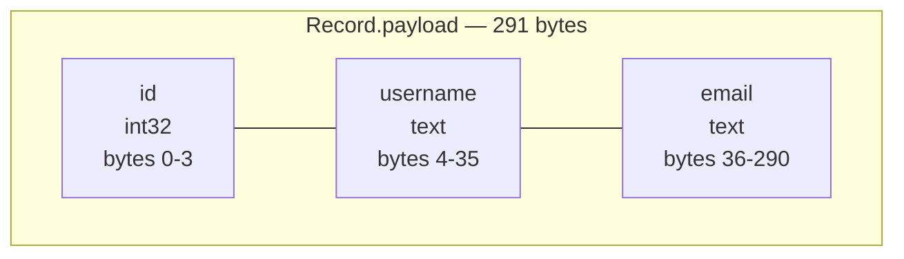

Rows are packed into 4 KiB pages. The **pager** owns those pages: it keeps a cache
of up to 100 page pointers, allocates a page on first touch, reads it from the file
on a cache miss, and writes every cached page back on `db_close`. **Rows never
straddle a page boundary** — a row's address is a pure function of its row number.

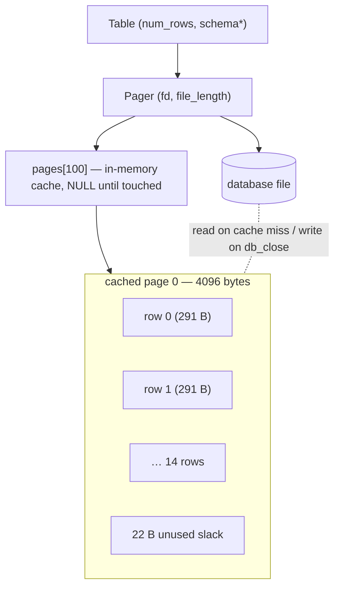

The paging math:

```text
rows_per_page = floor(PAGE_SIZE / row_size) = floor(4096 / 291) = 14
slack_per_page = 4096 - (14 × 291)          = 22 bytes
max_rows       = rows_per_page × MAX_PAGES  = 14 × 100 = 1400
```

Insert #1401 returns `EXECUTE_TABLE_FULL`. Because `rows_per_page` is derived from
`schema->row_size` at call time (not a compile-time constant), this all recomputes
automatically the day the schema changes.

> The row count is currently recovered as `file_length / row_size` on open. This is
> a deliberately fragile stopgap (cstack's) that the B-tree replaces by storing its
> own metadata — noted so it isn't mistaken for a design choice.

---

## Command lifecycle

### INSERT

The parser validates **before** allocating, so a rejected insert never leaks the
record payload. Execution opens a cursor at the end of the table and writes there.

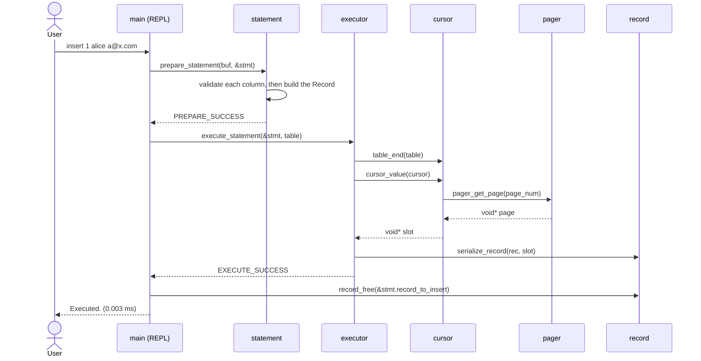

### SELECT

A full scan: a cursor walks from the start of the table, deserializing and printing
each row until `end_of_table`.

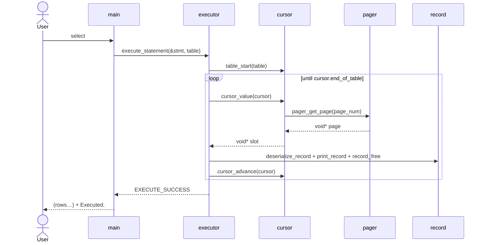

On `.exit`, `db_close` flushes every cached page to the file — that's when the data
becomes durable.

---

## The REPL state machine

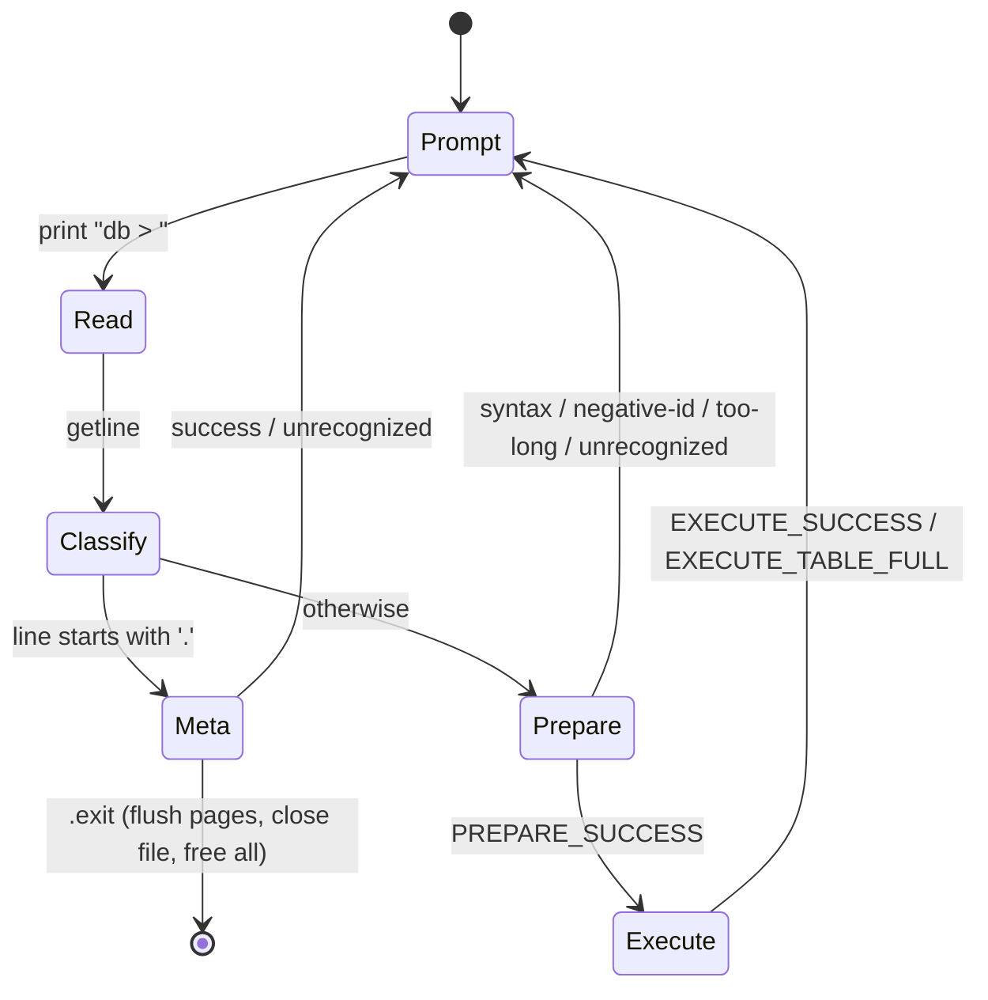

The loop is infinite by construction; the only exit is `.exit`, which calls
`db_close` (flush + close file + free pager, schema, and table) and then `exit()`
from inside `do_meta_command`. There is no fall-through cleanup path because control
never reaches the end of `main`.

---

## Insert validation

`prepare_insert` is **schema-generic** — it loops over `schema->columns` and
dispatches on each column's `type`. It is not hardcoded to three columns, so it will
parse inserts for any future runtime schema unchanged. The two-pass structure
(validate everything, *then* allocate) is what keeps the error paths leak-free.

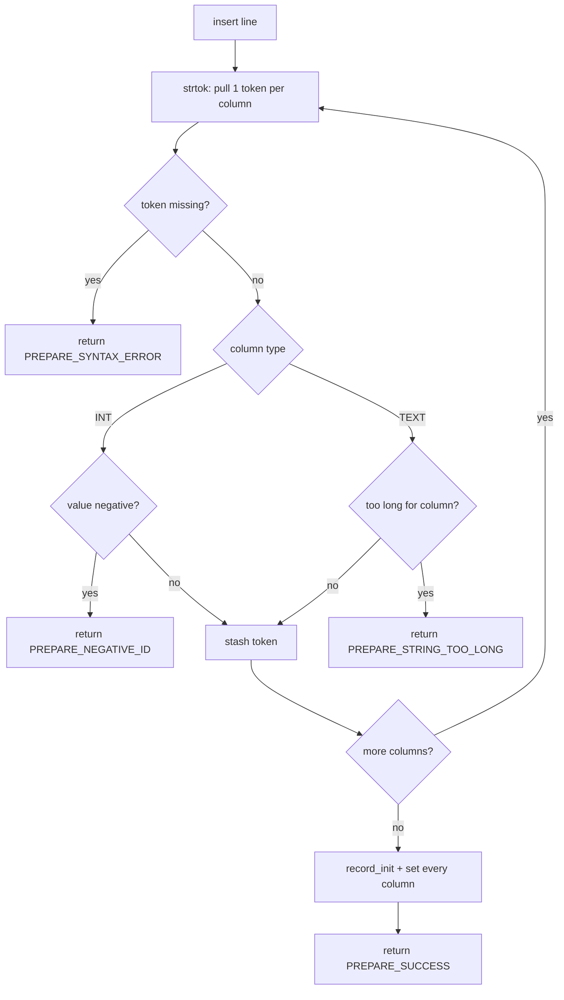

| Result code | Message | Cause |
| --- | --- | --- |
| `PREPARE_SUCCESS` | — | well-formed insert |
| `PREPARE_SYNTAX_ERROR` | `Syntax error. Could not parse statement.` | too few tokens |
| `PREPARE_NEGATIVE_ID` | `ID must be positive.` | an `INT` column got a negative value |
| `PREPARE_STRING_TOO_LONG` | `String is too long.` | a `TEXT` value exceeds the column width |
| `PREPARE_UNRECOGNIZED_STATEMENT` | `Unrecognized keyword …` | not `insert`/`select` |

> Note: "negative id" is currently generalized to *any* `INT` column. That is a
> pragmatic stand-in until per-column constraints (PRIMARY KEY / UNSIGNED) exist —
> see [design decisions](#design-decisions).

---

## Memory ownership

Explicit ownership is the spine of a C codebase. The rules, drawn:

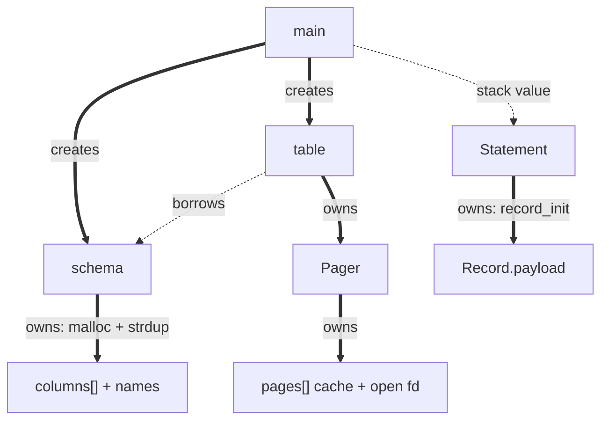

Legend: **thick arrow = owns/frees**, **dotted arrow = borrows or stack**.

Lifecycle rules:

- `schema_create` deep-copies the caller's column array and `strdup`s each name, so
  the source array may be a stack literal in `main`.
- `db_open` opens the file (via `pager_open`) and stores a **borrowed** `Schema*`.
- `db_close` is the single teardown path: it flushes every cached page, then
  `pager_close` (closes the fd + frees the cache), then `schema_free`, then frees the
  table. `.exit` is the only caller.
- Each REPL iteration zero-initializes `Statement statement = {0}` and calls
  `record_free` after execution — a no-op for `select` (NULL payload), the real free
  for `insert`. This plugs what would otherwise be a per-insert leak. The `Cursor`
  is `malloc`'d per statement and freed at the end of each execute.

---

## Build system

CMake produces two targets:

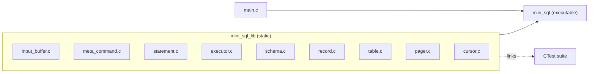

Compiled with `-Wall -Wextra -Wpedantic` under strict C11 (`CMAKE_C_EXTENSIONS
OFF`), and emits `compile_commands.json` for clangd. The library/executable split
exists so the test and benchmark targets can link the engine in one line without
recompiling every source. (`pager.c` defines `_POSIX_C_SOURCE` so the POSIX file
calls resolve under strict C11.)

---

## Testing

Black-box, output-asserting tests in the style of the tutorial's rspec suite, but
implemented as a dependency-free bash script and registered with CTest — one entry
per case, so a failure names itself.

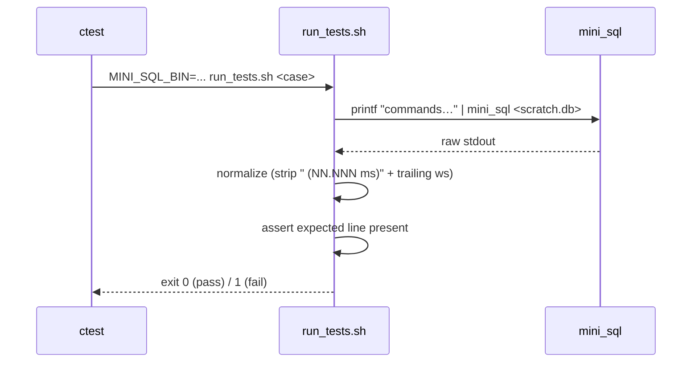

The `normalize` step strips the timing suffix so assertions stay deterministic. Each
case runs against a scratch database file (wiped first). The six cases: insert/select
round-trip, table-full, max-length strings, over-length strings, negative id, and
**persistence** (insert + `.exit`, then reopen the same file and read it back).

```sh
ctest --test-dir build --output-on-failure
```

---

## Design decisions

**Schema-driven, not struct-driven.** The tutorial's `Row` struct bakes the row
layout into the compiler; `ALTER TABLE` is then impossible without changing C source.
`mini-sql` computes the layout in `schema_create`, so a row is just bytes plus a
ruler. Cost: a layer of indirection now. Payoff: runtime `CREATE TABLE` / `ALTER`
later with no change to `record`, `table`, or `executor`.

**Storage behind a cursor.** `execute_insert`/`execute_select` touch rows only
through `cursor_value` / `cursor_advance`. They assume nothing about *how* the table
is stored, so replacing the append-only page array with a B-tree is a change to the
cursor and table internals — not to the executor.

**The pager owns the file.** The page cache, file descriptor, and file length live in
one place. `db_close` is the only durability point (flush-on-exit); there is no
per-write journaling yet.

**Address columns by stable `column_id`.** Never by name or ordinal. `RENAME` becomes
a metadata edit; `DROP` becomes a flag; neither disturbs other columns' data.

**Validate before allocate.** `prepare_insert` proves the whole line is valid before
calling `record_init`. Early returns can't leak, and there's no half-built record to
unwind.

**`%.*s`, not `%s`, when printing text.** A maximum-width text field has no room for a
NUL terminator. Bounding the print to `column->size` means `mini-sql` never had the
"garbage bytes on max-length strings" bug the tutorial hits — and never needed the
"+1 byte" struct fix, because there is no struct.

---

## Roadmap

Built bottom-up so something runs at every step. Storage-engine priorities
(pager, B-tree) come before query-language breadth.


- **Done — Pager (5):** `table.c`'s in-memory `void* pages[]` array is replaced by a
  file-backed page cache (`pager_open` / `pager_get_page` / `pager_flush` /
  `pager_close`). Data survives restarts.
- **Done — Cursor (6):** `table_start` / `table_end` / `cursor_value` /
  `cursor_advance`. Insert and select stop indexing pages directly.
- **Next — B-tree (7–14):** replace the append-only array with an ordered tree keyed
  by `id`; leaf format → binary search → leaf split → internal nodes → multi-level
  search and scan. The cursor is the interface it plugs into.
- **Then — Catalog + DDL:** a name→table registry, then runtime `CREATE TABLE` and the
  `ALTER TABLE ADD/DROP/RENAME COLUMN` family the schema layer was designed for.

---

## Project layout

```text
mini-sql/
├── CMakeLists.txt          # two targets: mini_sql_lib (static) + mini_sql (exe)
├── include/
│   ├── input_buffer.h      # line reader
│   ├── meta_command.h      # dot-commands
│   ├── schema.h            # ColumnType, ColumnDefinition, Schema
│   ├── record.h            # Record + (de)serialization
│   ├── pager.h             # Pager + page cache constants
│   ├── table.h             # Table + db_open / db_close
│   ├── cursor.h            # Cursor + start/end/value/advance
│   ├── statement.h         # Statement, PrepareResult
│   └── executor.h          # ExecuteResult, execute_statement
├── src/
│   ├── input_buffer.c
│   ├── meta_command.c
│   ├── schema.c
│   ├── record.c
│   ├── pager.c
│   ├── table.c
│   ├── cursor.c
│   ├── statement.c
│   ├── executor.c
│   └── main.c              # REPL — the only file with no header
└── tests/
    └── run_tests.sh        # black-box suite, driven by CTest
```

---

## Limitations & non-goals

This is a learning engine. It is **not** trying to be:

- **Crash-safe** — pages are flushed only on a clean `.exit`; kill the process and
  in-flight changes are lost. No rollback journal or WAL. (A known gap, not a design
  goal yet.)
- **A real SQL dialect** — `insert`/`select` only, fixed positional syntax, one
  hardcoded `users` table, no `WHERE` / `UPDATE` / `DELETE` / joins.
- **Ordered / indexed** — storage is still an append-only array of pages; ordered
  access arrives with the B-tree.
- **A bytecode VM** — the executor runs statements directly; there is no parse tree,
  no code generator, no VDBE.
- **Concurrent** — single-threaded, no locking.

Each of those is a known gap with a place on the [roadmap](#roadmap), not an
accident. The aim is a correct, legible core that grows one well-understood layer at
a time.

---

*Built by following cstack's tutorial, with a schema-driven spine bolted in from the
start.*
