# mini-sql

A SQLite-style database engine, built from scratch in C — one layer at a time.

> Small. Schema-driven. Honest about what it isn't (yet).

`mini-sql` is a teaching/learning implementation that follows the spirit of
[cstack's *Let's Build a Simple Database*](https://cstack.github.io/db_tutorial/),
but **deliberately diverges in one important way**: where the tutorial hardcodes
a single `Row` struct and compile-time byte offsets, `mini-sql` is **schema-driven
from the first commit**. The layout of a row is *computed at runtime* from a
`Schema`, not frozen by the C compiler. That single decision is what keeps the
door open to `CREATE TABLE`, `ALTER TABLE`, and multiple tables without a rewrite.

Today it is a **persistent B+ tree** over a single table. Rows are kept sorted by
primary key in 4 KiB leaf pages; internal pages route lookups, so finding a key
costs one binary search per level; leaves split and grow a new root as the table
fills; and a chain of sibling pointers lets a scan return every row in key order.
The pager caches pages in memory and writes them to a single database file.

---

## Table of contents

- [Quick start](#quick-start)
- [What works today](#what-works-today)
- [Architecture at a glance](#architecture-at-a-glance)
- [How it maps to SQLite](#how-it-maps-to-sqlite)
- [Module dependency graph](#module-dependency-graph)
- [The data model](#the-data-model)
- [Row layout](#row-layout)
- [On-disk node format](#on-disk-node-format)
- [How the B-tree works](#how-the-b-tree-works)
- [Command lifecycle](#command-lifecycle)
- [The REPL state machine](#the-repl-state-machine)
- [Insert validation](#insert-validation)
- [Memory ownership](#memory-ownership)
- [Build system](#build-system)
- [Testing](#testing)
- [Design decisions](#design-decisions)
- [Where mini-sql diverges from the tutorial](#where-mini-sql-diverges-from-the-tutorial)
- [Roadmap](#roadmap)
- [Project layout](#project-layout)
- [Limitations & non-goals](#limitations--non-goals)

---

## Quick start

```sh
cmake -S . -B build           # configure
cmake --build build           # compile
./build/mini_sql mydb.db      # run the REPL against a database file
ctest --test-dir build        # run the test suite
```

The binary takes the database filename as an argument. Rows are stored in key
order whatever order they arrive in, duplicate keys are rejected, and everything
survives a restart:

```text
$ ./build/mini_sql mydb.db
db > insert 3 carol carol@example.com
Executed. (0.000 ms)
db > insert 1 alice alice@example.com
Executed. (0.001 ms)
db > insert 2 bob bob@example.com
Executed. (0.000 ms)
db > insert 1 again again@example.com
Error: Duplicate key.
db > .btree
Tree:
- leaf (size 3)
  - 1
  - 2
  - 3
db > .exit

$ ./build/mini_sql mydb.db
db > select
(1, alice, alice@example.com)
(2, bob, bob@example.com)
(3, carol, carol@example.com)
Executed. (0.008 ms)
db > .exit
```

`.btree` prints the tree's shape and `.constants` prints the on-page layout sizes.

Requirements: a C11 compiler (Apple Clang / GCC), CMake ≥ 3.20, and `bash` for the
tests. No third-party libraries.

---

## What works today

| Capability | Status |
| --- | --- |
| Interactive REPL with `db >` prompt | ✅ |
| Meta-commands: `.exit`, `.btree`, `.constants` | ✅ |
| `insert <id> <username> <email>` into a fixed `users` schema | ✅ |
| `select` — full scan, rows in primary-key order | ✅ |
| **B+ tree storage**: sorted leaves, internal routing nodes | ✅ |
| **O(log n) lookup**: binary search per node, descending from the root | ✅ |
| **Duplicate primary keys rejected** | ✅ |
| **Leaf splits** that grow a new internal root | ✅ |
| **Scans across leaves** through a sibling-pointer chain | ✅ |
| Input validation (syntax, negative id, over-length text) | ✅ |
| Schema-driven row (de)serialization | ✅ |
| Persistence to a single database file | ✅ |
| Per-statement execution timing | ✅ |
| Black-box test suite (14 CTest cases) | ✅ |
| Splitting a leaf that isn't the root | ⛔ next — the table currently tops out at 20–26 rows |
| Splitting internal nodes | ⛔ |
| `WHERE`, `DELETE`, `UPDATE` | ⛔ |
| `CREATE TABLE` / multiple tables | ⛔ single hardcoded schema |
| Crash safety (journal / WAL) | ⛔ flush happens only on clean `.exit` |
| File-format versioning | ⛔ files from before a format change are unreadable |

---

## Architecture at a glance

The engine is a classic **front-end / back-end** split. The front end turns text
into a validated `Statement`; the back end executes it through a cursor, which
navigates the B-tree, which reads and writes pages through the pager.

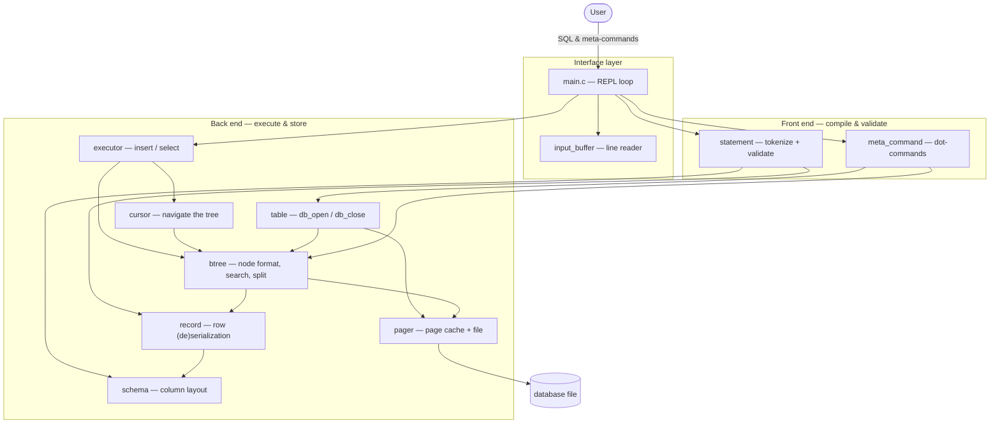
```mermaid
flowchart TD
    User([User]) -->|SQL & meta-commands| REPL

    subgraph Interface["Interface layer"]
        REPL["main.c — REPL loop"]
        IB["input_buffer — line reader"]
    end

    subgraph Frontend["Front end — compile & validate"]
        META["meta_command — dot-commands"]
        STMT["statement — tokenize + validate"]
    end

    subgraph Backend["Back end — execute & store"]
        EXEC["executor — insert / select"]
        CUR["cursor — navigate the tree"]
        TABLE["table — db_open / db_close"]
        BTREE["btree — node format, search, split"]
        REC["record — row (de)serialization"]
        SCHEMA["schema — column layout"]
        PAGER["pager — page cache + file"]
    end

    FILE[("database file")]

    REPL --> IB
    REPL --> META
    REPL --> STMT
    REPL --> EXEC
    STMT --> REC
    STMT --> SCHEMA
    EXEC --> CUR
    EXEC --> BTREE
    CUR --> BTREE
    TABLE --> BTREE
    TABLE --> PAGER
    META --> BTREE
    META --> TABLE
    BTREE --> PAGER
    BTREE --> REC
    REC --> SCHEMA
    PAGER --> FILE
```

The layering runs one way: **executor → cursor → btree → pager**. `btree` knows
page numbers and node bytes but nothing about tables or cursors; `cursor` chains
btree's per-node answers into tree navigation; the executor only ever talks to a
cursor. That's why `execute_select` has not changed since the table was an
array — the storage underneath it became a B-tree without it noticing.

---

## How it maps to SQLite

SQLite compiles SQL to bytecode and runs it on a virtual machine over a B-tree /
pager stack. `mini-sql` builds that stack **bottom-up**: the pager and the B-tree
are now genuine counterparts; the SQL-compiler half stays intentionally trivial
(no bytecode VM — the executor runs the statement directly).

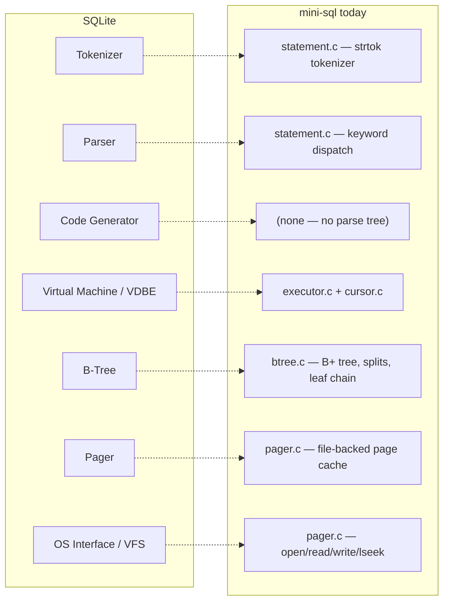
```mermaid
flowchart LR
    subgraph SQLite["SQLite"]
        direction TB
        s1[Tokenizer]
        s2[Parser]
        s3[Code Generator]
        s4[Virtual Machine / VDBE]
        s5[B-Tree]
        s6[Pager]
        s7[OS Interface / VFS]
    end
    subgraph Mini["mini-sql today"]
        direction TB
        m1["statement.c — strtok tokenizer"]
        m2["statement.c — keyword dispatch"]
        m3["(none — no parse tree)"]
        m4["executor.c + cursor.c"]
        m5["btree.c — B+ tree, splits, leaf chain"]
        m6["pager.c — file-backed page cache"]
        m7["pager.c — open/read/write/lseek"]
    end
    s1 -.-> m1
    s2 -.-> m2
    s3 -.-> m3
    s4 -.-> m4
    s5 -.-> m5
    s6 -.-> m6
    s7 -.-> m7
```

The backend rows are real; the code-generator row is the honest gap — see the
[roadmap](#roadmap).

---

## Module dependency graph

Each `.c` includes only the headers it truly needs; `pager`, `schema`, and
`input_buffer` are the leaves. The static library `mini_sql_lib` contains every
module except `main`, so tests and future benchmarks link against it without
recompiling sources.

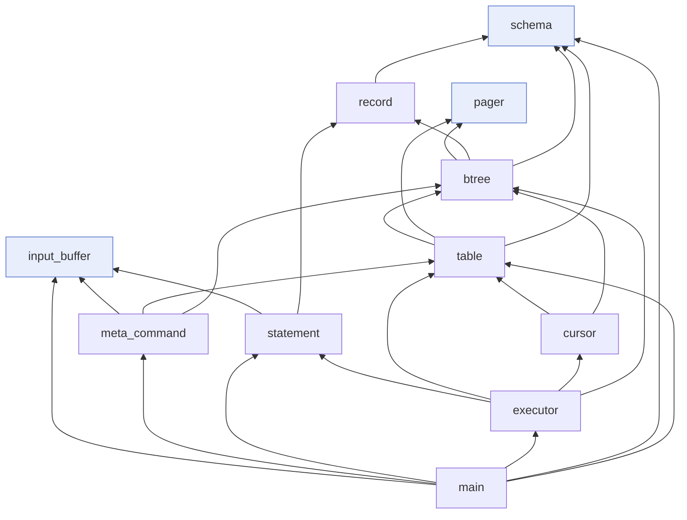
```mermaid
flowchart BT
    main --> input_buffer
    main --> meta_command
    main --> statement
    main --> executor
    main --> schema
    main --> table

    meta_command --> input_buffer
    meta_command --> table
    meta_command --> btree
    statement --> input_buffer
    statement --> record
    executor --> statement
    executor --> table
    executor --> cursor
    executor --> btree
    cursor --> table
    cursor --> btree
    table --> btree
    table --> pager
    table --> schema
    btree --> pager
    btree --> record
    btree --> schema
    record --> schema

    classDef leaf fill:#e8eefc,stroke:#5577cc;
    class schema,input_buffer,pager leaf;
```

| Module | Responsibility | Key entry points |
| --- | --- | --- |
| `input_buffer` | Read a line of stdin into a growable buffer | `new_input_buffer`, `read_input`, `close_input_buffer` |
| `meta_command` | Handle `.`-prefixed commands; teardown on `.exit` | `do_meta_command` |
| `schema` | Runtime column layout: types, sizes, **computed offsets** | `schema_create`, `schema_find_column_by_id/name`, `schema_free` |
| `record` | An opaque row payload + schema-keyed get/set + (de)serialize | `record_init`, `record_set_int/text`, `serialize_record`, `print_record` |
| `pager` | Page cache backed by a file; allocates, reads on miss, flushes on close | `pager_open`, `pager_get_page`, `get_unused_page_num`, `pager_flush`, `pager_close` |
| `btree` | Leaf and internal node formats, per-node binary search, leaf split and root growth, tree printer | `leaf_node_insert`, `leaf_node_find_cell`, `internal_node_find_child`, `leaf_node_next_leaf`, `print_tree` |
| `table` | Opens/closes a database connection; creates the root leaf of a new file | `db_open`, `db_close` |
| `cursor` | A position in a leaf; tree descent and leaf-chain traversal | `table_start`, `table_find`, `cursor_value`, `cursor_advance` |
| `statement` | Tokenize + validate input into a `Statement` | `prepare_statement`, `statement_set_default_schema` |
| `executor` | Run a prepared `Statement` against a `Table` via a cursor | `execute_statement` |
| `main` | REPL loop + wiring + lifetime management | — |

---

## The data model

The core structs and their ownership relationships (these encode the rules the
code actually follows):

- `Schema` **owns** its `ColumnDefinition` array (deep copy, including names).
- `Table` **owns** a `Pager` and **borrows** a `Schema` (taken at open, freed by
  `db_close`). A table *is* a B-tree, identified by its root page — always page 0.
- `Pager` **owns** the page cache and the open file descriptor.
- `Cursor` **points into** a leaf of a `Table`; it owns nothing.
- `Statement` **holds** a `Record` inline; `Record` is just bytes, **interpreted by**
  a `Schema`.

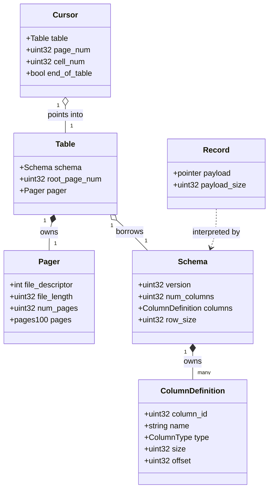
```mermaid
classDiagram
    class Schema {
        +uint32 version
        +uint32 num_columns
        +ColumnDefinition columns
        +uint32 row_size
    }
    class ColumnDefinition {
        +uint32 column_id
        +string name
        +ColumnType type
        +uint32 size
        +uint32 offset
    }
    class Pager {
        +int file_descriptor
        +uint32 file_length
        +uint32 num_pages
        +pages100 pages
    }
    class Table {
        +Schema schema
        +uint32 root_page_num
        +Pager pager
    }
    class Cursor {
        +Table table
        +uint32 page_num
        +uint32 cell_num
        +bool end_of_table
    }
    class Record {
        +pointer payload
        +uint32 payload_size
    }

    Schema "1" *-- "many" ColumnDefinition : owns
    Table "1" *-- "1" Pager : owns
    Table "1" o-- "1" Schema : borrows
    Cursor "1" o-- "1" Table : points into
    Record ..> Schema : interpreted by
```

The pivotal field is `ColumnDefinition.column_id` — a **stable identity** assigned
once and never reused. Every read/write addresses a column by `column_id`, never by
its position or its name. That indirection is what will make `ALTER TABLE RENAME
COLUMN` a one-line metadata change instead of a code-wide find-and-replace.

---

## Row layout

`schema_create` walks the column list once, assigning each column a byte `offset`
and accumulating `row_size`. For the built-in `users` schema:

| Column | Type | Size (bytes) | Offset |
| --- | --- | ---: | ---: |
| `id` | `INT` | 4 | 0 |
| `username` | `TEXT` | 32 | 4 |
| `email` | `TEXT` | 255 | 36 |
| **`row_size`** | | **291** | |

A `Record`'s `payload` is exactly that 291-byte block — the same bytes that end
up in a leaf cell:

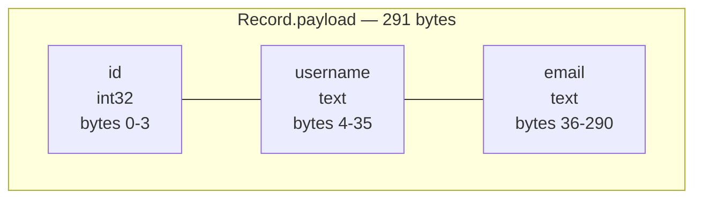
```mermaid
flowchart LR
    subgraph payload["Record.payload — 291 bytes"]
        direction LR
        idf["id<br/>int32<br/>bytes 0-3"]
        unf["username<br/>text<br/>bytes 4-35"]
        emf["email<br/>text<br/>bytes 36-290"]
    end
    idf --- unf --- emf
```

The `id` column is the row's primary key: it is copied into the key slot of the
cell that stores the row, and the tree is ordered by it.

---

## On-disk node format

The database file is an array of 4 KiB pages, and **every page holds exactly one
B-tree node**. Page 0 is always the root. Every node starts with the same 8-byte
header:

| Bytes | Field |
| --- | --- |
| 0 | node type (`0` internal, `1` leaf) |
| 1 | `is_root` |
| 2–3 | padding |
| 4–7 | parent page number (reserved for the parent-update stage) |

**Leaf node** — holds the rows:

| Bytes | Field |
| --- | --- |
| 0–7 | common header |
| 8–11 | `num_cells` |
| 12–15 | `next_leaf` — page of the right sibling, `0` for the rightmost leaf |
| 16 + 296·i | cell *i*: 4-byte key, 291-byte row, 1 byte of padding |

**Internal node** — routes lookups:

| Bytes | Field |
| --- | --- |
| 0–7 | common header |
| 8–11 | `num_keys` |
| 12–15 | page of the rightmost child |
| 16 + 8·i | cell *i*: child page (4 bytes), then its separator key (4 bytes) |

Each separator key is the **largest key stored under the child to its left**, and a
node with *N* keys has *N + 1* children, the last of which lives in the header.

The arithmetic:

```text
leaf cell       = 4 (key) + 291 (row) = 295 → padded to 296
cells per leaf  = (4096 − 16) / 296       = 13
keys per internal node = (4096 − 16) / 8  = 510   (511 children)
```

Every multi-byte field sits on a 4-byte boundary. That's deliberate: the tutorial
packs its header into 6 bytes, which puts `uint32_t` fields at odd offsets, and the
accessors dereference `uint32_t*` pointers into the page — undefined behaviour that
UBSan reports, even though x86 and ARM happen to tolerate it. Two padding bytes and
a rounded cell size buy clean, portable loads without costing a single cell of
capacity. `.constants` prints these numbers, and a test pins them.

---

## How the B-tree works

Fifteen rows inserted in order produce this tree — a root that splits once, then
keeps routing:

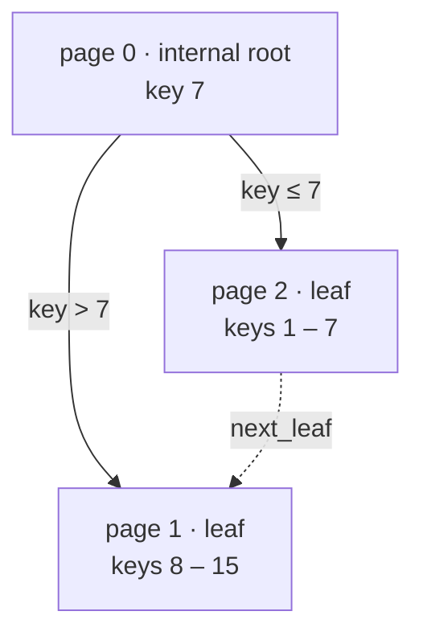
```mermaid
flowchart TD
    R["page 0 · internal root<br/>key 7"]
    L["page 2 · leaf<br/>keys 1 – 7"]
    RL["page 1 · leaf<br/>keys 8 – 15"]
    R -->|"key ≤ 7"| L
    R -->|"key > 7"| RL
    L -.->|next_leaf| RL
```

```text
db > .btree
Tree:
- internal (size 1)
  - leaf (size 7)
    - 1
    ...
    - 7
  - key 7
  - leaf (size 8)
    - 8
    ...
    - 15
```

### Search — descending to a leaf

`table_find(key)` starts at the root. At each internal node,
`internal_node_find_child` binary-searches the separator keys for the first one
`>= key` (a key equal to a separator lives *left*, since the separator is the left
child's maximum), and the loop follows that child's page. When it reaches a leaf,
`leaf_node_find_cell` binary-searches the cells and returns either the cell holding
the key or the cell it would be inserted at. One page fetch and one binary search
per level: **O(log n)**.

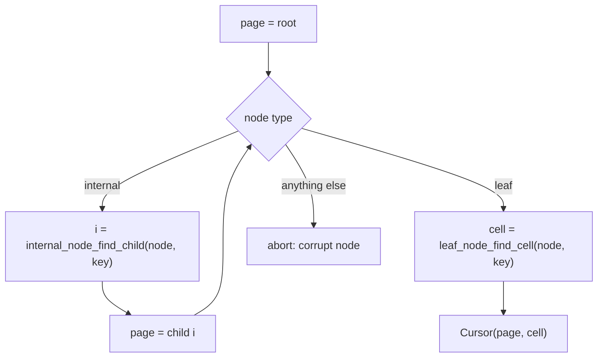
```mermaid
flowchart TD
    A["page = root"] --> B{node type}
    B -->|internal| C["i = internal_node_find_child(node, key)"]
    C --> D["page = child i"]
    D --> B
    B -->|leaf| E["cell = leaf_node_find_cell(node, key)"]
    E --> F["Cursor(page, cell)"]
    B -->|anything else| X["abort: corrupt node"]
```

### Insert — and splitting a full leaf

The executor finds the key's position, rejects the insert if that cell already
holds the key, and otherwise calls `leaf_node_insert`. A leaf with room shifts its
later cells right and writes the new one. A **full** leaf splits instead:

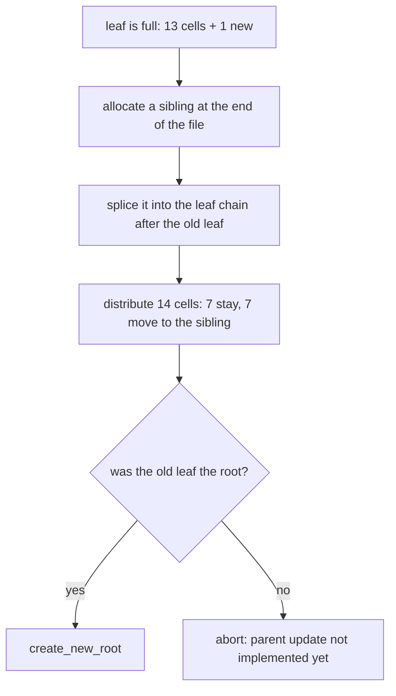
```mermaid
flowchart TD
    A["leaf is full: 13 cells + 1 new"] --> B["allocate a sibling at the end of the file"]
    B --> C["splice it into the leaf chain after the old leaf"]
    C --> D["distribute 14 cells: 7 stay, 7 move to the sibling"]
    D --> E{was the old leaf the root?}
    E -->|yes| F["create_new_root"]
    E -->|no| G["abort: parent update not implemented yet"]
```

Cells are placed walking from the highest position down, which makes it safe to
rearrange the old leaf in place: a position only ever reads old cells at or below
itself, which haven't been overwritten yet. The new cell's key goes in the key
slot and its row in the value slot.

**The root never moves.** When the root leaf splits, `create_new_root` copies its
contents (now the left half) to a freshly allocated page and reinitializes page 0
as an internal node pointing at both halves, with the left half's maximum as the
separator. The table's `root_page_num` therefore stays 0 forever, and the copy
carries the left half's `next_leaf` pointer with it, so the leaf chain comes out
right without special handling.

| | before the 14th insert | after |
| --- | --- | --- |
| page 0 | leaf, 13 cells (root) | internal root: key 7 → page 2, else page 1 |
| page 1 | — | leaf, keys 8–14, `next_leaf = 0` |
| page 2 | — | leaf, keys 1–7 (copied from page 0), `next_leaf = 1` |

### Scan — walking the leaf chain

`table_start` is simply `table_find(table, 0)`: keys are unsigned, so searching
for 0 lands on cell 0 of the leftmost leaf. `cursor_advance` steps through the
leaf's cells, and when it passes the last one it follows `next_leaf` to the
sibling's cell 0 — the scan never climbs back up through the internal nodes. Only
the rightmost leaf has `next_leaf = 0`, and running off it ends the table.

### The cursor invariant

**A cursor always points into a leaf.** Rows live only in leaves, and a cursor on
an internal node would read child page numbers as if they were rows. The invariant
holds by construction — `table_start` and `table_find` are the only constructors,
and both go through the same descent, which stops only at a leaf; `cursor_advance`
only moves along the leaf chain — and `cursor_value` / `cursor_advance` assert it.

---

## Command lifecycle

### INSERT

The parser validates **before** allocating, so a rejected insert never leaks the
record payload. Execution descends to the key's leaf, checks for a duplicate there,
and inserts — splitting the leaf if it's full.

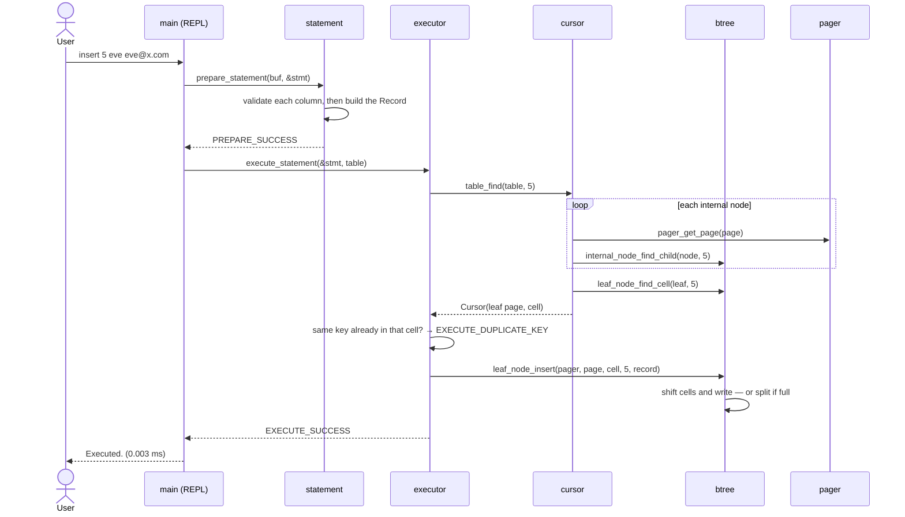
```mermaid
sequenceDiagram
    actor U as User
    participant M as main (REPL)
    participant S as statement
    participant E as executor
    participant C as cursor
    participant B as btree
    participant P as pager

    U->>M: insert 5 eve eve@x.com
    M->>S: prepare_statement(buf, &stmt)
    S->>S: validate each column, then build the Record
    S-->>M: PREPARE_SUCCESS

    M->>E: execute_statement(&stmt, table)
    E->>C: table_find(table, 5)
    loop each internal node
        C->>P: pager_get_page(page)
        C->>B: internal_node_find_child(node, 5)
    end
    C->>B: leaf_node_find_cell(leaf, 5)
    C-->>E: Cursor(leaf page, cell)
    E->>E: same key already in that cell? → EXECUTE_DUPLICATE_KEY
    E->>B: leaf_node_insert(pager, page, cell, 5, record)
    B->>B: shift cells and write — or split if full
    E-->>M: EXECUTE_SUCCESS
    M-->>U: Executed. (0.003 ms)
```

### SELECT

A full scan: a cursor starts at the leftmost leaf and walks the leaf chain,
deserializing and printing each row until `end_of_table`.

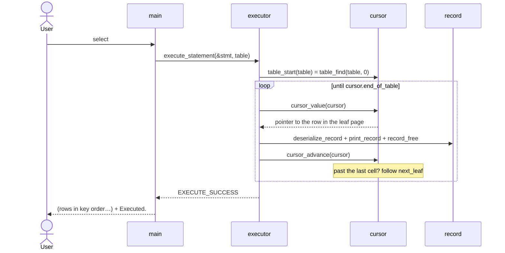
```mermaid
sequenceDiagram
    actor U as User
    participant M as main
    participant E as executor
    participant C as cursor
    participant R as record

    U->>M: select
    M->>E: execute_statement(&stmt, table)
    E->>C: table_start(table) = table_find(table, 0)
    loop until cursor.end_of_table
        E->>C: cursor_value(cursor)
        C-->>E: pointer to the row in the leaf page
        E->>R: deserialize_record + print_record + record_free
        E->>C: cursor_advance(cursor)
        Note over C: past the last cell? follow next_leaf
    end
    E-->>M: EXECUTE_SUCCESS
    M-->>U: (rows in key order…) + Executed.
```

On `.exit`, `db_close` flushes every cached page to the file — that's when the data
becomes durable.

---

## The REPL state machine

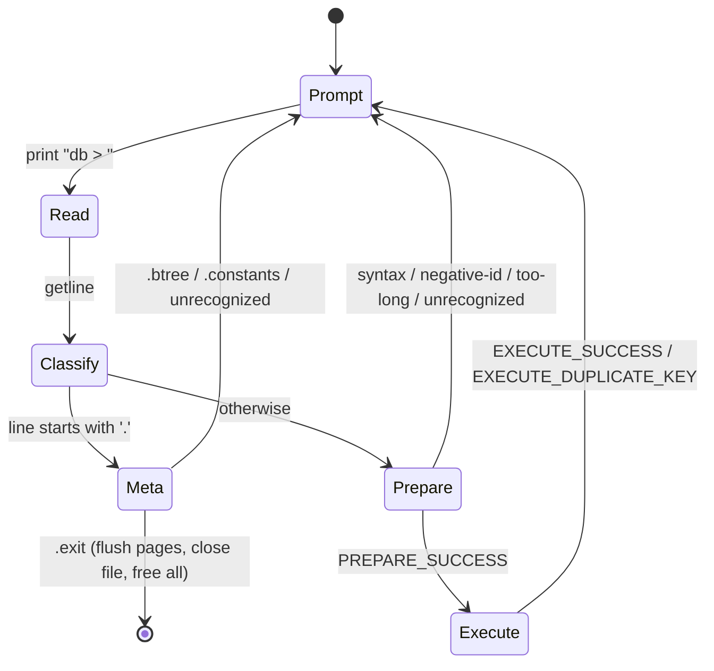
```mermaid
stateDiagram-v2
    [*] --> Prompt
    Prompt --> Read : print "db > "
    Read --> Classify : getline

    Classify --> Meta : line starts with '.'
    Classify --> Prepare : otherwise

    Meta --> Prompt : .btree / .constants / unrecognized
    Meta --> [*] : .exit (flush pages, close file, free all)

    Prepare --> Execute : PREPARE_SUCCESS
    Prepare --> Prompt : syntax / negative-id / too-long / unrecognized

    Execute --> Prompt : EXECUTE_SUCCESS / EXECUTE_DUPLICATE_KEY
```

The loop is infinite by construction; the only exit is `.exit`, which calls
`db_close` (flush + close file + free pager, schema, and table) and then `exit()`
from inside `do_meta_command`. There is no fall-through cleanup path because control
never reaches the end of `main`.

---

## Insert validation

`prepare_insert` is **schema-generic** — it loops over `schema->columns` and
dispatches on each column's `type`. It is not hardcoded to three columns, so it will
parse inserts for any future runtime schema unchanged. The two-pass structure
(validate everything, *then* allocate) is what keeps the error paths leak-free.

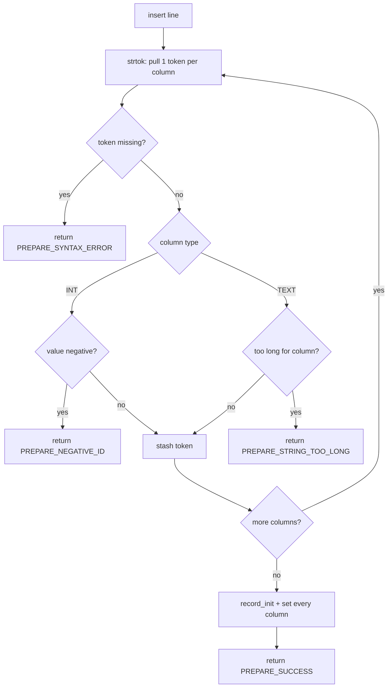
```mermaid
flowchart TD
    A["insert line"] --> B["strtok: pull 1 token per column"]
    B --> C{token missing?}
    C -->|yes| E1["return PREPARE_SYNTAX_ERROR"]
    C -->|no| D{column type}
    D -->|INT| F{value negative?}
    F -->|yes| E2["return PREPARE_NEGATIVE_ID"]
    F -->|no| G["stash token"]
    D -->|TEXT| H{too long for column?}
    H -->|yes| E3["return PREPARE_STRING_TOO_LONG"]
    H -->|no| G
    G --> I{more columns?}
    I -->|yes| B
    I -->|no| J["record_init + set every column"]
    J --> K["return PREPARE_SUCCESS"]
```

| Result code | Message | Cause |
| --- | --- | --- |
| `PREPARE_SUCCESS` | — | well-formed insert |
| `PREPARE_SYNTAX_ERROR` | `Syntax error. Could not parse statement.` | too few tokens |
| `PREPARE_NEGATIVE_ID` | `ID must be positive.` | an `INT` column got a negative value |
| `PREPARE_STRING_TOO_LONG` | `String is too long.` | a `TEXT` value exceeds the column width |
| `PREPARE_UNRECOGNIZED_STATEMENT` | `Unrecognized keyword …` | not `insert`/`select` |
| `EXECUTE_DUPLICATE_KEY` | `Error: Duplicate key.` | a row with that id already exists |

> Note: "negative id" is currently generalized to *any* `INT` column. That is a
> pragmatic stand-in until per-column constraints (PRIMARY KEY / UNSIGNED) exist —
> see [design decisions](#design-decisions).

---

## Memory ownership

Explicit ownership is the spine of a C codebase. The rules, drawn:

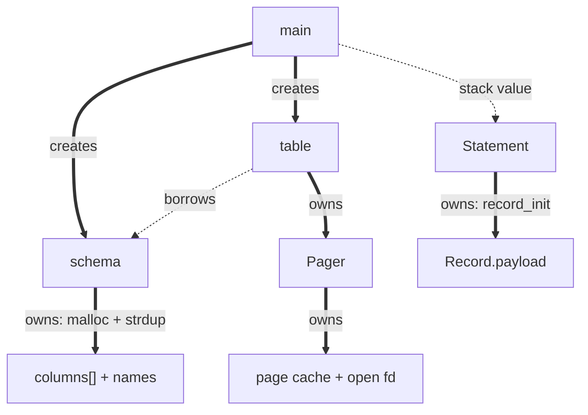
```mermaid
flowchart TD
    main ==>|creates| schema
    main ==>|creates| table
    main -.->|stack value| stmt["Statement"]

    schema ==>|owns: malloc + strdup| cols["columns[] + names"]
    table ==>|owns| pager["Pager"]
    pager ==>|owns| pagesfd["page cache + open fd"]
    table -.->|borrows| schema
    stmt ==>|owns: record_init| payload["Record.payload"]
```

Legend: **thick arrow = owns/frees**, **dotted arrow = borrows or stack**.

Lifecycle rules:

- `schema_create` deep-copies the caller's column array and `strdup`s each name, so
  the source array may be a stack literal in `main`.
- `db_open` opens the file (via `pager_open`), stores a **borrowed** `Schema*`, and
  for a new file turns page 0 into an empty root leaf.
- New nodes get their page from `get_unused_page_num` — the page just past the end
  of the file — and are cached like any other page. Nothing is reserved until the
  page is fetched, so callers fetch a page before allocating the next one.
- `db_close` is the single teardown path: it flushes every cached page, then
  `pager_close` (closes the fd + frees the cache), then `schema_free`, then frees the
  table. `.exit` is the only caller.
- Each REPL iteration zero-initializes `Statement statement = {0}` and calls
  `record_free` after execution — a no-op for `select` (NULL payload), the real free
  for `insert`. The `Cursor` is `malloc`'d per statement and freed at the end of
  each execute, including on the duplicate-key path.

---

## Build system

CMake produces two targets:

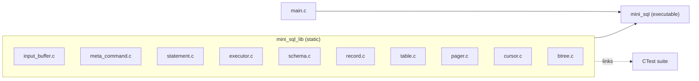
```mermaid
flowchart LR
    subgraph lib["mini_sql_lib (static)"]
        a[input_buffer.c]
        b[meta_command.c]
        c[statement.c]
        d[executor.c]
        e[schema.c]
        f[record.c]
        g[table.c]
        h[pager.c]
        i[cursor.c]
        j[btree.c]
    end
    main_c[main.c] --> exe["mini_sql (executable)"]
    lib --> exe
    lib -.->|links| tests["CTest suite"]
```

Compiled with `-Wall -Wextra -Wpedantic` under strict C11 (`CMAKE_C_EXTENSIONS
OFF`), and emits `compile_commands.json` for clangd. The library/executable split
exists so the test and benchmark targets can link the engine in one line without
recompiling every source. (`pager.c` and `schema.c` define `_POSIX_C_SOURCE` so the
POSIX file calls and `strdup` resolve under strict C11.)

---

## Testing

Black-box, output-asserting tests in the style of the tutorial's rspec suite, but
implemented as a dependency-free bash script and registered with CTest — one entry
per case, so a failure names itself.

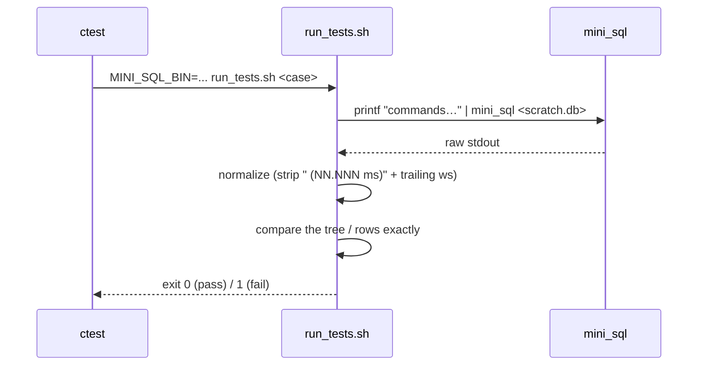
```mermaid
sequenceDiagram
    participant CT as ctest
    participant SH as run_tests.sh
    participant DB as mini_sql

    CT->>SH: MINI_SQL_BIN=... run_tests.sh <case>
    SH->>DB: printf "commands…" | mini_sql <scratch.db>
    DB-->>SH: raw stdout
    SH->>SH: normalize (strip " (NN.NNN ms)" + trailing ws)
    SH->>SH: compare the tree / rows exactly
    SH-->>CT: exit 0 (pass) / 1 (fail)
```

The 14 cases:

| Area | Cases |
| --- | --- |
| Basics | insert/select round trip; max-length strings; over-length strings; negative id |
| Persistence | rows survive a reopen |
| Layout | `.constants` pins every size and offset |
| Tree shape | one sorted leaf; a root split under four insertion orders; the split survives a reopen; inserts routed left and right after the split, including a key equal to the separator |
| Duplicates | rejected in a single leaf and in either leaf of a split tree |
| Scans | every row in key order across leaves, for four insertion orders and across a reopen; an empty table |
| Boundary | the next unimplemented step (splitting a non-root leaf) stops with an explicit message |

How the suite earns its trust:

- **Exact comparison.** Tree shapes and scan results are compared line for line
  (`btree_block`, `select_rows`), because a substring check can't tell `- 1` from
  `- 10`.
- **Insertion orders chosen to hit each branch.** The split tests insert the same
  14 keys ascending, descending, and with the splitting key landing as the left
  half's last cell and as the right half's first — the exact boundary where an
  off-by-one would hide.
- **Mutation checks.** The split, routing and scan stages were each verified by
  deliberately breaking the code and confirming the suite fails: an off-by-one at
  the split boundary, `>` instead of `>=` when routing past a separator, a missing
  sibling link, and the tutorial's own split bug — which reproduces its exact
  corrupted row, `(1919251317, 14, on14@example.com)`, and is caught by the scan
  test.
- **Sanitizers.** The B-tree stages were each run under AddressSanitizer and
  UndefinedBehaviorSanitizer, which is what surfaced the misaligned loads in the
  tutorial's node layout.
- **Timeouts.** Scans follow on-disk pointers, so each test has a 10-second limit
  that turns a pointer cycle into a fast failure instead of a hang.

```sh
ctest --test-dir build --output-on-failure
```

---

## Design decisions

**Schema-driven, not struct-driven.** The tutorial's `Row` struct bakes the row
layout into the compiler; `ALTER TABLE` is then impossible without changing C source.
`mini-sql` computes the layout in `schema_create`, so a row is just bytes plus a
ruler. Cost: a layer of indirection now. Payoff: runtime `CREATE TABLE` / `ALTER`
later with no change to `record`, `btree`, or `executor`.

**Storage behind a cursor.** `execute_insert` / `execute_select` reach rows only
through a cursor. That abstraction paid off when the table became a B-tree: the
executor's scan loop didn't change at all.

**One-way layering, mirroring SQLite.** `btree` works in pages and node bytes and
knows nothing about tables or cursors. Its search functions return *positions
within a node* (a cell index, a child index), and `cursor` chains them into
navigation with an iterative descent loop. Each layer can be tested and reasoned
about without the ones above it.

**Naturally aligned node layout.** An 8-byte common header and a cell size rounded
to a multiple of four keep every `uint32_t` field aligned, so reading a field
through a pointer is well-defined C on any architecture. Same capacity as the
packed layout.

**The root never moves.** A root split copies the old root out rather than moving
the new root in, so the table is identified by page 0 forever and nothing has to be
updated when the tree grows a level.

**Invariants by construction, then asserted.** "A cursor always points into a leaf"
isn't checked in scattered places — the only two ways to create a cursor go through
the same descent that stops only at leaves, and the functions that rely on it assert
it.

**Loud boundaries over wrong answers.** While a feature is missing, the code path
that would need it stops with a message naming it (`Need to implement …`) instead
of returning plausible-looking garbage. Tests pin each boundary, and the stage that
implements the feature deliberately flips the test.

**Address columns by stable `column_id`.** Never by name or ordinal. `RENAME` becomes
a metadata edit; `DROP` becomes a flag; neither disturbs other columns' data.

**Validate before allocate.** `prepare_insert` proves the whole line is valid before
calling `record_init`. Early returns can't leak, and there's no half-built record to
unwind.

**`%.*s`, not `%s`, when printing text.** A maximum-width text field has no room for a
NUL terminator. Bounding the print to `column->size` means `mini-sql` never had the
"garbage bytes on max-length strings" bug the tutorial hits — and never needed the
"+1 byte" struct fix, because there is no struct.

---

## Where mini-sql diverges from the tutorial

| The tutorial | mini-sql | Why it matters |
| --- | --- | --- |
| A fixed `Row` struct with compile-time offsets | A runtime `Schema` computes every offset | `CREATE TABLE` / `ALTER TABLE` stay possible |
| Row text buffers need a `+1` for the NUL | Width-bounded printing (`%.*s`) | No struct, so the max-length-string bug never existed |
| Packed 6-byte node header | Aligned 8-byte header, 4-byte-multiple cells | `uint32_t` loads are UBSan-clean |
| The leaf split writes the new row at the start of the cell and never writes its key | Key and row go into their own slots | The corruption the tutorial discovers two parts later never happened here |
| `internal_node_key` adds 4 to a `uint32_t*` — 16 bytes, not 4 | Byte arithmetic | Separator keys sit at the right offset |
| Mutual recursion between two search functions that return cursors | An iterative descent in `cursor`; `btree` returns indices | `btree` stays free of cursors; no recursion |
| As written in the articles, the duplicate check reads the root node | It reads the leaf the cursor landed in | Correct as soon as the root splits |
| A cursor leaks on a duplicate key | Freed | No leak per rejected insert |
| `select` after the first split prints a corrupted row until scans are implemented | It stopped with an explicit message until then | Missing features fail loudly |
| rspec tests | bash + CTest, exact comparisons, sanitizers, mutation checks | Tests that demonstrably catch the bugs above |

---

## Roadmap

Built bottom-up so something runs at every step. Storage-engine priorities
(pager, B-tree) come before query-language breadth.


```mermaid
flowchart LR
    A["1–6 · REPL → pager → cursor"] --> B["7–12 · B-tree: format, search, split, scan"]
    B --> C["13 · update parent after a split"]
    C --> D["14 · split internal nodes"]
    D --> E["WHERE / DELETE"]
    E --> F["catalog"]
    F --> G["CREATE / ALTER TABLE"]

    classDef done fill:#d6f5d6,stroke:#3a9a3a;
    classDef now fill:#fff2cc,stroke:#bba12a;
    classDef todo fill:#eeeeee,stroke:#999999;

    class A,B done;
    class C now;
    class D,E,F,G todo;
```

- **Done — storage foundations (1–6):** REPL, schema-driven rows, tests, a
  file-backed pager, and the cursor abstraction.
- **Done — B-tree (7–12):** sorted leaves with binary search, duplicate-key
  rejection, leaf splits that grow a new root, descent through internal nodes, and
  leaf-chain scans.
- **Next — updating the parent after a split (13):** splitting a leaf that isn't the
  root adds a key and a child to its parent. This lifts today's 20–26-row ceiling;
  the next limits become a full internal root and the pager's 100-page cache.
- **Then — splitting internal nodes (14):** the tree can grow to any depth.
- **Then — `WHERE` and `DELETE`:** a point lookup is `table_find` plus one cell; a
  range scan is `table_find(low)` plus a walk along the leaf chain.
- **Then — catalog + DDL:** a name→table registry, then runtime `CREATE TABLE` and the
  `ALTER TABLE ADD/DROP/RENAME COLUMN` family the schema layer was designed for.
- **Worth doing before storing anything that matters:** a versioned file header, so
  a file written by an older format is rejected cleanly instead of misread.

---

## Project layout

```text
mini-sql/
├── CMakeLists.txt          # two targets: mini_sql_lib (static) + mini_sql (exe)
├── include/
│   ├── input_buffer.h      # line reader
│   ├── meta_command.h      # dot-commands
│   ├── schema.h            # ColumnType, ColumnDefinition, Schema
│   ├── record.h            # Record + (de)serialization
│   ├── pager.h             # Pager, page cache constants, page allocation
│   ├── btree.h             # node formats, search, insert/split, tree printer
│   ├── table.h             # Table + db_open / db_close
│   ├── cursor.h            # Cursor + start/find/value/advance
│   ├── statement.h         # Statement, PrepareResult
│   └── executor.h          # ExecuteResult, execute_statement
├── src/
│   ├── input_buffer.c
│   ├── meta_command.c
│   ├── schema.c
│   ├── record.c
│   ├── pager.c
│   ├── btree.c
│   ├── table.c
│   ├── cursor.c
│   ├── statement.c
│   ├── executor.c
│   └── main.c              # REPL — the only file with no header
└── tests/
    └── run_tests.sh        # black-box suite, driven by CTest
```

---

## Limitations & non-goals

This is a learning engine. Known gaps, most of them on the [roadmap](#roadmap):

- **Capacity** — splitting a leaf that isn't the root isn't implemented yet, so the
  table tops out at 20 rows inserted in ascending order, and at most 26. The insert
  that would need it stops with `Need to implement updating parent after split`.
- **Crash safety** — pages are flushed only on a clean `.exit`; kill the process, or
  hit one of the boundaries above, and unsaved changes are lost. No rollback journal
  or WAL.
- **File-format stability** — the page layout has changed several times on the way
  here and isn't versioned, so a database file from an earlier build is unreadable.
  Delete and recreate it.
- **A real SQL dialect** — `insert`/`select` only, fixed positional syntax, one
  hardcoded `users` table, no `WHERE` / `UPDATE` / `DELETE` / joins.
- **A bytecode VM** — the executor runs statements directly; there is no parse tree,
  no code generator, no VDBE.
- **Concurrent** — single-threaded, no locking.

The aim is a correct, legible core that grows one well-understood layer at a time.

---

*Built by following cstack's tutorial, with a schema-driven spine bolted in from the
start.*
