# mini-sql

A SQLite-style database engine, built from scratch in C — one layer at a time.

> Small. Schema-driven. Honest about what it isn't (yet).

`mini-sql` is a teaching/learning implementation that follows the spirit of
[cstack's *Let's Build a Simple Database*](https://cstack.github.io/db_tutorial/),
but **deliberately diverges in one important way**: where the tutorial hardcodes
a single `Row` struct and compile-time byte offsets, `mini-sql` is **schema-driven
from the first commit**. The layout of a row is *computed at runtime* from a
`Schema`, not frozen by the C compiler. That single decision is what keeps the
door open to `CREATE TABLE`, `ALTER TABLE`, and multiple tables without a rewrite.

Today it is a **persistent B+ tree** over a single table. Rows are kept sorted by
primary key in 4 KiB leaf pages; internal pages route lookups, so finding a key
costs one binary search per level; full nodes, leaf or internal, split and cascade
up to a new root, so the tree grows to any depth; and a chain of sibling pointers
lets a scan return every row in key order. The pager caches pages in memory and
writes them to a single database file. Every part of the tutorial's storage engine
is in place.

---

## Table of contents

- [Quick start](#quick-start)
- [What works today](#what-works-today)
- [Architecture at a glance](#architecture-at-a-glance)
- [How it maps to SQLite](#how-it-maps-to-sqlite)
- [Module dependency graph](#module-dependency-graph)
- [The data model](#the-data-model)
- [Row layout](#row-layout)
- [On-disk format](#on-disk-format)
- [How the B-tree works](#how-the-b-tree-works)
- [Command lifecycle](#command-lifecycle)
- [The REPL state machine](#the-repl-state-machine)
- [Parsing and validation](#parsing-and-validation)
- [Memory ownership](#memory-ownership)
- [Build system](#build-system)
- [Testing](#testing)
- [Design decisions](#design-decisions)
- [Where mini-sql diverges from the tutorial](#where-mini-sql-diverges-from-the-tutorial)
- [Roadmap](#roadmap)
- [Project layout](#project-layout)
- [Limitations & non-goals](#limitations--non-goals)

---

## Quick start

```sh
cmake -S . -B build           # configure
cmake --build build           # compile
./build/mini_sql mydb.db      # run the REPL against a database file
ctest --test-dir build        # run the test suite
```

The binary takes the database filename as an argument and reads one SQL statement
per line. Rows are stored in key order whatever order they arrive in, duplicate
keys are rejected, bad statements say exactly what's wrong, and everything survives
a restart:

```text
$ ./build/mini_sql mydb.db
db > INSERT INTO users VALUES (3, 'carol', 'carol@example.com');
Executed. (0.000 ms)
db > INSERT INTO users VALUES (1, 'alice', 'alice@example.com');
Executed. (0.001 ms)
db > INSERT INTO users (email, id, username) VALUES ('bob@example.com', 2, 'Bob Smith');
Executed. (0.000 ms)
db > INSERT INTO users VALUES (1, 'again', 'again@example.com');
Error: Duplicate key.
db > INSERT INTO users VALUES ('four', 'dan', 'dan@example.com');
Type error: column 'id' is INT, but 'four' is text.
db > SELECT * FORM users;
Syntax error: expected FROM near 'FORM' at column 10.
db > .btree
Tree:
- leaf (size 3)
  - 1
  - 2
  - 3
db > .exit

$ ./build/mini_sql mydb.db
db > SELECT * FROM users;
(1, alice, alice@example.com)
(2, Bob Smith, bob@example.com)
(3, carol, carol@example.com)
Executed. (0.008 ms)
db > .exit
```

`.btree` prints the tree's shape and `.constants` prints the on-page layout sizes.
The trailing `;` is optional, keywords and names ignore case, and `--` starts a
comment.

Requirements: a C11 compiler (Apple Clang / GCC), CMake ≥ 3.20, and `bash` for the
tests. No third-party libraries.

---

## What works today

| Capability | Status |
| --- | --- |
| Interactive REPL with `db >` prompt | ✅ |
| Meta-commands: `.exit`, `.btree`, `.constants` | ✅ |
| **SQL front end**: tokenizer, recursive-descent parser, binder | ✅ |
| `INSERT INTO users [(columns)] VALUES (…)` into a fixed `users` schema | ✅ |
| `SELECT * FROM users` — full scan, rows in primary-key order | ✅ |
| **Syntax and type errors** that name the problem and its column position | ✅ |
| **B+ tree storage**: sorted leaves, internal routing nodes | ✅ |
| **O(log n) lookup**: binary search per node, descending from the root | ✅ |
| **Duplicate primary keys rejected** | ✅ |
| **Leaf splits** that grow a new internal root | ✅ |
| **Splits below the root** that update the parent's separators and children | ✅ |
| **Internal-node splits** that cascade up to a new root — a tree of any depth | ✅ |
| **Scans across leaves** through a sibling-pointer chain | ✅ |
| Input validation (syntax, negative id, over-length text) | ✅ |
| Schema-driven row (de)serialization | ✅ |
| Persistence to a single database file | ✅ |
| **Page cache that grows with the file** — no page limit | ✅ |
| **Versioned file header**: foreign, older or corrupt files are refused, never misread | ✅ |
| Per-statement execution timing | ✅ |
| Black-box test suite (22 CTest cases) with a B+ tree invariant checker | ✅ |
| `WHERE`, `DELETE`, `UPDATE` | ⛔ |
| `CREATE TABLE` / multiple tables | ⛔ single hardcoded schema |
| Crash safety (journal / WAL) | ⛔ flush happens only on clean `.exit` |

---

## Architecture at a glance

The engine is a classic **front-end / back-end** split. The front end turns text
into a validated `Statement` in three steps — tokens, a syntax tree, then a check
against the table's schema; the back end executes it through a cursor, which
navigates the B-tree, which reads and writes pages through the pager.

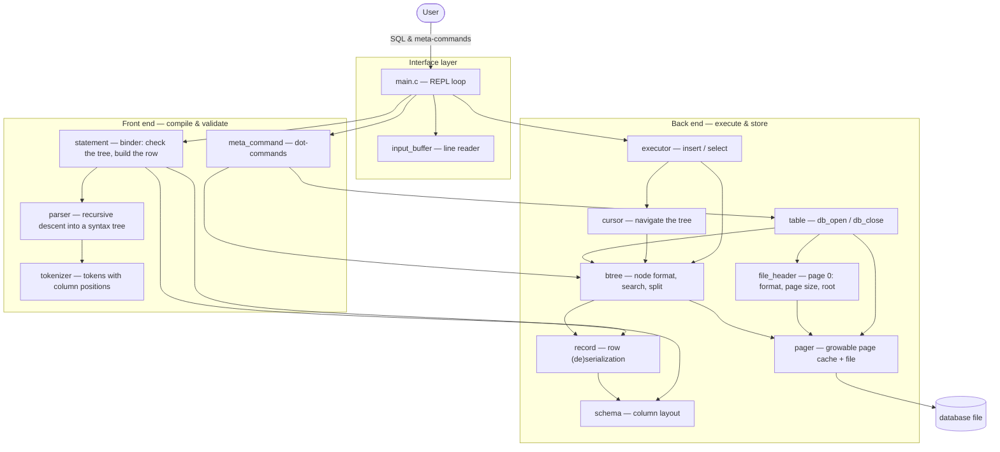
```mermaid
flowchart TD
    User([User]) -->|SQL & meta-commands| REPL

    subgraph Interface["Interface layer"]
        REPL["main.c — REPL loop"]
        IB["input_buffer — line reader"]
    end

    subgraph Frontend["Front end — compile & validate"]
        META["meta_command — dot-commands"]
        STMT["statement — binder: check the tree, build the row"]
        PARSE["parser — recursive descent into a syntax tree"]
        TOK["tokenizer — tokens with column positions"]
    end

    subgraph Backend["Back end — execute & store"]
        EXEC["executor — insert / select"]
        CUR["cursor — navigate the tree"]
        TABLE["table — db_open / db_close"]
        HDR["file_header — page 0: format, page size, root"]
        BTREE["btree — node format, search, split"]
        REC["record — row (de)serialization"]
        SCHEMA["schema — column layout"]
        PAGER["pager — growable page cache + file"]
    end

    FILE[("database file")]

    REPL --> IB
    REPL --> META
    REPL --> STMT
    REPL --> EXEC
    STMT --> PARSE
    PARSE --> TOK
    STMT --> REC
    STMT --> SCHEMA
    EXEC --> CUR
    EXEC --> BTREE
    CUR --> BTREE
    TABLE --> BTREE
    TABLE --> HDR
    TABLE --> PAGER
    HDR --> PAGER
    META --> BTREE
    META --> TABLE
    BTREE --> PAGER
    BTREE --> REC
    REC --> SCHEMA
    PAGER --> FILE
```

The layering runs one way: **executor → cursor → btree → pager**. `btree` knows
page numbers and node bytes but nothing about tables or cursors; `cursor` chains
btree's per-node answers into tree navigation; the executor only ever talks to a
cursor. That's why `execute_select` has not changed since the table was an
array — the storage underneath it became a B-tree without it noticing.

---

## How it maps to SQLite

SQLite compiles SQL to bytecode and runs it on a virtual machine over a B-tree /
pager stack. `mini-sql` builds that stack **bottom-up**: the pager and the B-tree
are genuine counterparts, and so are the tokenizer and parser. Between the parser
and the storage, a binder checks the syntax tree and the executor runs the result
directly — there is no bytecode or VM.

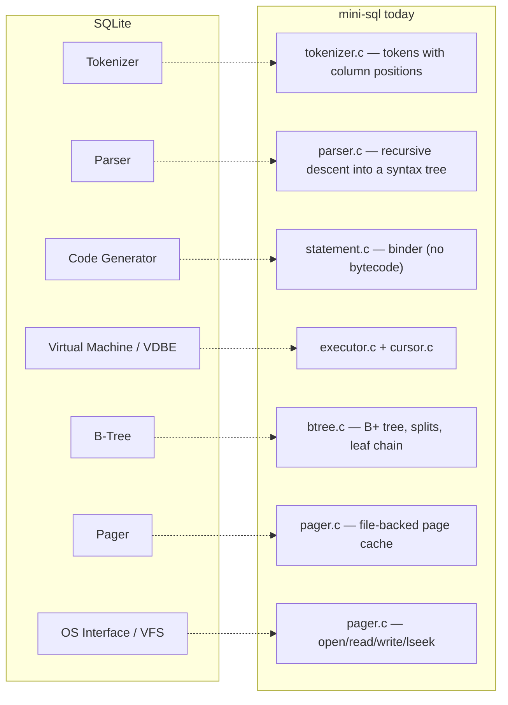
```mermaid
flowchart LR
    subgraph SQLite["SQLite"]
        direction TB
        s1[Tokenizer]
        s2[Parser]
        s3[Code Generator]
        s4[Virtual Machine / VDBE]
        s5[B-Tree]
        s6[Pager]
        s7[OS Interface / VFS]
    end
    subgraph Mini["mini-sql today"]
        direction TB
        m1["tokenizer.c — tokens with column positions"]
        m2["parser.c — recursive descent into a syntax tree"]
        m3["statement.c — binder (no bytecode)"]
        m4["executor.c + cursor.c"]
        m5["btree.c — B+ tree, splits, leaf chain"]
        m6["pager.c — file-backed page cache"]
        m7["pager.c — open/read/write/lseek"]
    end
    s1 -.-> m1
    s2 -.-> m2
    s3 -.-> m3
    s4 -.-> m4
    s5 -.-> m5
    s6 -.-> m6
    s7 -.-> m7
```

Every row but the code generator and VM is a real counterpart. Those two are the
honest gap: the binder produces a ready-to-run `Statement` rather than a program —
see [limitations](#limitations--non-goals).

---

## Module dependency graph

Each `.c` includes only the headers it truly needs; `pager`, `schema`,
`input_buffer` and `tokenizer` are the leaves. The static library `mini_sql_lib`
contains every module except `main`, so tests and future benchmarks link against it
without recompiling sources.

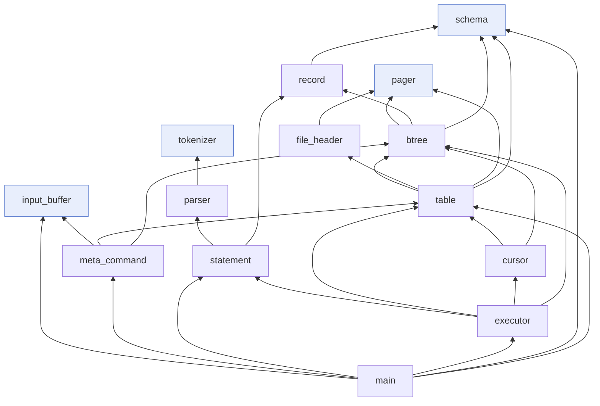
```mermaid
flowchart BT
    main --> input_buffer
    main --> meta_command
    main --> statement
    main --> executor
    main --> schema
    main --> table

    meta_command --> input_buffer
    meta_command --> table
    meta_command --> btree
    statement --> parser
    statement --> record
    parser --> tokenizer
    executor --> statement
    executor --> table
    executor --> cursor
    executor --> btree
    cursor --> table
    cursor --> btree
    table --> btree
    table --> file_header
    table --> pager
    table --> schema
    file_header --> pager
    btree --> pager
    btree --> record
    btree --> schema
    record --> schema

    classDef leaf fill:#e8eefc,stroke:#5577cc;
    class schema,input_buffer,pager,tokenizer leaf;
```

| Module | Responsibility | Key entry points |
| --- | --- | --- |
| `input_buffer` | Read a line of stdin into a growable buffer | `new_input_buffer`, `read_input`, `close_input_buffer` |
| `meta_command` | Handle `.`-prefixed commands; teardown on `.exit` | `do_meta_command` |
| `tokenizer` | Split a line of SQL into tokens, each with its column | `tokenizer_init`, `tokenizer_next`, `token_type_name` |
| `parser` | Recursive descent from tokens to a syntax tree; syntax errors | `parse_statement`, `ast_free` |
| `schema` | Runtime column layout: types, sizes, **computed offsets**; case-insensitive name lookup | `schema_create`, `schema_find_column_by_id/name`, `schema_names_equal`, `schema_free` |
| `record` | An opaque row payload + schema-keyed get/set + (de)serialize | `record_init`, `record_set_int/text`, `serialize_record`, `print_record` |
| `pager` | Growable page cache backed by a file; allocates zeroed pages, reads on miss, flushes on close | `pager_open`, `pager_get_page`, `get_unused_page_num`, `pager_flush`, `pager_close` |
| `file_header` | Page 0's layout: writes a new header, validates an existing one, reads the root page | `file_header_initialize`, `file_header_validate`, `file_header_root_page` |
| `btree` | Leaf and internal node formats, per-node binary search, leaf split and root growth, tree printer | `leaf_node_insert`, `leaf_node_find_cell`, `internal_node_find_child`, `leaf_node_next_leaf`, `print_tree` |
| `table` | Opens/closes a database connection; writes the header and root of a new file, refuses a file it can't read | `db_open`, `db_close` |
| `cursor` | A position in a leaf; tree descent and leaf-chain traversal | `table_start`, `table_find`, `cursor_value`, `cursor_advance` |
| `statement` | The binder: check a syntax tree against the table, build the row; type and name errors | `prepare_statement`, `statement_set_default_table` |
| `executor` | Run a prepared `Statement` against a `Table` via a cursor | `execute_statement` |
| `main` | REPL loop + wiring + lifetime management | — |

---

## The data model

The core structs and their ownership relationships (these encode the rules the
code actually follows):

- `Schema` **owns** its `ColumnDefinition` array (deep copy, including names).
- `Table` **owns** a `Pager` and **borrows** a `Schema` (taken at open, freed by
  `db_close`). A table *is* a B-tree, identified by its root page — the page the
  file header records, page 1 in a new database.
- `Pager` **owns** the page cache and the open file descriptor.
- `Cursor` **points into** a leaf of a `Table`; it owns nothing.
- `Statement` **holds** a `Record` inline; `Record` is just bytes, **interpreted by**
  a `Schema`.
- `Ast`, the parser's syntax tree, **owns** its names and literal text, and lives
  only for the duration of `prepare_statement`.

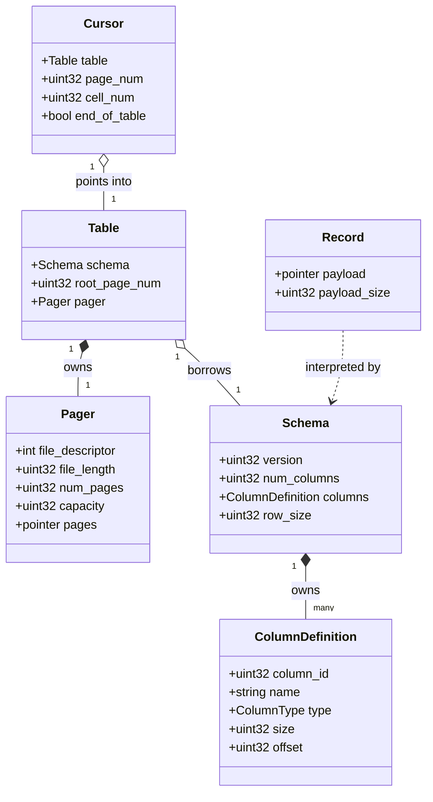
```mermaid
classDiagram
    class Schema {
        +uint32 version
        +uint32 num_columns
        +ColumnDefinition columns
        +uint32 row_size
    }
    class ColumnDefinition {
        +uint32 column_id
        +string name
        +ColumnType type
        +uint32 size
        +uint32 offset
    }
    class Pager {
        +int file_descriptor
        +uint32 file_length
        +uint32 num_pages
        +uint32 capacity
        +pointer pages
    }
    class Table {
        +Schema schema
        +uint32 root_page_num
        +Pager pager
    }
    class Cursor {
        +Table table
        +uint32 page_num
        +uint32 cell_num
        +bool end_of_table
    }
    class Record {
        +pointer payload
        +uint32 payload_size
    }

    Schema "1" *-- "many" ColumnDefinition : owns
    Table "1" *-- "1" Pager : owns
    Table "1" o-- "1" Schema : borrows
    Cursor "1" o-- "1" Table : points into
    Record ..> Schema : interpreted by
```

The pivotal field is `ColumnDefinition.column_id` — a **stable identity** assigned
once and never reused. Every read/write addresses a column by `column_id`, never by
its position or its name. That indirection is what will make `ALTER TABLE RENAME
COLUMN` a one-line metadata change instead of a code-wide find-and-replace.

---

## Row layout

`schema_create` walks the column list once, assigning each column a byte `offset`
and accumulating `row_size`. For the built-in `users` schema:

| Column | Type | Size (bytes) | Offset |
| --- | --- | ---: | ---: |
| `id` | `INT` | 4 | 0 |
| `username` | `TEXT` | 32 | 4 |
| `email` | `TEXT` | 255 | 36 |
| **`row_size`** | | **291** | |

A `Record`'s `payload` is exactly that 291-byte block — the same bytes that end
up in a leaf cell:

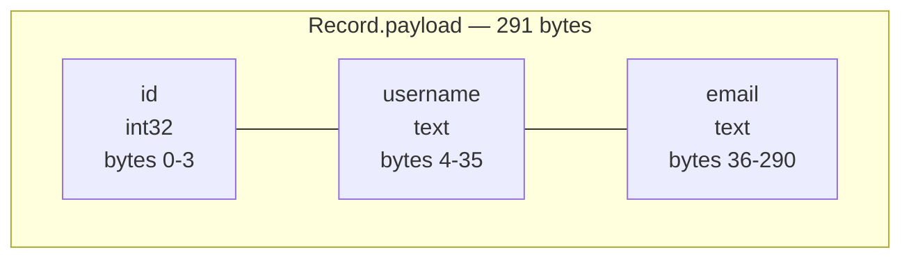
```mermaid
flowchart LR
    subgraph payload["Record.payload — 291 bytes"]
        direction LR
        idf["id<br/>int32<br/>bytes 0-3"]
        unf["username<br/>text<br/>bytes 4-35"]
        emf["email<br/>text<br/>bytes 36-290"]
    end
    idf --- unf --- emf
```

The `id` column is the row's primary key: it is copied into the key slot of the
cell that stores the row, and the tree is ordered by it.

---

## On-disk format

The database file is an array of 4 KiB pages. **Page 0 is the file header**, and
**every other page holds exactly one B-tree node**:

```text
page 0   file header
page 1   root of the users table (in a new database)
page 2…  every other node, each allocated at the end of the file as it's needed
```

### The file header

| Bytes | Field |
| --- | --- |
| 0–15 | magic `mini-sql format\0`, after SQLite's `SQLite format 3\0` |
| 16–19 | file format version — `1` |
| 20–23 | page size — `4096` |
| 24–27 | page holding the table's root node |
| 28–4095 | zero, reserved for fields later formats add |

Opening a file checks the header before anything else, and refuses — with a
message, and without writing a byte — a file that fails:

| Check | Message |
| --- | --- |
| length a whole number of pages | `Db file is not a whole number of pages. Corrupt file.` |
| the magic | `Error: X is not a mini-sql database, or was written by an older build.` |
| the format version | `Error: X uses file format 2; this build reads format 1.` |
| the page size | `Error: X uses 8192-byte pages; this build uses 4096.` |
| the root is a node page | `Error: X is corrupt: its root page 99 is not a node page of the file.` |

Every file written before the header existed has a node where the magic belongs, so
it's refused by the second check rather than misread. Any change to what a file
holds bumps the format version, so from here on old files are always refused
cleanly.

The header gets a whole page to itself. SQLite instead fits a 100-byte header at the
start of its first page, which also holds a B-tree root; here every node starts at
byte 0 of its page, and sharing a page would make that depend on the page number in
every accessor. Fields are stored in the machine's byte order, like every node
field.

### Nodes

Every node starts with the same 8-byte header:

| Bytes | Field |
| --- | --- |
| 0 | node type (`0` internal, `1` leaf) |
| 1 | `is_root` |
| 2–3 | padding |
| 4–7 | parent page number (unused on the root) |

**Leaf node** — holds the rows:

| Bytes | Field |
| --- | --- |
| 0–7 | common header |
| 8–11 | `num_cells` |
| 12–15 | `next_leaf` — page of the right sibling, `0` for the rightmost leaf (page 0 is the header, so it can't be a sibling) |
| 16 + 296·i | cell *i*: 4-byte key, 291-byte row, 1 byte of padding |

**Internal node** — routes lookups:

| Bytes | Field |
| --- | --- |
| 0–7 | common header |
| 8–11 | `num_keys` |
| 12–15 | page of the rightmost child |
| 16 + 8·i | cell *i*: child page (4 bytes), then its separator key (4 bytes) |

Each separator key is the **largest key stored under the child to its left**, and a
node with *N* keys has *N + 1* children, the last of which lives in the header.

The arithmetic:

```text
leaf cell       = 4 (key) + 291 (row) = 295 → padded to 296
cells per leaf  = (4096 − 16) / 296       = 13
keys per internal node = (4096 − 16) / 8  = 510   (511 children)
```

The internal-node cap can be lowered at build time with
`-DMINI_SQL_INTERNAL_NODE_MAX_KEYS=N` (no lower than 3, so a split always leaves
both halves a key). The test suite uses that for a second binary
capped at 3 keys, the only way to reach a full internal node in a few dozen rows;
the page layout is identical either way.

Every multi-byte field sits on a 4-byte boundary. That's deliberate: the tutorial
packs its header into 6 bytes, which puts `uint32_t` fields at odd offsets, and the
accessors dereference `uint32_t*` pointers into the page — undefined behaviour that
UBSan reports, even though x86 and ARM happen to tolerate it. Two padding bytes and
a rounded cell size buy clean, portable loads without costing a single cell of
capacity. `.constants` prints these numbers, and a test pins them.

---

## How the B-tree works

Fifteen rows inserted in order produce this tree — a root that splits once, then
keeps routing:


```mermaid
flowchart TD
    R["page 1 · internal root<br/>key 7"]
    L["page 3 · leaf<br/>keys 1 – 7"]
    RL["page 2 · leaf<br/>keys 8 – 15"]
    R -->|"key ≤ 7"| L
    R -->|"key > 7"| RL
    L -.->|next_leaf| RL
```

```text
db > .btree
Tree:
- internal (size 1)
  - leaf (size 7)
    - 1
    ...
    - 7
  - key 7
  - leaf (size 8)
    - 8
    ...
    - 15
```

### Search — descending to a leaf

`table_find(key)` starts at the root. At each internal node,
`internal_node_find_child` binary-searches the separator keys for the first one
`>= key` (a key equal to a separator lives *left*, since the separator is the left
child's maximum), and the loop follows that child's page. When it reaches a leaf,
`leaf_node_find_cell` binary-searches the cells and returns either the cell holding
the key or the cell it would be inserted at. One page fetch and one binary search
per level: **O(log n)**.

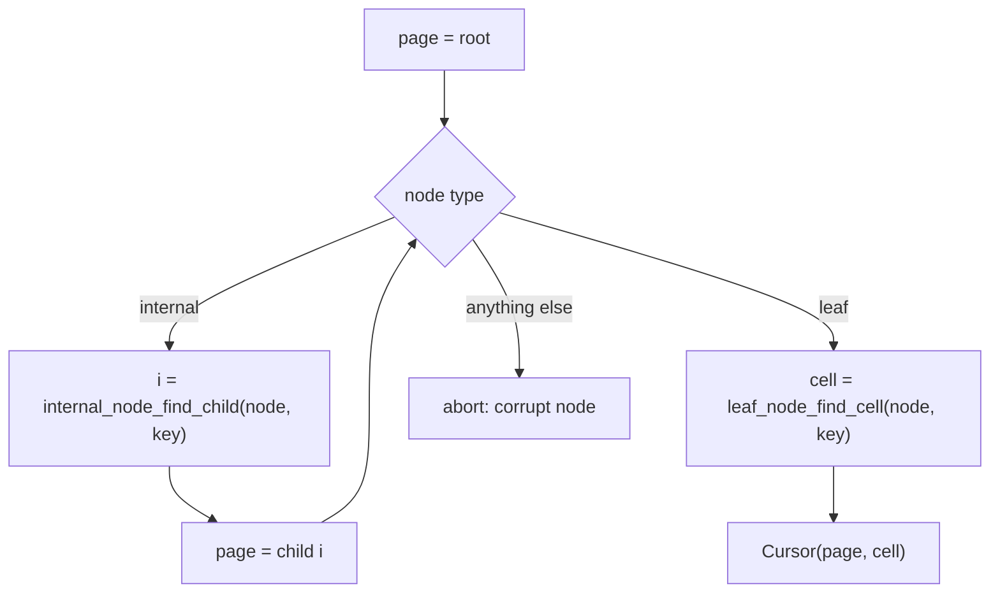
```mermaid
flowchart TD
    A["page = root"] --> B{node type}
    B -->|internal| C["i = internal_node_find_child(node, key)"]
    C --> D["page = child i"]
    D --> B
    B -->|leaf| E["cell = leaf_node_find_cell(node, key)"]
    E --> F["Cursor(page, cell)"]
    B -->|anything else| X["abort: corrupt node"]
```

### Insert — and splitting a full leaf

The executor finds the key's position, rejects the insert if that cell already
holds the key, and otherwise calls `leaf_node_insert`. A leaf with room shifts its
later cells right and writes the new one. A **full** leaf splits instead:

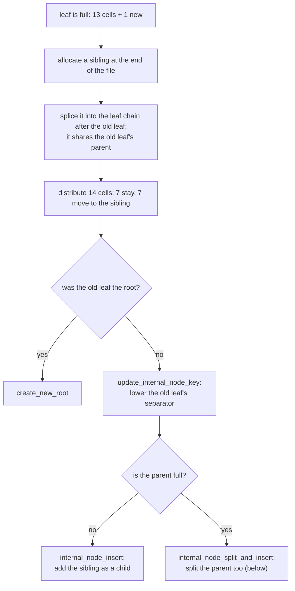
```mermaid
flowchart TD
    A["leaf is full: 13 cells + 1 new"] --> B["allocate a sibling at the end of the file"]
    B --> C["splice it into the leaf chain after the old leaf;<br/>it shares the old leaf's parent"]
    C --> D["distribute 14 cells: 7 stay, 7 move to the sibling"]
    D --> E{was the old leaf the root?}
    E -->|yes| F["create_new_root"]
    E -->|no| G["update_internal_node_key:<br/>lower the old leaf's separator"]
    G --> H{is the parent full?}
    H -->|no| I["internal_node_insert:<br/>add the sibling as a child"]
    H -->|yes| J["internal_node_split_and_insert:<br/>split the parent too (below)"]
```

Cells are placed walking from the highest position down, which makes it safe to
rearrange the old leaf in place: a position only ever reads old cells at or below
itself, which haven't been overwritten yet. The new cell's key goes in the key
slot and its row in the value slot.

**The root never moves.** When the root leaf splits, `create_new_root` copies its
contents (now the left half) to a freshly allocated page and reinitializes the root
page as an internal node pointing at both halves, with the left half's maximum as
the separator. The root page the header records therefore never changes, and the
copy carries the left half's `next_leaf` pointer with it, so the leaf chain comes
out right without special handling. Both halves record the root page as their
parent.

| | before the 14th insert | after |
| --- | --- | --- |
| page 0 | header | header (unchanged) |
| page 1 | leaf, 13 cells (root) | internal root: key 7 → page 3, else page 2 |
| page 2 | — | leaf, keys 8–14, `next_leaf = 0` |
| page 3 | — | leaf, keys 1–7 (copied from page 1), `next_leaf = 2` |

### Updating the parent — splitting a leaf below the root

When the leaf that splits isn't the root, its parent gets two edits, in this order:

1. **`update_internal_node_key`** lowers the old leaf's separator to its new, smaller
   maximum. The old leaf's entry is found by searching the parent for its *previous*
   maximum, which works because a separator always equals the maximum of the child
   on its left — keys only reach a child if they're ≤ its separator, and nothing is
   deleted. The rightmost child has no separator, so if that's the one that split,
   there's nothing to lower.
2. **`internal_node_insert`** adds the new leaf in key order, with its maximum as its
   separator. The rightmost child lives in the header rather than in a cell, which
   makes this a two-branch operation:

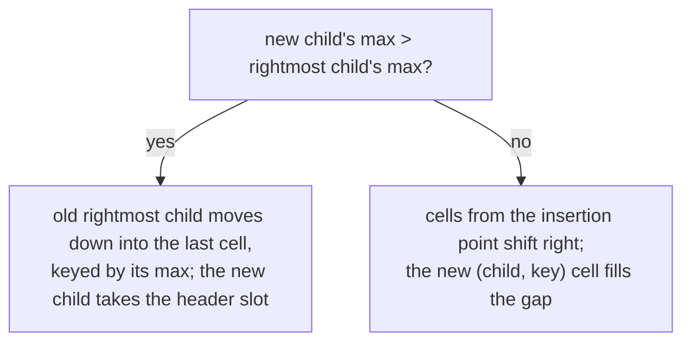
```mermaid
flowchart TD
    A["new child's max > rightmost child's max?"] -->|yes| B["old rightmost child moves down into the last cell,<br/>keyed by its max; the new child takes the header slot"]
    A -->|no| C["cells from the insertion point shift right;<br/>the new (child, key) cell fills the gap"]
```

Inserting 1–30 in ascending order exercises the first branch every time — the
rightmost leaf keeps splitting — and produces a four-leaf tree:


```mermaid
flowchart TD
    R["page 1 · internal root<br/>keys 7 | 14 | 21"]
    L1["page 3 · leaf<br/>1 – 7"]
    L2["page 2 · leaf<br/>8 – 14"]
    L3["page 4 · leaf<br/>15 – 21"]
    L4["page 5 · leaf<br/>22 – 30"]
    R --> L1
    R --> L2
    R --> L3
    R --> L4
    L1 -.->|next_leaf| L2 -.->|next_leaf| L3 -.->|next_leaf| L4
```

Inserting 30–1 in descending order exercises the second branch instead, and the
tutorial's own 30-row test order builds exactly the tree the article prints —
except that its first separator reads `key 7` here, where the article's
pointer-arithmetic bug prints `key 1`.

Each child records its parent's page in bytes 4–7 of its header, which is how a
split finds the node to update.

### Splitting an internal node

When `internal_node_insert` finds the parent full, the parent splits too, in the
same shape as a leaf: **split in place, then grow a new root or update the parent
above.** With *k* keys:

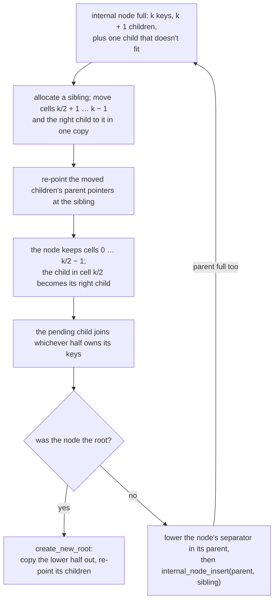
```mermaid
flowchart TD
    A["internal node full: k keys, k + 1 children,<br/>plus one child that doesn't fit"] --> B["allocate a sibling; move cells k/2 + 1 … k − 1<br/>and the right child to it in one copy"]
    B --> C["re-point the moved children's parent pointers at the sibling"]
    C --> D["the node keeps cells 0 … k/2 − 1;<br/>the child in cell k/2 becomes its right child"]
    D --> E["the pending child joins whichever half owns its keys"]
    E --> F{was the node the root?}
    F -->|yes| G["create_new_root:<br/>copy the lower half out, re-point its children"]
    F -->|no| H["lower the node's separator in its parent,<br/>then internal_node_insert(parent, sibling)"]
    H -->|parent full too| A
```

Key *k/2* isn't copied anywhere. It was the maximum of the child that becomes the
lower half's right child, so it's now the lower half's maximum, and the separator
one level up takes over its job. On the 3-key test build, inserting 1–35 in order
makes the root `[7 | 14 | 21]` split when row 35 arrives:

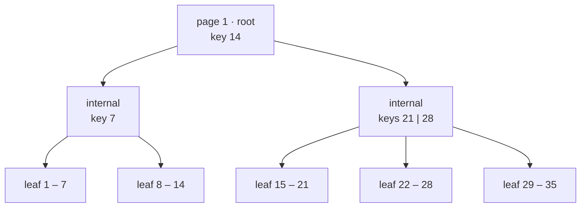
```mermaid
flowchart TD
    R["page 1 · root<br/>key 14"]
    I1["internal<br/>key 7"]
    I2["internal<br/>keys 21 | 28"]
    R --> I1
    R --> I2
    I1 --> A["leaf 1 – 7"]
    I1 --> B["leaf 8 – 14"]
    I2 --> C["leaf 15 – 21"]
    I2 --> D["leaf 22 – 28"]
    I2 --> E["leaf 29 – 35"]
```

Three things make deeper trees work:

- **A subtree's maximum comes from its rightmost leaf.** `get_node_max_key` follows
  right children down to a leaf. An internal node's last separator only bounds the
  child to its left, so it's the wrong answer as soon as a separator has to describe
  a whole subtree.
- **Parent pointers are written wherever a child is attached:** by
  `internal_node_insert` for the child it places, by the split for every child it
  moves, and by `create_new_root` for both halves (and for the children of the copied
  half, when the root was internal). A split deep in the tree follows these pointers
  up, so one stale pointer sends an update to the wrong node.
- **Separators are found by key range.** In a cascade, a node's rightmost leaf may
  have just split, so its current maximum can be below the separator its parent
  still records. `update_internal_node_key` searches for the first separator ≥ that
  maximum, which still lands on the node.

The trees match the tutorial's: the test build reproduces its published seven-leaf,
three-level tree line for line. The route there differs; see
[the divergences](#where-mini-sql-diverges-from-the-tutorial).

### Scan — walking the leaf chain

`table_start` is simply `table_find(table, 0)`: keys are unsigned, so searching
for 0 lands on cell 0 of the leftmost leaf. `cursor_advance` steps through the
leaf's cells, and when it passes the last one it follows `next_leaf` to the
sibling's cell 0 — the scan never climbs back up through the internal nodes. Only
the rightmost leaf has `next_leaf = 0`, and running off it ends the table.

### The cursor invariant

**A cursor always points into a leaf.** Rows live only in leaves, and a cursor on
an internal node would read child page numbers as if they were rows. The invariant
holds by construction — `table_start` and `table_find` are the only constructors,
and both go through the same descent, which stops only at a leaf; `cursor_advance`
only moves along the leaf chain — and `cursor_value` / `cursor_advance` assert it.

---

## Command lifecycle

### INSERT

The binder validates **before** allocating, so a rejected insert never leaks the
record payload. Execution descends to the key's leaf, checks for a duplicate there,
and inserts — splitting the leaf if it's full.

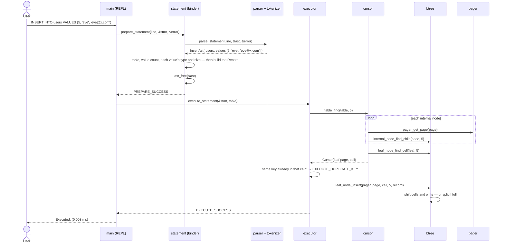
```mermaid
sequenceDiagram
    actor U as User
    participant M as main (REPL)
    participant S as statement (binder)
    participant Q as parser + tokenizer
    participant E as executor
    participant C as cursor
    participant B as btree
    participant P as pager

    U->>M: INSERT INTO users VALUES (5, 'eve', 'eve@x.com');
    M->>S: prepare_statement(line, &stmt, &error)
    S->>Q: parse_statement(line, &ast, &error)
    Q-->>S: InsertAst{ users, values [5, 'eve', 'eve@x.com'] }
    S->>S: table, value count, each value's type and size — then build the Record
    S->>S: ast_free(&ast)
    S-->>M: PREPARE_SUCCESS

    M->>E: execute_statement(&stmt, table)
    E->>C: table_find(table, 5)
    loop each internal node
        C->>P: pager_get_page(page)
        C->>B: internal_node_find_child(node, 5)
    end
    C->>B: leaf_node_find_cell(leaf, 5)
    C-->>E: Cursor(leaf page, cell)
    E->>E: same key already in that cell? → EXECUTE_DUPLICATE_KEY
    E->>B: leaf_node_insert(pager, page, cell, 5, record)
    B->>B: shift cells and write — or split if full
    E-->>M: EXECUTE_SUCCESS
    M-->>U: Executed. (0.003 ms)
```

### SELECT

A full scan: a cursor starts at the leftmost leaf and walks the leaf chain,
deserializing and printing each row until `end_of_table`.

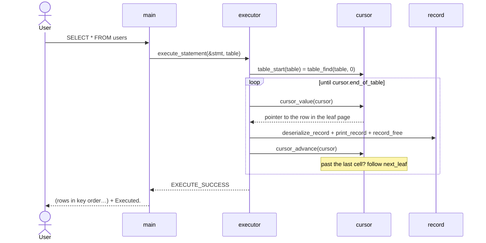
```mermaid
sequenceDiagram
    actor U as User
    participant M as main
    participant E as executor
    participant C as cursor
    participant R as record

    U->>M: SELECT * FROM users;
    M->>E: execute_statement(&stmt, table)
    E->>C: table_start(table) = table_find(table, 0)
    loop until cursor.end_of_table
        E->>C: cursor_value(cursor)
        C-->>E: pointer to the row in the leaf page
        E->>R: deserialize_record + print_record + record_free
        E->>C: cursor_advance(cursor)
        Note over C: past the last cell? follow next_leaf
    end
    E-->>M: EXECUTE_SUCCESS
    M-->>U: (rows in key order…) + Executed.
```

On `.exit`, `db_close` flushes every cached page to the file — that's when the data
becomes durable.

---

## The REPL state machine

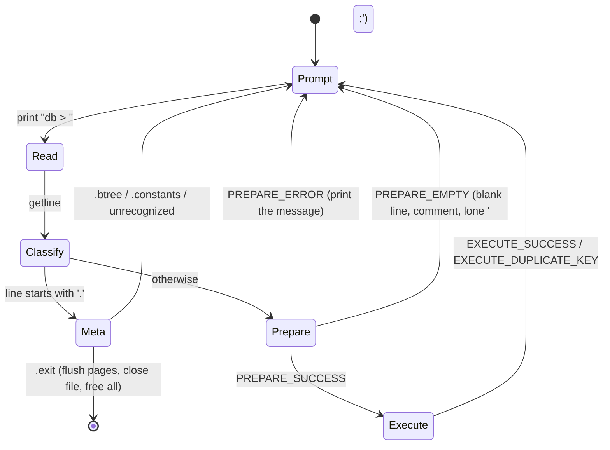
```mermaid
stateDiagram-v2
    [*] --> Prompt
    Prompt --> Read : print "db > "
    Read --> Classify : getline

    Classify --> Meta : line starts with '.'
    Classify --> Prepare : otherwise

    Meta --> Prompt : .btree / .constants / unrecognized
    Meta --> [*] : .exit (flush pages, close file, free all)

    Prepare --> Execute : PREPARE_SUCCESS
    Prepare --> Prompt : PREPARE_ERROR (print the message)
    Prepare --> Prompt : PREPARE_EMPTY (blank line, comment, lone ';')

    Execute --> Prompt : EXECUTE_SUCCESS / EXECUTE_DUPLICATE_KEY
```

The loop is infinite by construction; the only exit is `.exit`, which calls
`db_close` (flush + close file + free pager, schema, and table) and then `exit()`
from inside `do_meta_command`. There is no fall-through cleanup path because control
never reaches the end of `main`.

---

## Parsing and validation

A line of SQL goes through three layers, each knowing only the one below it:

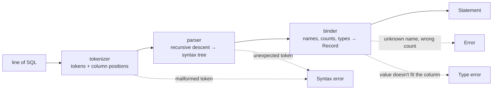
```mermaid
flowchart LR
    L["line of SQL"] --> T["tokenizer<br/>tokens + column positions"]
    T --> P["parser<br/>recursive descent → syntax tree"]
    P --> B["binder<br/>names, counts, types → Record"]
    B --> S["Statement"]
    T -.->|malformed token| E1["Syntax error"]
    P -.->|unexpected token| E1
    B -.->|unknown name, wrong count| E2["Error"]
    B -.->|value doesn't fit the column| E3["Type error"]
```

The parser knows nothing about schemas — a table name is just text to it — which is
what will let the catalog re-parse a stored `CREATE TABLE` before the table exists.
The binder knows nothing about token positions.

**Tokens.** The lexical rules cover every statement the engine is planned to
support, so later stages only add grammar:

| Class | Rule |
| --- | --- |
| Keywords (any case, reserved) | `SELECT INSERT INTO VALUES FROM WHERE CREATE TABLE DELETE AND OR NOT PRIMARY KEY INT TEXT EXPLAIN` |
| Identifier | `[A-Za-z_][A-Za-z0-9_]*`, not a keyword; compared ignoring case |
| Integer | `[0-9]+`; digits running into letters (`7x`) are a malformed number; overflow is flagged, never computed |
| String | `'…'`, with `''` for a quote inside it |
| Symbols | `( ) , ; * -` and `= != <> < <= > >=` |
| Skipped | spaces, tabs, `\r`, and `-- comments` to the end of the line |

**Grammar**, one parser function per rule:

```text
statement := [ insert | select ] [ ';' ] END
insert    := INSERT INTO name [ '(' name { ',' name } ')' ] VALUES '(' literal { ',' literal } ')'
select    := SELECT '*' FROM name
literal   := [ '-' ] INTEGER | STRING
```

The parser stops at the first error and frees whatever it had built. Anything after
a complete statement — a second statement, or a clause that isn't supported yet —
is a syntax error, not something to ignore.

**Binding.** The binder's checks run from the statement's shape down to single
values, so the error reported is the most basic thing wrong, and every check runs
before the row is allocated:

1. the table exists;
2. a column list, if given, names only real columns, each once;
3. there are as many values as columns;
4. a column list leaves no column out — there are no NULLs or defaults;
5. each value fits its column: INT takes an integer within int32 that isn't
   negative, TEXT(n) takes a string of at most n bytes.

Every message carries its category:

| Input | Message |
| --- | --- |
| `SELECT * FORM users` | `Syntax error: expected FROM near 'FORM' at column 10.` |
| `… VALUES (1, 'bob)` | `Syntax error: unterminated string starting at column 30.` |
| `… VALUES (7x, …)` | `Syntax error: malformed number '7x' at column 27.` |
| `SELECT * FROM users junk` | `Syntax error: expected end of statement near 'junk' at column 21.` |
| `INSERT INTO orders …` | `Error: no such table: orders.` |
| `… (id, email) VALUES (1, 'a@b')` | `Error: column 'username' has no value.` |
| `… VALUES (1, 'bob')` | `Error: 2 values for 3 columns.` |
| `… VALUES ('abc', …)` | `Type error: column 'id' is INT, but 'abc' is text.` |
| `… VALUES (3000000000, …)` | `Type error: 3000000000 is out of range for INT column 'id'.` |
| a 33-byte username | `Type error: column 'username' is TEXT(32), but the value is 33 bytes.` |
| `… VALUES (-1, …)` | `Error: column 'id' must not be negative.` |
| an id that's already stored | `Error: Duplicate key.` (from the executor) |

> Note: the "not negative" rule applies to every `INT` column for now. It narrows to
> the primary key once `CREATE TABLE` can declare one.

---

## Memory ownership

Explicit ownership is the spine of a C codebase. The rules, drawn:

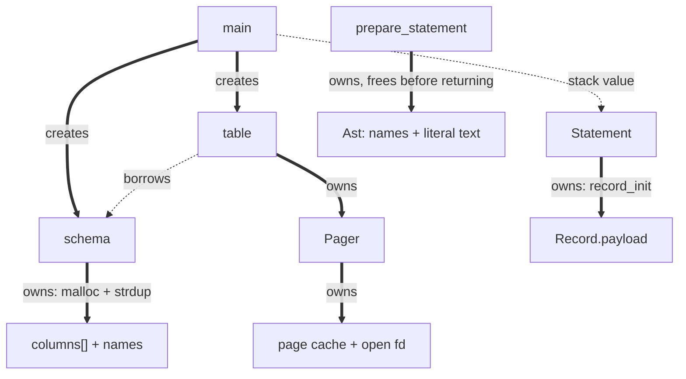
```mermaid
flowchart TD
    main ==>|creates| schema
    main ==>|creates| table
    main -.->|stack value| stmt["Statement"]

    schema ==>|owns: malloc + strdup| cols["columns[] + names"]
    table ==>|owns| pager["Pager"]
    pager ==>|owns| pagesfd["page cache + open fd"]
    table -.->|borrows| schema
    stmt ==>|owns: record_init| payload["Record.payload"]
    prep["prepare_statement"] ==>|owns, frees before returning| ast["Ast: names + literal text"]
```

Legend: **thick arrow = owns/frees**, **dotted arrow = borrows or stack**.

Lifecycle rules:

- `schema_create` deep-copies the caller's column array and `strdup`s each name, so
  the source array may be a stack literal in `main`.
- `db_open` opens the file (via `pager_open`) and stores a **borrowed** `Schema*`.
  For a new file it writes the header on page 0 and an empty root leaf on page 1;
  for an existing one it validates the header and exits without writing anything
  if the file isn't one it can read.
- New nodes get their page from `get_unused_page_num` — the page just past the end
  of the file — and are cached like any other page, zero-filled. Nothing is
  reserved until the page is fetched, so callers fetch a page before allocating the
  next one; a fetch further past the end is refused as a bug.
- The page cache is an array of page pointers that doubles as the file grows. Only
  the array moves: each page is its own allocation, so a node pointer the B-tree
  holds stays valid while it fetches other pages.
- `db_close` is the single teardown path: it flushes every cached page, then
  `pager_close` (closes the fd + frees the cache), then `schema_free`, then frees the
  table. `.exit` is the only caller.
- `prepare_statement` owns the syntax tree for exactly one call: the parser frees a
  partly built tree itself when it hits an error, and `prepare_statement` frees a
  complete one after binding, whether binding succeeded or not. Everything the
  executor needs is copied into the `Statement` first.
- Each REPL iteration zero-initializes `Statement statement = {0}` and calls
  `record_free` after execution — a no-op for `select` (NULL payload), the real free
  for `insert`. The `Cursor` is `malloc`'d per statement and freed at the end of
  each execute, including on the duplicate-key path.

---

## Build system

CMake builds the engine twice from one source list, `MINI_SQL_SOURCES`: once as
shipped, and once as a test build whose internal nodes are capped at 3 keys.

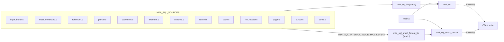
```mermaid
flowchart LR
    subgraph src["MINI_SQL_SOURCES"]
        a[input_buffer.c]
        b[meta_command.c]
        k[tokenizer.c]
        l[parser.c]
        c[statement.c]
        d[executor.c]
        e[schema.c]
        f[record.c]
        g[table.c]
        m[file_header.c]
        h[pager.c]
        i[cursor.c]
        j[btree.c]
    end
    src --> lib["mini_sql_lib (static)"]
    src -->|"MINI_SQL_INTERNAL_NODE_MAX_KEYS=3"| slib["mini_sql_small_fanout_lib (static)"]
    main_c[main.c] --> exe["mini_sql"]
    main_c --> sexe["mini_sql_small_fanout"]
    lib --> exe
    slib --> sexe
    exe -.->|driven by| tests["CTest suite"]
    sexe -.->|driven by| tests
```

Compiled with `-Wall -Wextra -Wpedantic` under strict C11 (`CMAKE_C_EXTENSIONS
OFF`), and emits `compile_commands.json` for clangd. The library/executable split
exists so the test and benchmark targets can link the engine in one line without
recompiling every source. The small-fan-out build exists only for the tests: with
510 keys per internal node, filling one takes thousands of rows, while 3 takes a
few dozen. (`pager.c` and `schema.c` define `_POSIX_C_SOURCE` so the POSIX file
calls and `strdup` resolve under strict C11.)

---

## Testing

Black-box, output-asserting tests in the style of the tutorial's rspec suite, but
implemented as a dependency-free bash script and registered with CTest — one entry
per case, so a failure names itself.

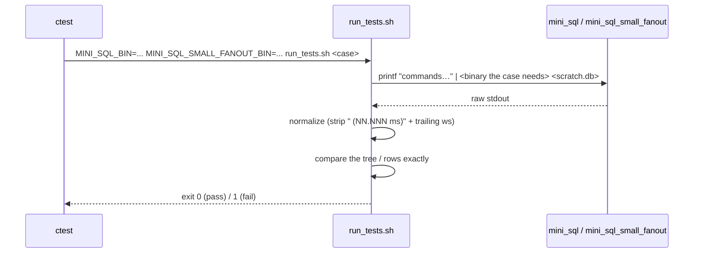
```mermaid
sequenceDiagram
    participant CT as ctest
    participant SH as run_tests.sh
    participant DB as mini_sql / mini_sql_small_fanout

    CT->>SH: MINI_SQL_BIN=... MINI_SQL_SMALL_FANOUT_BIN=... run_tests.sh <case>
    SH->>DB: printf "commands…" | <binary the case needs> <scratch.db>
    DB-->>SH: raw stdout
    SH->>SH: normalize (strip " (NN.NNN ms)" + trailing ws)
    SH->>SH: compare the tree / rows exactly
    SH-->>CT: exit 0 (pass) / 1 (fail)
```

Every case receives both binaries. The internal-split cases drive the 3-key test
build, and first check through `.constants` that it really got that build; the
rest drive the real `mini_sql`.

The 22 cases:

| Area | Cases |
| --- | --- |
| Basics | insert/select round trip; max-length strings; over-length strings in either column; negative id |
| SQL syntax | every syntax error, with its exact message and column: misspelled and missing keywords, unterminated strings, malformed numbers, stray characters, trailing tokens, unsupported clauses, reserved words as names, the tutorial's old syntax, and long tokens cut short in the message; none of them changes the table |
| Binding | unknown table and column, a column listed twice or left out, the wrong number of values, text in an INT column and an integer in a TEXT one, INT range edges (2147483647 and -0 accepted; 2147483648, -2147483649 and a 23-digit number rejected), negative values |
| Lexical rules | keywords and names in any case, reordered column lists, `''` inside strings, text holding spaces, commas, semicolons and `--`, tabs and extra whitespace, optional `;`, comments, silent blank lines, and a final line with no newline |
| Persistence | rows survive a reopen |
| Layout | `.constants` pins every size and offset, and the real 510-key internal capacity |
| Tree shape | one sorted leaf; a root split under four insertion orders; the split survives a reopen; inserts routed left and right after the split, including a key equal to the separator; four-leaf trees from splits below the root under ascending, descending and the tutorial's pseudorandom order, surviving a reopen |
| Internal splits | the tutorial's published three-level tree, line for line; trees four and five levels deep from 210 rows ascending, descending and scrambled, checked against the B+ tree invariants; a deep tree reopened and split all over again through parent pointers read from disk, then reopened once more |
| Duplicates | rejected in a single leaf, in either leaf of a split tree, and in a four-leaf tree for keys equal to a separator and just past the last one |
| Scans | every row in key order across leaves, for four insertion orders and across a reopen, and across four leaves and deep trees; an empty table |
| Large tables | on the real binary, 3,583 ascending rows fill a 510-key root exactly and row 3,584 splits it — the real fan-out's first internal split — with every row reachable before and after a reopen |
| File header | a new file's magic, format version, page size and root page; a header that stays byte-identical as the table grows and across a reopen, with its reserved bytes zero; two files built from the same statements, byte-identical |
| Refused files | a page of zeros, a file from before the header existed, a page of text, and good headers patched to format 2, 8192-byte pages, root page 0 and root page 99 — each refused with its message and a failing exit status, and left byte for byte unchanged |

How the suite earns its trust:

- **Exact comparison.** Tree shapes and scan results are compared line for line
  (`btree_block`, `select_rows`), because a substring check can't tell `- 1` from
  `- 10`.
- **An invariant checker for trees too big to spell out.** `btree_check` reads a
  printed tree and fails on the first broken B+ tree rule: keys not strictly
  increasing, a separator that isn't the largest key on its left, a node whose size
  disagrees with its contents or whose children and keys don't alternate, an empty
  or overfull node, or leaves at different depths. It was itself tested against
  doctored trees breaking each rule. It catches damage a scan can't see: a
  misfiled subtree still returns every row through the leaf chain.
- **Insertion orders chosen to hit each branch.** The split tests insert the same
  14 keys ascending, descending, and with the splitting key landing as the left
  half's last cell and as the right half's first — the exact boundary where an
  off-by-one would hide.
- **Mutation checks.** Every B-tree stage was verified by deliberately breaking the
  code and confirming the suite fails:
  - an off-by-one at the split boundary
  - `>` instead of `>=` when routing past a separator
  - a missing sibling link
  - a skipped separator update
  - a new child that never takes over the right-child slot
  - a subtree maximum taken from the last separator
  - a pending child sent to the wrong half
  - parent pointers left stale by a root split, by moved children, or by an insert
  - three of the tutorial's own bugs:
    - its split bug reproduces the exact corrupted row, `(1919251317, 14,
      on14@example.com)`
    - its `internal_node_key` bug reproduces its published four-leaf tree, `key 1`
      and all
    - its parent-pointer overwrite misfiles a subtree under the scrambled insertion
      order, which only the invariant checker notices
- **Front-end mutation checks.** Matching keywords case-sensitively, leaving `''`
  unescaped, ignoring trailing tokens, skipping the binder's type check, lexing `7x`
  as `7`, and cutting the last byte of an unterminated final line each fail a test.
- **Storage mutation checks.** Capping the page cache at 100 pages again, skipping
  the version, page-size or root check, and ignoring the header's root page each
  fail a test. One change can't be caught on macOS: allocating new pages with
  `malloc` instead of `calloc`, because a fresh 4 KiB allocation there is zeroed
  anyway. The zeroing is a guarantee for platforms where it isn't.
- **Sanitizers.** The B-tree stages were each run under AddressSanitizer and
  UndefinedBehaviorSanitizer, which is what surfaced the misaligned loads in the
  tutorial's node layout.
- **Fuzzing and leak checks for the front end.** 20,000 lines of random token soup
  and byte-level mutations of valid statements ran through the sanitized binary
  without a single report, and `leaks --atExit` finds nothing after a script that
  hits every kind of error — including the partly built syntax trees freed on the
  way out.
- **Timeouts.** Scans follow on-disk pointers, so each test has a 10-second limit
  that turns a pointer cycle into a fast failure instead of a hang.

```sh
ctest --test-dir build --output-on-failure
```

---

## Design decisions

**Schema-driven, not struct-driven.** The tutorial's `Row` struct bakes the row
layout into the compiler; `ALTER TABLE` is then impossible without changing C source.
`mini-sql` computes the layout in `schema_create`, so a row is just bytes plus a
ruler. Cost: a layer of indirection now. Payoff: runtime `CREATE TABLE` / `ALTER`
later with no change to `record`, `btree`, or `executor`.

**Storage behind a cursor.** `execute_insert` / `execute_select` reach rows only
through a cursor. That abstraction paid off when the table became a B-tree: the
executor's scan loop didn't change at all.

**One-way layering, mirroring SQLite.** `btree` works in pages and node bytes and
knows nothing about tables or cursors. Its search functions return *positions
within a node* (a cell index, a child index), and `cursor` chains them into
navigation with an iterative descent loop. Each layer can be tested and reasoned
about without the ones above it.

**Naturally aligned node layout.** An 8-byte common header and a cell size rounded
to a multiple of four keep every `uint32_t` field aligned, so reading a field
through a pointer is well-defined C on any architecture. Same capacity as the
packed layout.

**The root never moves.** A root split copies the old root out rather than moving
the new root in, so the root page the header records stays right forever and
nothing has to be updated when the tree grows a level.

**Refuse, never misread.** A file is checked against its header before a single
page is interpreted, and every format change bumps the version. The worst an old or
foreign file can get is a clear refusal — never wrong answers, and never a write.

**Invariants by construction, then asserted.** "A cursor always points into a leaf"
isn't checked in scattered places — the only two ways to create a cursor go through
the same descent that stops only at leaves, and the functions that rely on it assert
it.

**Test knobs live in a test build.** Reaching a full internal node at the real
fan-out takes thousands of rows, so the tutorial shrinks the engine's capacity to 3
"for testing". Here the engine keeps the capacity its page actually has, and the
small value is a compile-time option used only by a second, test-only binary —
the same approach SQLite takes with its `SQLITE_*` build options.

**One shape for every split.** Leaf or internal, a split happens in place, then
either grows a new root or lowers a separator and inserts the sibling one level up.
The two splits differ only in how they move cells, so the parent-update logic —
where most B-tree bugs live — exists once.

**Loud boundaries over wrong answers.** While a feature is missing, the code path
that would need it stops with a message naming it (`Need to implement …`) instead
of returning plausible-looking garbage. Tests pin each boundary, and the stage that
implements the feature deliberately flips the test.

**Address columns by stable `column_id`.** Never by name or ordinal. `RENAME` becomes
a metadata edit; `DROP` becomes a flag; neither disturbs other columns' data.

**Parse, then bind.** The parser turns text into a syntax tree without knowing any
schema; the binder checks that tree against the table. Syntax errors and schema
errors come from different layers with different information — a token's column,
or a column's type — and the parser can read a statement about a table that
doesn't exist yet, which the catalog will need.

**Validate before allocate.** The binder proves the whole statement is valid before
calling `record_init`. Early returns can't leak, and there's no half-built record to
unwind.

**One error, the first one.** The parser stops at the first unexpected token, and
the binder checks from the statement's shape down to single values. The message
names the most basic problem rather than a cascade of consequences.

**`%.*s`, not `%s`, when printing text.** A maximum-width text field has no room for a
NUL terminator. Bounding the print to `column->size` means `mini-sql` never had the
"garbage bytes on max-length strings" bug the tutorial hits — and never needed the
"+1 byte" struct fix, because there is no struct.

---

## Where mini-sql diverges from the tutorial

| The tutorial | mini-sql | Why it matters |
| --- | --- | --- |
| A fixed `Row` struct with compile-time offsets | A runtime `Schema` computes every offset | `CREATE TABLE` / `ALTER TABLE` stay possible |
| `insert 1 user email` split on spaces (`sscanf`, later `strtok`), with a few fixed error messages | SQL through a tokenizer, a recursive-descent parser and a binder, with errors that name the problem and its column | Text can hold spaces and quotes; `insert abc …` is an error, not id 0 |
| Row text buffers need a `+1` for the NUL | Width-bounded printing (`%.*s`) | No struct, so the max-length-string bug never existed |
| Packed 6-byte node header | Aligned 8-byte header, 4-byte-multiple cells | `uint32_t` loads are UBSan-clean |
| The leaf split writes the new row at the start of the cell and never writes its key | Key and row go into their own slots | The corruption the tutorial discovers two parts later never happened here |
| `internal_node_key` adds 4 to a `uint32_t*` — 16 bytes, not 4 | Byte arithmetic | Separator keys sit at the right offset; the article's four-leaf tree prints `key 1` where mini-sql prints `key 7` |
| Internal nodes capped at 3 keys "for testing" | The real 510; a separate test binary is built with 3 | The engine uses the page it has, and tests still reach a full node cheaply |
| When the rightmost child splits, the separator update writes a key one past the node's last cell | Skipped — the rightmost child has no separator | No writes outside the node's live cells |
| A full parent's key count is bumped before aborting | Checked before anything changes | The count never disagrees with the cells |
| A root split creates the new root first and splits the copy; the sibling is built by re-inserting children one at a time | Split in place, then create the root; the upper half moves in one copy | One split shape; linear instead of quadratic in the node size |
| Needs special cases for an empty internal node | The sibling is created with all its cells, so an empty internal node never exists | Fewer states to get wrong |
| After inserting the new sibling into its parent, resets the sibling's parent pointer to the old node's | The insert that finally places the sibling sets its parent | The tutorial's pointer is wrong whenever the parent's own split separates the siblings, and a later split then misfiles a subtree |
| Mutual recursion between two search functions that return cursors | An iterative descent in `cursor`; `btree` returns indices | `btree` stays free of cursors; no recursion |
| As written in the articles, the duplicate check reads the root node | It reads the leaf the cursor landed in | Correct as soon as the root splits |
| A cursor leaks on a duplicate key | Freed | No leak per rejected insert |
| `select` after the first split prints a corrupted row until scans are implemented | It stopped with an explicit message until then | Missing features fail loudly |
| rspec tests; the deep-tree test compares its lines as an unordered set | bash + CTest, exact comparisons, an invariant checker, sanitizers, mutation checks | Tests that demonstrably catch the bugs above |

---

## Roadmap

Built bottom-up so something runs at every step. The tutorial's storage engine is
finished; what follows grows it into a small SQL database in six stages, each with
its own design review.


```mermaid
flowchart LR
    A["tutorial 1–14 · REPL, pager, cursor, B+ tree"] --> S1["1 · SQL tokenizer + parser"]
    S1 --> S2["2 · storage: growable pager, file header"]
    S2 --> S3["3 · catalog, CREATE TABLE, many tables"]
    S3 --> S4["4 · typed WHERE, range scans, EXPLAIN"]
    S4 --> S5["5 · DELETE with rebalancing"]
    S5 --> S6["6 · error audit, benchmark"]

    classDef done fill:#d6f5d6,stroke:#3a9a3a;
    classDef now fill:#fff2cc,stroke:#bba12a;
    classDef todo fill:#eeeeee,stroke:#999999;

    class A,S1,S2 done;
    class S3 now;
    class S4,S5,S6 todo;
```

- **Done — the tutorial (1–14):** REPL, schema-driven rows, a file-backed pager, the
  cursor abstraction, and the whole B+ tree: sorted leaves with binary search,
  duplicate-key rejection, splits at every level cascading up to a new root, and
  leaf-chain scans.
- **Done — Stage 1, SQL front end:** a tokenizer, a recursive-descent parser and a
  binder for `INSERT` and `SELECT *`, with syntax and type errors that say what and
  where.
- **Done — Stage 2, storage foundation:** a page cache that grows with the file
  instead of stopping at 100 pages, and a versioned header on page 0 that refuses
  foreign, older or corrupt files cleanly. With the page limit gone, the real
  binary reaches its first 510-key internal split at 3,584 ascending rows.
- **Next — Stage 3, catalog and `CREATE TABLE`:** the catalog is itself a B-tree
  table holding each table's name, root page and `CREATE TABLE` text, re-parsed on
  open. The header records the catalog's root instead of a single table's, which
  makes it file format 2. Many tables share one file; the hardcoded `users` table
  goes away.
- **Stage 4 — `SELECT` column lists, typed `WHERE`, range scans:** conditions on the
  primary key become a point lookup or a seek plus a bounded walk along the leaf
  chain, and `EXPLAIN` shows which plan was chosen.
- **Stage 5 — `DELETE`:** borrowing from and merging with siblings, collapsing the
  root, and reusing freed pages, so the tree stays balanced.
- **Stage 6 — error audit and presentation:** every storage failure reports an error
  instead of ending the process, plus a benchmark of lookups against scans.
- **Later, perhaps:** dropping on-disk parent pointers for a path kept by the cursor,
  as SQLite does, which would save a split from fetching every child it moves.

---

## Project layout

```text
mini-sql/
├── CMakeLists.txt          # mini_sql_lib + mini_sql, and a 3-key-fan-out test build
├── include/
│   ├── input_buffer.h      # line reader
│   ├── meta_command.h      # dot-commands
│   ├── tokenizer.h         # TokenType, Token, Tokenizer
│   ├── parser.h            # syntax tree (Ast, Literal), SqlError, parse_statement
│   ├── schema.h            # ColumnType, ColumnDefinition, Schema
│   ├── record.h            # Record + (de)serialization
│   ├── pager.h             # Pager, PAGE_SIZE, the growable page cache, page allocation
│   ├── file_header.h       # page 0's layout, FILE_FORMAT_VERSION, header checks
│   ├── btree.h             # node formats, search, insert/split, tree printer
│   ├── table.h             # Table + db_open / db_close
│   ├── cursor.h            # Cursor + start/find/value/advance
│   ├── statement.h         # Statement, PrepareResult, the binder's entry point
│   └── executor.h          # ExecuteResult, execute_statement
├── src/
│   ├── input_buffer.c
│   ├── meta_command.c
│   ├── tokenizer.c
│   ├── parser.c
│   ├── schema.c
│   ├── record.c
│   ├── pager.c
│   ├── file_header.c
│   ├── btree.c
│   ├── table.c
│   ├── cursor.c
│   ├── statement.c
│   ├── executor.c
│   └── main.c              # REPL — the only file with no header
└── tests/
    └── run_tests.sh        # black-box suite, driven by CTest
```

---

## Limitations & non-goals

This is a learning engine. Known gaps, most of them on the [roadmap](#roadmap):

- **Memory** — the page cache never evicts, so every page a session touches stays in
  memory until `.exit`: 4 KiB per page, which for 100,000 rows inserted in order is
  a 56 MB file and 58 MB of memory at peak. Close writes every loaded page, changed
  or not. Files over 4 GiB aren't supported (the
  file's length is read into 32 bits), though memory runs out well before that.
- **Crash safety** — pages are flushed only on a clean `.exit`; kill the process, or
  hit a fatal error, and unsaved changes are lost. No rollback journal or WAL.
- **Older files** — files written before the header existed are refused (the header
  is the last format change that couldn't be detected); delete and recreate them.
  Stage 3 moves to format 2, and format-1 files will be refused the same way.
- **A small SQL dialect** — so far `INSERT` and `SELECT *` on one hardcoded `users`
  table, one statement per line, INT and TEXT(n) columns only, no NULLs or defaults.
  `WHERE` and `DELETE` are on the roadmap; `UPDATE`, joins and subqueries are not.
  The keywords are reserved, so a table or column can't be named `key` or `text`.
- **A bytecode VM** — the binder hands the executor a ready-to-run statement; there
  is no code generator and no VDBE.
- **Concurrent** — single-threaded, no locking.

The aim is a correct, legible core that grows one well-understood layer at a time.

---

*Built by following cstack's tutorial, with a schema-driven spine bolted in from the
start.*
