# mini-sql

A SQLite-style database engine, built from scratch in C — one layer at a time.

> Small. Schema-driven. Honest about what it isn't (yet).

`mini-sql` is a teaching/learning implementation that follows the spirit of
[cstack's *Let's Build a Simple Database*](https://cstack.github.io/db_tutorial/),
but **deliberately diverges in one important way**: where the tutorial hardcodes
a single `Row` struct and compile-time byte offsets, `mini-sql` is **schema-driven
from the first commit**. The layout of a row is *computed at runtime* from a
`Schema`, not frozen by the C compiler. That single decision is what made
`CREATE TABLE` and any number of tables possible without a rewrite.

Today it holds **any number of tables in one file**, each defined at runtime with
`CREATE TABLE` and recorded in a catalog that is itself a table. Every table is a
**persistent B+ tree**: rows are kept sorted by primary key in 4 KiB leaf pages;
internal pages route lookups, so finding a key costs one binary search per level;
full nodes, leaf or internal, split and cascade up to a new root, so the tree grows
to any depth; and a chain of sibling pointers lets a scan return every row in key
order. The pager caches pages in memory and writes them to a single database file.
Every part of the tutorial's storage engine is in place.

---

## Table of contents

- [Quick start](#quick-start)
- [What works today](#what-works-today)
- [Architecture at a glance](#architecture-at-a-glance)
- [How it maps to SQLite](#how-it-maps-to-sqlite)
- [Module dependency graph](#module-dependency-graph)
- [The data model](#the-data-model)
- [Row layout](#row-layout)
- [On-disk format](#on-disk-format)
- [How the B-tree works](#how-the-b-tree-works)
- [Command lifecycle](#command-lifecycle)
- [The REPL state machine](#the-repl-state-machine)
- [Parsing and validation](#parsing-and-validation)
- [Query planning](#query-planning)
- [Memory ownership](#memory-ownership)
- [Build system](#build-system)
- [Testing](#testing)
- [Design decisions](#design-decisions)
- [Where mini-sql diverges from the tutorial](#where-mini-sql-diverges-from-the-tutorial)
- [Roadmap](#roadmap)
- [Project layout](#project-layout)
- [Limitations & non-goals](#limitations--non-goals)

---

## Quick start

```sh
cmake -S . -B build           # configure
cmake --build build           # compile
./build/mini_sql mydb.db      # run the REPL against a database file
ctest --test-dir build        # run the test suite
```

The binary takes the database filename as an argument and reads one SQL statement
per line. A new database has no tables until you create them. Rows are stored in
key order whatever order they arrive in, duplicate keys are rejected, bad
statements say exactly what's wrong, and everything survives a restart:

```text
$ ./build/mini_sql mydb.db
db > CREATE TABLE users (id INT PRIMARY KEY, username TEXT(32), email TEXT(255));
Executed. (0.002 ms)
db > INSERT INTO users VALUES (3, 'carol', 'carol@example.com');
Executed. (0.000 ms)
db > INSERT INTO users VALUES (1, 'alice', 'alice@example.com');
Executed. (0.000 ms)
db > INSERT INTO users (email, id, username) VALUES ('bob@example.com', 2, 'Bob Smith');
Executed. (0.000 ms)
db > INSERT INTO users VALUES (1, 'again', 'again@example.com');
Error: Duplicate key.
db > INSERT INTO users VALUES ('four', 'dan', 'dan@example.com');
Type error: column 'id' is INT, but 'four' is text.
db > SELECT * FORM users;
Syntax error: expected FROM near 'FORM' at column 10.
db > CREATE TABLE orders (total INT, id INT PRIMARY KEY, note TEXT(40));
Executed. (0.001 ms)
db > INSERT INTO orders VALUES (-5, 7, 'refund');
Executed. (0.001 ms)
db > .tables
users
orders
db > .btree users
Tree:
- leaf (size 3)
  - 1
  - 2
  - 3
db > .exit

$ ./build/mini_sql mydb.db
db > SELECT * FROM users;
(1, alice, alice@example.com)
(2, Bob Smith, bob@example.com)
(3, carol, carol@example.com)
Executed. (0.005 ms)
db > .schema orders
CREATE TABLE orders (total INT, id INT PRIMARY KEY, note TEXT(40));
db > .exit
```

`SELECT` takes a column list and a typed `WHERE`. Conditions on the primary key
become a point lookup or a range scan that reads only the rows it needs — `EXPLAIN`
shows the plan, and `.stats` how many rows the last `SELECT` read. On a table of
1,000 users:

```text
db > SELECT username, id FROM users WHERE id > 500 AND id <= 503;
(user501, 501)
(user502, 502)
(user503, 503)
Executed. (0.003 ms)
db > .stats
Rows examined: 3
db > SELECT id FROM users WHERE username = 'user42';
(42)
Executed. (0.183 ms)
db > .stats
Rows examined: 1000
db > EXPLAIN SELECT * FROM users WHERE id >= 10 AND id < 20 AND username != 'x';
SEARCH users USING PRIMARY KEY (id >= 10 AND id <= 19)
Executed. (0.000 ms)
db > SELECT * FROM users WHERE id = 'ten';
Type error: cannot compare INT column 'id' with 'ten'.
```

`DELETE` takes the same `WHERE` and picks its rows the same way. The tree stays
balanced as rows go, and the pages it no longer needs are kept for reuse:

```text
db > EXPLAIN DELETE FROM users WHERE id > 10;
SEARCH users USING PRIMARY KEY (id >= 11)
Executed. (0.001 ms)
db > DELETE FROM users WHERE id > 10;
Executed. (0.545 ms)
db > .stats
Rows examined: 990
db > DELETE FROM users WHERE username = 'user3';
Executed. (0.001 ms)
db > SELECT id FROM users;
(1)
(2)
(4)
…
(10)
Executed. (0.002 ms)
```

`.tables` lists the tables and `.schema [TABLE]` prints their definitions;
`.btree TABLE` prints a table's tree and `.constants [TABLE]` the on-page layout
sizes. The trailing `;` is optional, keywords and names ignore case, and `--`
starts a comment.

Requirements: a C11 compiler (Apple Clang / GCC), CMake ≥ 3.20, and `bash` for the
tests. No third-party libraries.

---

## What works today

| Capability | Status |
| --- | --- |
| Interactive REPL with `db >` prompt | ✅ |
| Meta-commands: `.exit`, `.tables`, `.schema`, `.btree`, `.constants`, `.stats` | ✅ |
| **SQL front end**: tokenizer, recursive-descent parser, binder | ✅ |
| **`CREATE TABLE`** with INT and TEXT(n) columns and an INT PRIMARY KEY, validated | ✅ |
| **Any number of tables** in one file, listed in a catalog that is itself a table | ✅ |
| `INSERT INTO t [(columns)] VALUES (…)` | ✅ |
| `SELECT * \| col, … FROM t` — rows in primary-key order | ✅ |
| **Typed `WHERE`**: `= != <> < <= > >=`, `AND` / `OR` / `NOT`, parentheses | ✅ |
| **Point lookups and range scans** on the primary key, planned from the `WHERE` | ✅ |
| **`EXPLAIN`** for the chosen plan, **`.stats`** for rows read | ✅ |
| **Syntax, type and schema errors** that name the problem and, for syntax, its column | ✅ |
| **B+ tree storage**: sorted leaves, internal routing nodes | ✅ |
| **O(log n) lookup**: binary search per node, descending from the root | ✅ |
| **Duplicate primary keys rejected** | ✅ |
| **Leaf splits** that grow a new internal root | ✅ |
| **Splits below the root** that update the parent's separators and children | ✅ |
| **Internal-node splits** that cascade up to a new root — a tree of any depth | ✅ |
| **Scans across leaves** through a sibling-pointer chain | ✅ |
| Input validation (syntax, negative keys, over-length text) | ✅ |
| Schema-driven row (de)serialization, with layouts from `CREATE TABLE` | ✅ |
| Persistence to a single database file | ✅ |
| **Page cache that grows with the file** — no page limit | ✅ |
| **Versioned file header**: foreign, older or corrupt files are refused, never misread | ✅ |
| Per-statement execution timing | ✅ |
| **`DELETE FROM t [WHERE …]`**, planned like `SELECT` | ✅ |
| **Rebalancing on delete**: borrow, merge, cascade, root collapse — nodes stay half full | ✅ |
| **Free list**: pages emptied by deletes are reused before the file grows | ✅ |
| Black-box test suite (34 CTest cases) with a B+ tree invariant checker | ✅ |
| `UPDATE` | ⛔ |
| `ORDER BY`, `LIMIT`, aggregates, secondary indexes | ⛔ |
| `DROP TABLE`, `ALTER TABLE` | ⛔ |
| Crash safety (journal / WAL) | ⛔ flush happens only on clean `.exit` |

---

## Architecture at a glance

The engine is a classic **front-end / back-end** split. The front end turns text
into a validated `Statement` in three steps — tokens, a syntax tree, then a check
against the database's tables; the back end executes it through a cursor, which
navigates the table's B-tree, which reads and writes pages through the pager. The
database ties it together: it owns the file, the catalog and the open tables.

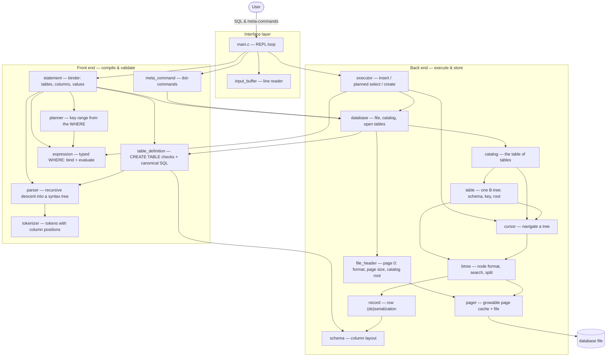
```mermaid
flowchart TD
    User([User]) -->|SQL & meta-commands| REPL

    subgraph Interface["Interface layer"]
        REPL["main.c — REPL loop"]
        IB["input_buffer — line reader"]
    end

    subgraph Frontend["Front end — compile & validate"]
        META["meta_command — dot-commands"]
        STMT["statement — binder: tables, columns, values"]
        DEF["table_definition — CREATE TABLE checks + canonical SQL"]
        EXPR["expression — typed WHERE: bind + evaluate"]
        PLAN["planner — key range from the WHERE"]
        PARSE["parser — recursive descent into a syntax tree"]
        TOK["tokenizer — tokens with column positions"]
    end

    subgraph Backend["Back end — execute & store"]
        EXEC["executor — insert / planned select / create"]
        DB["database — file, catalog, open tables"]
        CAT["catalog — the table of tables"]
        TABLE["table — one B-tree: schema, key, root"]
        CUR["cursor — navigate a tree"]
        HDR["file_header — page 0: format, page size, catalog root"]
        BTREE["btree — node format, search, split"]
        REC["record — row (de)serialization"]
        SCHEMA["schema — column layout"]
        PAGER["pager — growable page cache + file"]
    end

    FILE[("database file")]

    REPL --> IB
    REPL --> META
    REPL --> STMT
    REPL --> EXEC
    STMT --> PARSE
    STMT --> DEF
    STMT --> DB
    STMT --> EXPR
    STMT --> PLAN
    PLAN --> EXPR
    PARSE --> TOK
    DEF --> PARSE
    DEF --> SCHEMA
    EXEC --> DB
    EXEC --> EXPR
    EXEC --> CUR
    META --> DB
    DB --> CAT
    DB --> HDR
    DB --> DEF
    CAT --> TABLE
    CAT --> CUR
    TABLE --> CUR
    TABLE --> BTREE
    CUR --> BTREE
    HDR --> PAGER
    BTREE --> PAGER
    BTREE --> REC
    REC --> SCHEMA
    PAGER --> FILE
```

The layering runs one way: **executor → cursor → btree → pager**. `btree` knows
page numbers and node bytes but nothing about tables or cursors; `cursor` chains
btree's per-node answers into tree navigation; the executor only ever talks to a
cursor. That's why `execute_select` has barely changed since the table was an
array — the storage underneath it became a B-tree, then one of many, without it
noticing.

---

## How it maps to SQLite

SQLite compiles SQL to bytecode and runs it on a virtual machine over a B-tree /
pager stack. `mini-sql` builds that stack **bottom-up**: the pager and the B-tree
are genuine counterparts, and so are the tokenizer and parser. Between the parser
and the storage, a binder checks the syntax tree and the executor runs the result
directly — there is no bytecode or VM.

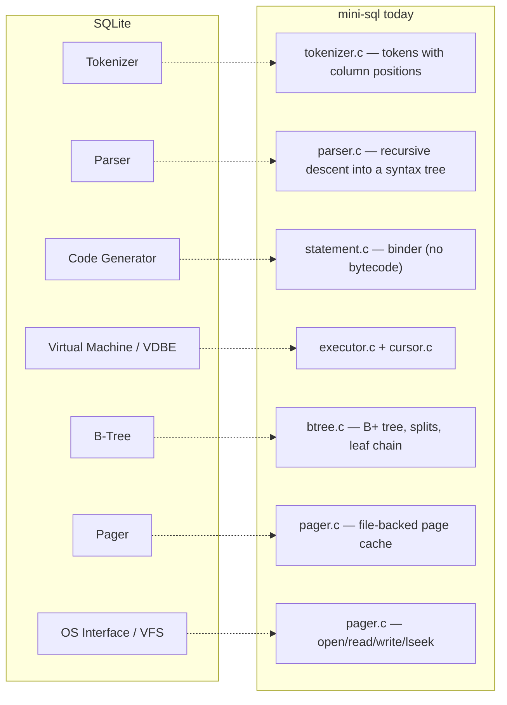
```mermaid
flowchart LR
    subgraph SQLite["SQLite"]
        direction TB
        s1[Tokenizer]
        s2[Parser]
        s3[Code Generator]
        s4[Virtual Machine / VDBE]
        s5[B-Tree]
        s6[Pager]
        s7[OS Interface / VFS]
    end
    subgraph Mini["mini-sql today"]
        direction TB
        m1["tokenizer.c — tokens with column positions"]
        m2["parser.c — recursive descent into a syntax tree"]
        m3["statement.c — binder (no bytecode)"]
        m4["executor.c + cursor.c"]
        m5["btree.c — B+ tree, splits, leaf chain"]
        m6["pager.c — file-backed page cache"]
        m7["pager.c — open/read/write/lseek"]
    end
    s1 -.-> m1
    s2 -.-> m2
    s3 -.-> m3
    s4 -.-> m4
    s5 -.-> m5
    s6 -.-> m6
    s7 -.-> m7
```

Every row but the code generator and VM is a real counterpart. Those two are the
honest gap: the binder produces a ready-to-run `Statement` rather than a program —
see [limitations](#limitations--non-goals).

The catalog follows SQLite's `sqlite_schema` closely: a table holding each table's
name, root page and `CREATE TABLE` text, which is parsed again every time the
database is opened. The planner is a small cousin of SQLite's: with only the
primary key's B-tree to use, it chooses between a lookup, a range and a scan, and
`EXPLAIN` reports the choice in SQLite's `SEARCH … USING PRIMARY KEY` / `SCAN`
wording.

---

## Module dependency graph

Each `.c` includes only the headers it truly needs; `pager`, `schema`,
`input_buffer` and `tokenizer` are the leaves. The static library `mini_sql_lib`
contains every module except `main`, so tests and future benchmarks link against it
without recompiling sources.

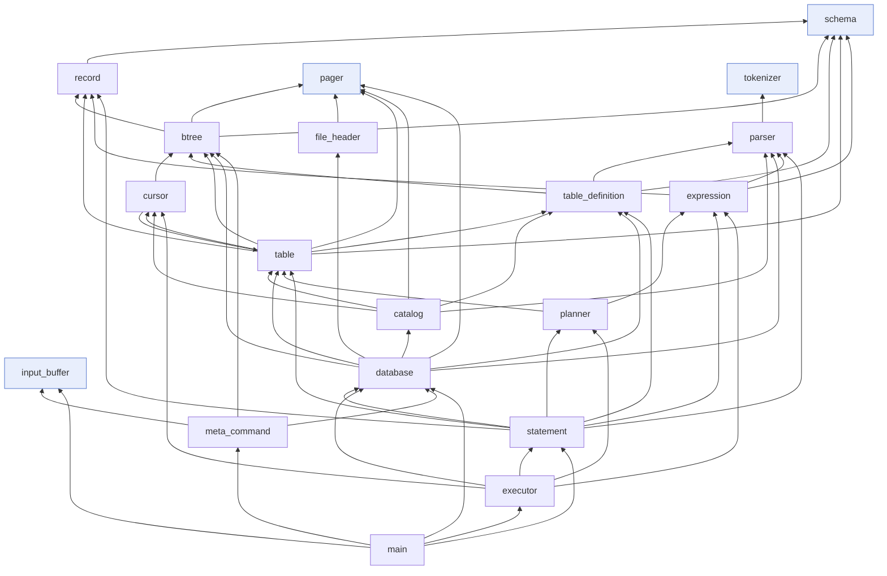
```mermaid
flowchart BT
    main --> input_buffer
    main --> meta_command
    main --> statement
    main --> executor
    main --> database

    meta_command --> input_buffer
    meta_command --> database
    meta_command --> btree
    executor --> statement
    executor --> database
    executor --> cursor
    executor --> expression
    executor --> planner
    statement --> database
    statement --> parser
    statement --> record
    statement --> table
    statement --> table_definition
    statement --> expression
    statement --> planner
    planner --> expression
    planner --> table
    expression --> parser
    expression --> record
    expression --> schema
    database --> catalog
    database --> table
    database --> table_definition
    database --> file_header
    database --> parser
    database --> pager
    database --> btree
    catalog --> table
    catalog --> table_definition
    catalog --> parser
    catalog --> cursor
    catalog --> pager
    table --> table_definition
    table --> cursor
    table --> btree
    table --> pager
    table --> record
    table --> schema
    table_definition --> parser
    table_definition --> schema
    table_definition --> btree
    cursor --> table
    cursor --> btree
    parser --> tokenizer
    file_header --> pager
    btree --> pager
    btree --> record
    btree --> schema
    record --> schema

    classDef leaf fill:#e8eefc,stroke:#5577cc;
    class schema,input_buffer,pager,tokenizer leaf;
```

`table` and `cursor` reach each other in both directions: `cursor.h` includes
`table.h` for the struct a cursor points into, and `table.c` uses a cursor to find
where `table_insert` belongs. The cycle is between modules, not headers — `table.h`
doesn't include `cursor.h` — so it compiles in any order.

| Module | Responsibility | Key entry points |
| --- | --- | --- |
| `input_buffer` | Read a line of stdin into a growable buffer | `new_input_buffer`, `read_input`, `close_input_buffer` |
| `meta_command` | Handle `.`-prefixed commands; teardown on `.exit` | `do_meta_command` |
| `tokenizer` | Split a line of SQL into tokens, each with its column | `tokenizer_init`, `tokenizer_next`, `token_type_name` |
| `parser` | Recursive descent from tokens to a syntax tree; syntax errors | `parse_statement`, `ast_free` |
| `schema` | Runtime column layout: types, sizes, **computed offsets**; case-insensitive name lookup | `schema_create`, `schema_find_column_by_id/name`, `schema_names_equal`, `schema_free` |
| `record` | An opaque row payload + schema-keyed get/set + (de)serialize; prints all or chosen columns | `record_init`, `record_set_int/text`, `serialize_record`, `print_record`, `print_record_columns` |
| `pager` | Growable page cache backed by a file; allocates zeroed pages from the free list or the end of the file, frees them back, reads on miss, flushes on close | `pager_open`, `pager_get_page`, `pager_allocate_page`, `pager_free_page`, `pager_flush`, `pager_close` |
| `file_header` | Page 0's layout: writes a new header, validates an existing one, reads the catalog root | `file_header_initialize`, `file_header_validate`, `file_header_catalog_root_page` |
| `btree` | Leaf and internal node formats, per-node binary search, splits, deletes with rebalancing, tree printer, row-size limit | `leaf_node_insert`, `leaf_node_delete`, `leaf_node_find_cell`, `internal_node_find_child`, `leaf_node_max_row_size`, `print_tree` |
| `table_definition` | Checks a parsed `CREATE TABLE` and builds its schema, key column and canonical SQL | `table_definition_from_ast`, `table_definition_free` |
| `table` | One table: its B-tree root, schema, key column and definition; inserts and deletes a row by key | `table_create`, `table_insert`, `table_delete`, `table_free` |
| `catalog` | The table of tables: its own definition in SQL, adding and reading entries | `catalog_open`, `catalog_add`, `catalog_load` |
| `database` | Opens a file (new, or checked and loaded from its catalog), creates and finds tables, remembers rows read for `.stats`, closes | `db_open`, `db_close`, `database_find_table`, `database_create_table` |
| `cursor` | A position in a leaf; tree descent and leaf-chain traversal | `table_start`, `table_find`, `cursor_key`, `cursor_value`, `cursor_advance` |
| `expression` | Bind a `WHERE` to a table (names, types) and evaluate it against a row | `expression_bind`, `expression_evaluate`, `expression_free` |
| `planner` | Turn conditions on the primary key into a point lookup, a range, nothing, or a scan; describe it | `plan_select`, `plan_describe` |
| `statement` | The binder: resolve tables and columns, bind the `WHERE`, plan, check values and definitions | `prepare_statement`, `statement_free` |
| `executor` | Run a prepared `Statement`: insert, planned select (or its `EXPLAIN`), or create a table | `execute_statement` |
| `main` | REPL loop + wiring + lifetime management | — |

---

## The data model

The core structs and their ownership relationships (these encode the rules the
code actually follows):

- `Database` **owns** the `Pager`, the catalog and every open `Table`, and
  `db_close` tears them all down.
- `Table` **owns** its name, `Schema` and `CREATE TABLE` text, and **borrows** the
  database's `Pager`. A table *is* a B-tree, identified by its root page, and knows
  which column's value is its key. The catalog is a `Table` like any other.
- `Schema` **owns** its `ColumnDefinition` array (deep copy, including names).
- `Pager` **owns** the page cache and the open file descriptor.
- `Cursor` **points into** a leaf of a `Table`; it owns nothing.
- `Statement` **holds** a `Record` inline and, for `CREATE TABLE`, a
  `TableDefinition` until the table is created; `Record` is just bytes,
  **interpreted by** a `Schema`.
- `Ast`, the parser's syntax tree, **owns** its names and literal text, and lives
  only for the duration of `prepare_statement`.

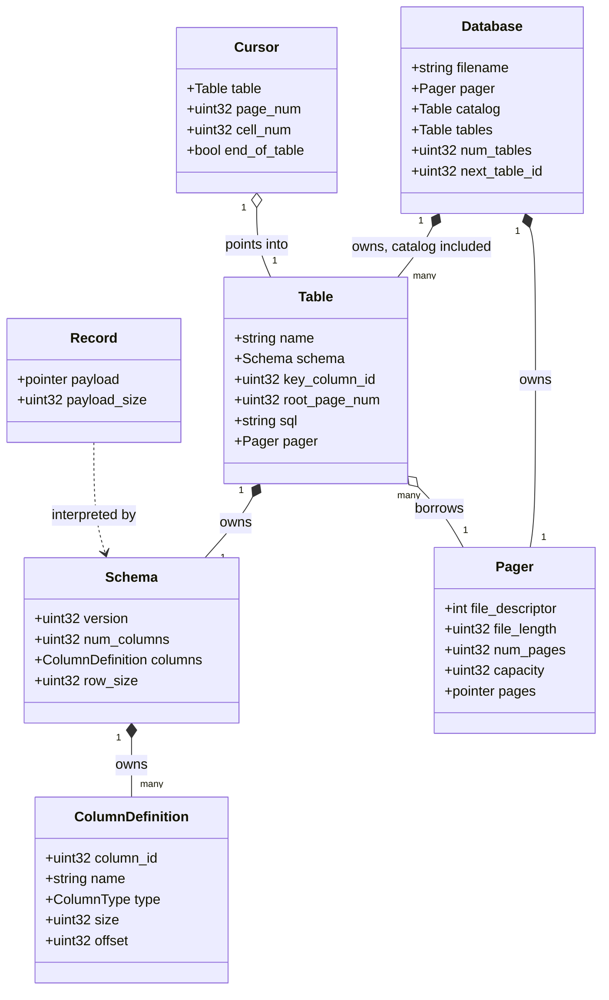
```mermaid
classDiagram
    class Schema {
        +uint32 version
        +uint32 num_columns
        +ColumnDefinition columns
        +uint32 row_size
    }
    class ColumnDefinition {
        +uint32 column_id
        +string name
        +ColumnType type
        +uint32 size
        +uint32 offset
    }
    class Pager {
        +int file_descriptor
        +uint32 file_length
        +uint32 num_pages
        +uint32 capacity
        +pointer pages
    }
    class Database {
        +string filename
        +Pager pager
        +Table catalog
        +Table tables
        +uint32 num_tables
        +uint32 next_table_id
    }
    class Table {
        +string name
        +Schema schema
        +uint32 key_column_id
        +uint32 root_page_num
        +string sql
        +Pager pager
    }
    class Cursor {
        +Table table
        +uint32 page_num
        +uint32 cell_num
        +bool end_of_table
    }
    class Record {
        +pointer payload
        +uint32 payload_size
    }

    Database "1" *-- "1" Pager : owns
    Database "1" *-- "many" Table : owns, catalog included
    Schema "1" *-- "many" ColumnDefinition : owns
    Table "1" *-- "1" Schema : owns
    Table "many" o-- "1" Pager : borrows
    Cursor "1" o-- "1" Table : points into
    Record ..> Schema : interpreted by
```

The pivotal field is `ColumnDefinition.column_id` — a **stable identity** assigned
once and never reused. Every read/write addresses a column by `column_id`, never by
its position or its name. That indirection is what will make `ALTER TABLE RENAME
COLUMN` a one-line metadata change instead of a code-wide find-and-replace.

---

## Row layout

`CREATE TABLE` lists the columns; `schema_create` walks them once, assigning each a
byte `offset` and accumulating `row_size`. INT columns take 4 bytes and TEXT(n)
columns n. For the `users` table used throughout this README and the tests,
`CREATE TABLE users (id INT PRIMARY KEY, username TEXT(32), email TEXT(255))`:

| Column | Type | Size (bytes) | Offset |
| --- | --- | ---: | ---: |
| `id` | `INT` | 4 | 0 |
| `username` | `TEXT` | 32 | 4 |
| `email` | `TEXT` | 255 | 36 |
| **`row_size`** | | **291** | |

A `Record`'s `payload` is exactly that 291-byte block — the same bytes that end
up in a leaf cell:

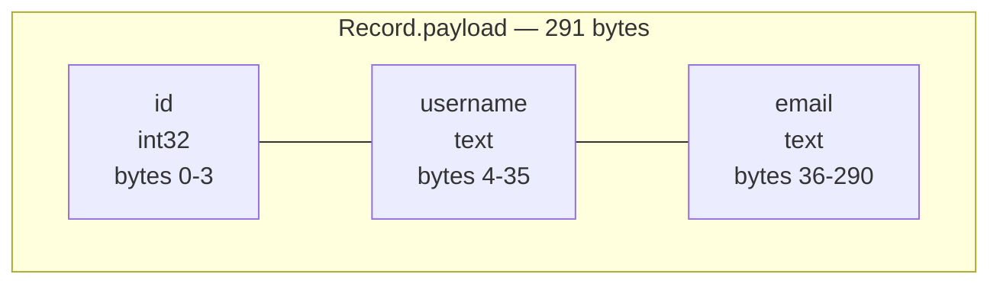
```mermaid
flowchart LR
    subgraph payload["Record.payload — 291 bytes"]
        direction LR
        idf["id<br/>int32<br/>bytes 0-3"]
        unf["username<br/>text<br/>bytes 4-35"]
        emf["email<br/>text<br/>bytes 36-290"]
    end
    idf --- unf --- emf
```

The `id` column is the row's primary key: it is copied into the key slot of the
cell that stores the row, and the tree is ordered by it. The key can be any INT
column — `CREATE TABLE orders (total INT, id INT PRIMARY KEY, …)` orders its rows
by the second column. A row may take at most 1,356 bytes, so that a leaf always
holds at least three.

---

## On-disk format

The database file is an array of 4 KiB pages. **Page 0 is the file header**, and
**every other page holds exactly one B-tree node**:

```text
page 0   file header
page 1   root of the catalog (in a new database)
page 2…  table roots and every other node, each allocated at the end of the file
         as it's needed — the first table created gets page 2 for its root
```

### The file header

| Bytes | Field |
| --- | --- |
| 0–15 | magic `mini-sql format\0`, after SQLite's `SQLite format 3\0` |
| 16–19 | file format version — `3` |
| 20–23 | page size — `4096` |
| 24–27 | page holding the catalog's root node |
| 28–31 | first page of the free list — `0` when it's empty |
| 32–4095 | zero, reserved for fields later formats add |

### Free pages

A page a delete empties — a merged leaf or internal node, or the child a collapsing
root absorbs — goes on the **free list**, a chain through the free pages themselves
that starts at the header's bytes 28–31. A free page is zeroed, then marked:

| Bytes | Field |
| --- | --- |
| 0 | `0xFF` — never a node type (0 internal, 1 leaf), so a stray pointer into a free page reads as a corrupt node instead of data |
| 4–7 | next page on the free list, `0` at the end |

Every new node takes its page from the free list first and only grows the file
when the list is empty. The file never shrinks; freed pages wait for reuse.

### The catalog

The catalog is the table of tables — one row per table — and an ordinary B-tree
table itself. Its own definition is written in SQL and parsed at open by the same
code as every other table's:

```sql
CREATE TABLE mini_sql_catalog (id INT PRIMARY KEY, name TEXT(64), root_page INT, sql TEXT(1024))
```

A catalog row is 1,096 bytes, so a catalog leaf holds three; a database with more
tables splits the catalog like any other table. The `sql` column holds a canonical
form of each `CREATE TABLE`, regenerated from the checked definition — which is
also what `.schema` prints.

### Opening a file

Opening a file checks everything before a byte is written, and refuses — with a
message — a file that fails:

| Check | Message |
| --- | --- |
| length a whole number of pages | `Db file is not a whole number of pages. Corrupt file.` |
| the magic | `Error: X is not a mini-sql database, or was written by an older build.` |
| the format version | `Error: X uses file format 2; this build reads format 3.` |
| the page size | `Error: X uses 8192-byte pages; this build uses 4096.` |
| the catalog root is a node page | `Error: X is corrupt: its catalog root page 99 is not a node page of the file.` |
| the free-list head is a page of the file | `Error: X is corrupt: its free-list head 99 is not a page of the file.` |
| each stored definition parses | `Error: X is corrupt: the stored definition of table users doesn't parse.` |
| …and passes the `CREATE TABLE` checks | `Error: X is corrupt: the stored definition of table users is invalid.` |
| …and is for the table the catalog names | `Error: X is corrupt: the catalog lists table xsers, but its definition is for users.` |
| each table's root is a node page | `Error: X is corrupt: table users has root page 99, which is not a node page of the file.` |

Every file written before the header existed has a node where the magic belongs, so
it's refused by the magic check rather than misread. Any change to what a file
holds bumps the format version — the catalog made format 2, the free list format 3
— so older files are always refused cleanly.

The header gets a whole page to itself. SQLite instead fits a 100-byte header at the
start of its first page, which also holds a B-tree root; here every node starts at
byte 0 of its page, and sharing a page would make that depend on the page number in
every accessor. Fields are stored in the machine's byte order, like every node
field.

### Nodes

Every node starts with the same 8-byte header:

| Bytes | Field |
| --- | --- |
| 0 | node type (`0` internal, `1` leaf) |
| 1 | `is_root` |
| 2–3 | padding |
| 4–7 | parent page number (unused on the root) |

**Leaf node** — holds the rows:

| Bytes | Field |
| --- | --- |
| 0–7 | common header |
| 8–11 | `num_cells` |
| 12–15 | `next_leaf` — page of the right sibling, `0` for the rightmost leaf (page 0 is the header, so it can't be a sibling) |
| 16 + 296·i | cell *i*: 4-byte key, 291-byte row, 1 byte of padding |

**Internal node** — routes lookups:

| Bytes | Field |
| --- | --- |
| 0–7 | common header |
| 8–11 | `num_keys` |
| 12–15 | page of the rightmost child |
| 16 + 8·i | cell *i*: child page (4 bytes), then its separator key (4 bytes) |

Each separator key is the **largest key stored under the child to its left**, and a
node with *N* keys has *N + 1* children, the last of which lives in the header.

The arithmetic:

```text
leaf cell       = 4 (key) + 291 (row) = 295 → padded to 296
cells per leaf  = (4096 − 16) / 296       = 13
keys per internal node = (4096 − 16) / 8  = 510   (511 children)
```

The internal-node cap can be lowered at build time with
`-DMINI_SQL_INTERNAL_NODE_MAX_KEYS=N` (no lower than 3, so a split always leaves
both halves a key). The test suite uses that for a second binary
capped at 3 keys, the only way to reach a full internal node in a few dozen rows;
the page layout is identical either way.

Every multi-byte field sits on a 4-byte boundary. That's deliberate: the tutorial
packs its header into 6 bytes, which puts `uint32_t` fields at odd offsets, and the
accessors dereference `uint32_t*` pointers into the page — undefined behaviour that
UBSan reports, even though x86 and ARM happen to tolerate it. Two padding bytes and
a rounded cell size buy clean, portable loads without costing a single cell of
capacity. `.constants` prints these numbers, and a test pins them.

---

## How the B-tree works

Fifteen rows inserted in order produce this tree — a root that splits once, then
keeps routing:


```mermaid
flowchart TD
    R["page 2 · internal root<br/>key 7"]
    L["page 4 · leaf<br/>keys 1 – 7"]
    RL["page 3 · leaf<br/>keys 8 – 15"]
    R -->|"key ≤ 7"| L
    R -->|"key > 7"| RL
    L -.->|next_leaf| RL
```

```text
db > .btree users
Tree:
- internal (size 1)
  - leaf (size 7)
    - 1
    ...
    - 7
  - key 7
  - leaf (size 8)
    - 8
    ...
    - 15
```

### Search — descending to a leaf

`table_find(key)` starts at the root. At each internal node,
`internal_node_find_child` binary-searches the separator keys for the first one
`>= key` (a key equal to a separator lives *left*, since the separator is the left
child's maximum), and the loop follows that child's page. When it reaches a leaf,
`leaf_node_find_cell` binary-searches the cells and returns either the cell holding
the key or the cell it would be inserted at. One page fetch and one binary search
per level: **O(log n)**.

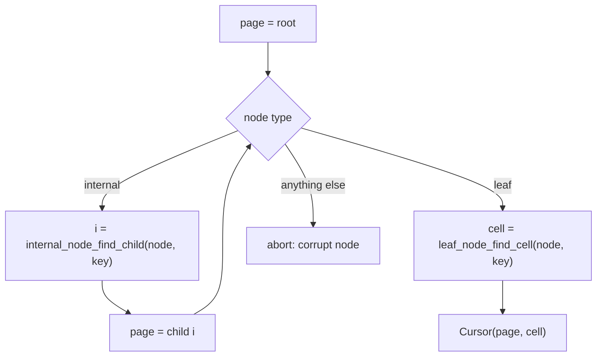
```mermaid
flowchart TD
    A["page = root"] --> B{node type}
    B -->|internal| C["i = internal_node_find_child(node, key)"]
    C --> D["page = child i"]
    D --> B
    B -->|leaf| E["cell = leaf_node_find_cell(node, key)"]
    E --> F["Cursor(page, cell)"]
    B -->|anything else| X["abort: corrupt node"]
```

### Insert — and splitting a full leaf

The executor finds the key's position, rejects the insert if that cell already
holds the key, and otherwise calls `leaf_node_insert`. A leaf with room shifts its
later cells right and writes the new one. A **full** leaf splits instead:

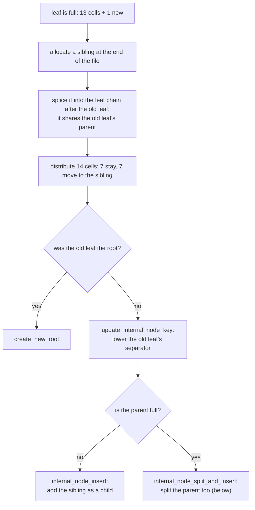
```mermaid
flowchart TD
    A["leaf is full: 13 cells + 1 new"] --> B["allocate a sibling at the end of the file"]
    B --> C["splice it into the leaf chain after the old leaf;<br/>it shares the old leaf's parent"]
    C --> D["distribute 14 cells: 7 stay, 7 move to the sibling"]
    D --> E{was the old leaf the root?}
    E -->|yes| F["create_new_root"]
    E -->|no| G["update_internal_node_key:<br/>lower the old leaf's separator"]
    G --> H{is the parent full?}
    H -->|no| I["internal_node_insert:<br/>add the sibling as a child"]
    H -->|yes| J["internal_node_split_and_insert:<br/>split the parent too (below)"]
```

Cells are placed walking from the highest position down, which makes it safe to
rearrange the old leaf in place: a position only ever reads old cells at or below
itself, which haven't been overwritten yet. The new cell's key goes in the key
slot and its row in the value slot.

**The root never moves.** When the root leaf splits, `create_new_root` copies its
contents (now the left half) to a freshly allocated page and reinitializes the root
page as an internal node pointing at both halves, with the left half's maximum as
the separator. The root page the header records therefore never changes, and the
copy carries the left half's `next_leaf` pointer with it, so the leaf chain comes
out right without special handling. Both halves record the root page as their
parent.

| | before the 14th insert | after |
| --- | --- | --- |
| page 0 | header | header (unchanged) |
| page 1 | catalog | catalog (unchanged) |
| page 2 | leaf, 13 cells (root of `users`) | internal root: key 7 → page 4, else page 3 |
| page 3 | — | leaf, keys 8–14, `next_leaf = 0` |
| page 4 | — | leaf, keys 1–7 (copied from page 2), `next_leaf = 3` |

### Updating the parent — splitting a leaf below the root

When the leaf that splits isn't the root, its parent gets two edits, in this order:

1. **`update_internal_node_key`** lowers the old leaf's separator to its new, smaller
   maximum. The old leaf's entry is found by searching the parent for its *previous*
   maximum, which works because a separator always equals the maximum of the child
   on its left — keys only reach a child if they're ≤ its separator, and nothing is
   deleted. The rightmost child has no separator, so if that's the one that split,
   there's nothing to lower.
2. **`internal_node_insert`** adds the new leaf in key order, with its maximum as its
   separator. The rightmost child lives in the header rather than in a cell, which
   makes this a two-branch operation:

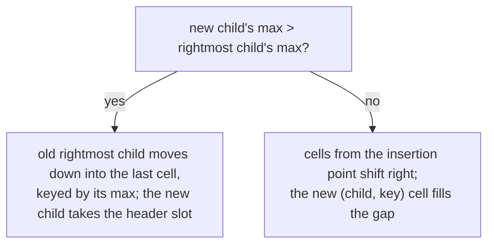
```mermaid
flowchart TD
    A["new child's max > rightmost child's max?"] -->|yes| B["old rightmost child moves down into the last cell,<br/>keyed by its max; the new child takes the header slot"]
    A -->|no| C["cells from the insertion point shift right;<br/>the new (child, key) cell fills the gap"]
```

Inserting 1–30 in ascending order exercises the first branch every time — the
rightmost leaf keeps splitting — and produces a four-leaf tree:

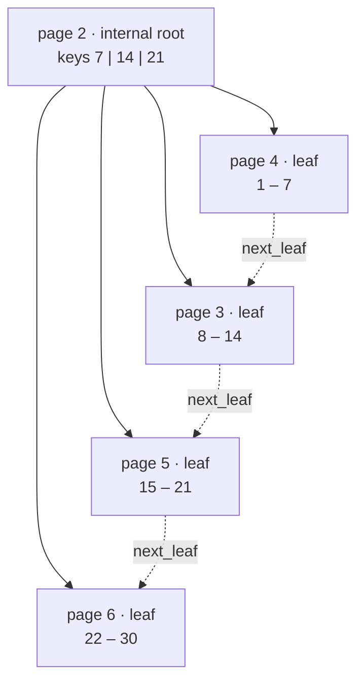
```mermaid
flowchart TD
    R["page 2 · internal root<br/>keys 7 | 14 | 21"]
    L1["page 4 · leaf<br/>1 – 7"]
    L2["page 3 · leaf<br/>8 – 14"]
    L3["page 5 · leaf<br/>15 – 21"]
    L4["page 6 · leaf<br/>22 – 30"]
    R --> L1
    R --> L2
    R --> L3
    R --> L4
    L1 -.->|next_leaf| L2 -.->|next_leaf| L3 -.->|next_leaf| L4
```

Inserting 30–1 in descending order exercises the second branch instead, and the
tutorial's own 30-row test order builds exactly the tree the article prints —
except that its first separator reads `key 7` here, where the article's
pointer-arithmetic bug prints `key 1`.

Each child records its parent's page in bytes 4–7 of its header, which is how a
split finds the node to update.

### Splitting an internal node

When `internal_node_insert` finds the parent full, the parent splits too, in the
same shape as a leaf: **split in place, then grow a new root or update the parent
above.** With *k* keys:

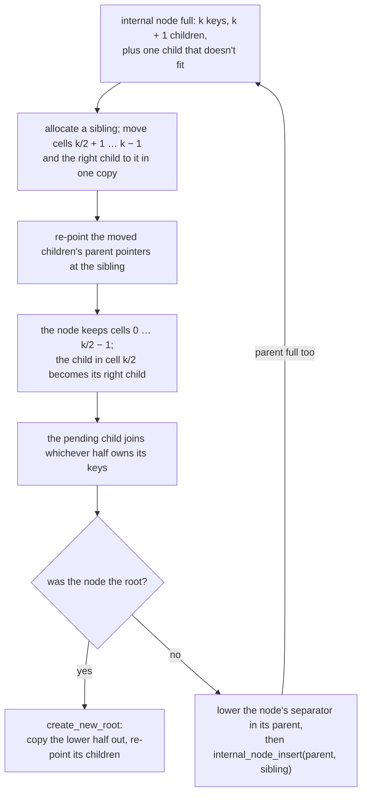
```mermaid
flowchart TD
    A["internal node full: k keys, k + 1 children,<br/>plus one child that doesn't fit"] --> B["allocate a sibling; move cells k/2 + 1 … k − 1<br/>and the right child to it in one copy"]
    B --> C["re-point the moved children's parent pointers at the sibling"]
    C --> D["the node keeps cells 0 … k/2 − 1;<br/>the child in cell k/2 becomes its right child"]
    D --> E["the pending child joins whichever half owns its keys"]
    E --> F{was the node the root?}
    F -->|yes| G["create_new_root:<br/>copy the lower half out, re-point its children"]
    F -->|no| H["lower the node's separator in its parent,<br/>then internal_node_insert(parent, sibling)"]
    H -->|parent full too| A
```

Key *k/2* isn't copied anywhere. It was the maximum of the child that becomes the
lower half's right child, so it's now the lower half's maximum, and the separator
one level up takes over its job. On the 3-key test build, inserting 1–35 in order
makes the root `[7 | 14 | 21]` split when row 35 arrives:


```mermaid
flowchart TD
    R["page 2 · root<br/>key 14"]
    I1["internal<br/>key 7"]
    I2["internal<br/>keys 21 | 28"]
    R --> I1
    R --> I2
    I1 --> A["leaf 1 – 7"]
    I1 --> B["leaf 8 – 14"]
    I2 --> C["leaf 15 – 21"]
    I2 --> D["leaf 22 – 28"]
    I2 --> E["leaf 29 – 35"]
```

Three things make deeper trees work:

- **A subtree's maximum comes from its rightmost leaf.** `get_node_max_key` follows
  right children down to a leaf. An internal node's last separator only bounds the
  child to its left, so it's the wrong answer as soon as a separator has to describe
  a whole subtree.
- **Parent pointers are written wherever a child is attached:** by
  `internal_node_insert` for the child it places, by the split for every child it
  moves, and by `create_new_root` for both halves (and for the children of the copied
  half, when the root was internal). A split deep in the tree follows these pointers
  up, so one stale pointer sends an update to the wrong node.
- **Separators are found by key range.** In a cascade, a node's rightmost leaf may
  have just split, so its current maximum can be below the separator its parent
  still records. `update_internal_node_key` searches for the first separator ≥ that
  maximum, which still lands on the node.

The trees match the tutorial's: the test build reproduces its published seven-leaf,
three-level tree line for line. The route there differs; see
[the divergences](#where-mini-sql-diverges-from-the-tutorial).

### Delete — and rebalancing

Deleting keeps the tree balanced, so a lookup stays one descent of logarithmic
depth however rows come and go. Every node but the root stays **at least half
full** — ⌈M/2⌉ cells in a leaf of capacity M (7 for `users`), ⌈K/2⌉−1 keys in an
internal node with room for K (254 at the real 510) — which is exactly what a split
leaves behind, so a tree only ever inserted into already meets it.

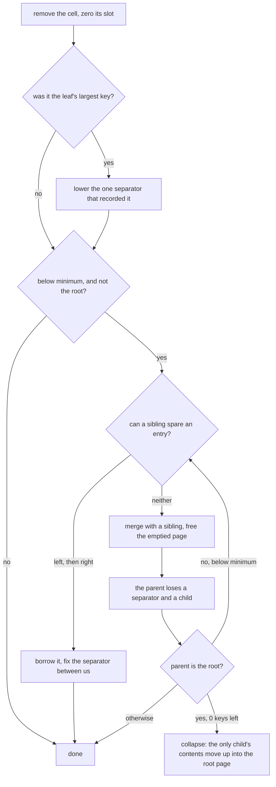
```mermaid
flowchart TD
    A["remove the cell, zero its slot"] --> B{"was it the leaf's largest key?"}
    B -->|yes| C["lower the one separator that recorded it"]
    B -->|no| D{"below minimum, and not the root?"}
    C --> D
    D -->|no| Z["done"]
    D -->|yes| E{"can a sibling spare an entry?"}
    E -->|"left, then right"| F["borrow it, fix the separator between us"]
    F --> Z
    E -->|neither| G["merge with a sibling, free the emptied page"]
    G --> H["the parent loses a separator and a child"]
    H --> I{"parent is the root?"}
    I -->|"yes, 0 keys left"| J["collapse: the only child's contents move up into the root page"]
    I -->|"no, below minimum"| E
    I -->|otherwise| Z
```

- **Separators stay exact.** When a leaf loses its largest key, the one separator
  that recorded it — in the nearest ancestor where the leaf's subtree isn't the
  rightmost child — drops to the new largest. Every borrow and merge sets the
  separators it touches from actual keys. Range scans and lookups start from a
  single descent that relies on this.
- **Borrowing** moves one entry across: a leaf takes its sibling's nearest cell; an
  internal node takes its sibling's nearest child, together with the separator from
  the parent, and hands the parent a new one.
- **Merging** fits because a node one short plus a sibling at the minimum is never
  more than a full node. An internal merge pulls the parent's separator down between
  the two halves. A merged leaf's place in the leaf chain passes to its sibling.
- **The root never moves**, even when it shrinks: a root left with one child takes
  that child's contents onto its own page, and the child's page is freed.
- **Pages go on the free list**, and children that move are pointed at their new
  parent.

### Scan — walking the leaf chain

`table_start` is simply `table_find(table, 0)`: keys are unsigned, so searching
for 0 lands on cell 0 of the leftmost leaf. `cursor_advance` steps through the
leaf's cells, and when it passes the last one it follows `next_leaf` to the
sibling's cell 0 — the scan never climbs back up through the internal nodes. Only
the rightmost leaf has `next_leaf = 0`, and running off it ends the table.

### The cursor invariant

**A cursor always points into a leaf.** Rows live only in leaves, and a cursor on
an internal node would read child page numbers as if they were rows. The invariant
holds by construction — `table_start` and `table_find` are the only constructors,
and both go through the same descent, which stops only at a leaf; `cursor_advance`
only moves along the leaf chain — and `cursor_value` / `cursor_advance` assert it.

---

## Command lifecycle

### INSERT

The binder validates **before** allocating, so a rejected insert never leaks the
record payload. Execution descends to the key's leaf, checks for a duplicate there,
and inserts — splitting the leaf if it's full.

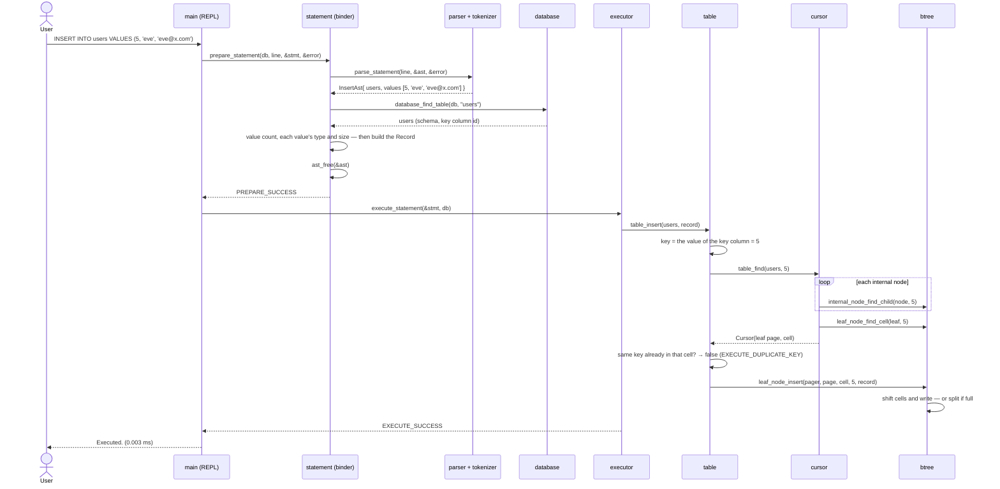
```mermaid
sequenceDiagram
    actor U as User
    participant M as main (REPL)
    participant S as statement (binder)
    participant Q as parser + tokenizer
    participant D as database
    participant E as executor
    participant T as table
    participant C as cursor
    participant B as btree

    U->>M: INSERT INTO users VALUES (5, 'eve', 'eve@x.com');
    M->>S: prepare_statement(db, line, &stmt, &error)
    S->>Q: parse_statement(line, &ast, &error)
    Q-->>S: InsertAst{ users, values [5, 'eve', 'eve@x.com'] }
    S->>D: database_find_table(db, "users")
    D-->>S: users (schema, key column id)
    S->>S: value count, each value's type and size — then build the Record
    S->>S: ast_free(&ast)
    S-->>M: PREPARE_SUCCESS

    M->>E: execute_statement(&stmt, db)
    E->>T: table_insert(users, record)
    T->>T: key = the value of the key column = 5
    T->>C: table_find(users, 5)
    loop each internal node
        C->>B: internal_node_find_child(node, 5)
    end
    C->>B: leaf_node_find_cell(leaf, 5)
    C-->>T: Cursor(leaf page, cell)
    T->>T: same key already in that cell? → false (EXECUTE_DUPLICATE_KEY)
    T->>B: leaf_node_insert(pager, page, cell, 5, record)
    B->>B: shift cells and write — or split if full
    E-->>M: EXECUTE_SUCCESS
    M-->>U: Executed. (0.003 ms)
```

### CREATE TABLE

Checking a definition happens entirely in the binder; only once it's accepted does
execution touch the file — one new page for the table's root, one catalog row.

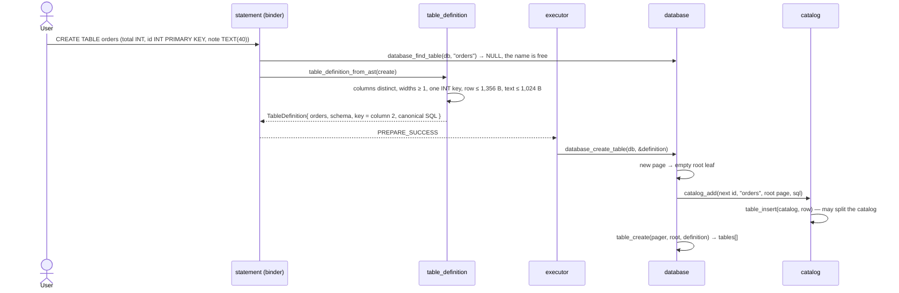
```mermaid
sequenceDiagram
    actor U as User
    participant S as statement (binder)
    participant F as table_definition
    participant E as executor
    participant D as database
    participant K as catalog

    U->>S: CREATE TABLE orders (total INT, id INT PRIMARY KEY, note TEXT(40));
    S->>D: database_find_table(db, "orders") → NULL, the name is free
    S->>F: table_definition_from_ast(create)
    F->>F: columns distinct, widths ≥ 1, one INT key, row ≤ 1,356 B, text ≤ 1,024 B
    F-->>S: TableDefinition{ orders, schema, key = column 2, canonical SQL }
    S-->>E: PREPARE_SUCCESS
    E->>D: database_create_table(db, &definition)
    D->>D: new page → empty root leaf
    D->>K: catalog_add(next id, "orders", root page, sql)
    K->>K: table_insert(catalog, row) — may split the catalog
    D->>D: table_create(pager, root, definition) → tables[]
```

### SELECT

The binder resolves the column list and binds the `WHERE`, and the planner decides
how to read the table. Execution then starts a cursor where the plan says — the
first leaf for a scan, the low end of the key range otherwise — and walks the leaf
chain, stopping past the high end. Every row read is checked against the whole
`WHERE`, and the rows that pass print their chosen columns.

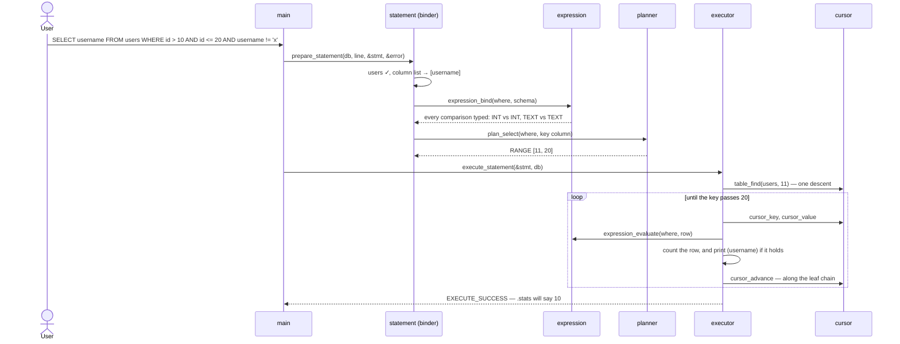
```mermaid
sequenceDiagram
    actor U as User
    participant M as main
    participant S as statement (binder)
    participant X as expression
    participant L as planner
    participant E as executor
    participant C as cursor

    U->>M: SELECT username FROM users WHERE id > 10 AND id <= 20 AND username != 'x';
    M->>S: prepare_statement(db, line, &stmt, &error)
    S->>S: users ✓, column list → [username]
    S->>X: expression_bind(where, schema)
    X-->>S: every comparison typed: INT vs INT, TEXT vs TEXT
    S->>L: plan_select(where, key column)
    L-->>S: RANGE [11, 20]
    M->>E: execute_statement(&stmt, db)
    E->>C: table_find(users, 11) — one descent
    loop until the key passes 20
        E->>C: cursor_key, cursor_value
        E->>X: expression_evaluate(where, row)
        E->>E: count the row, and print (username) if it holds
        E->>C: cursor_advance — along the leaf chain
    end
    E-->>M: EXECUTE_SUCCESS — .stats will say 10
```

### DELETE

A `DELETE` is bound and planned exactly like a `SELECT` with the same `WHERE`, and
then runs in two phases: first the rows are chosen and only their keys kept, then
each key is deleted. Deleting reshapes the tree — cells shift, nodes merge, pages
are freed, the root can collapse — so no cursor is walking it while that happens.

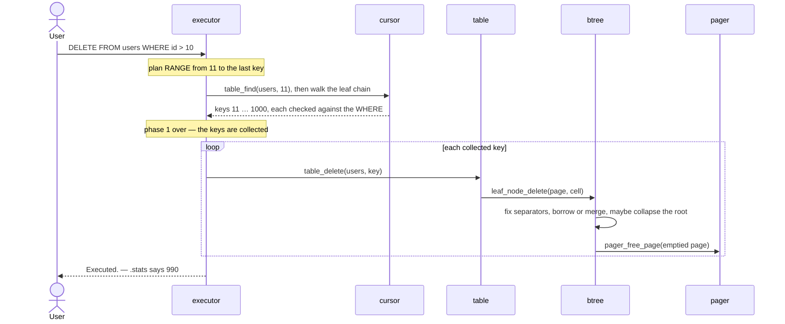
```mermaid
sequenceDiagram
    actor U as User
    participant E as executor
    participant C as cursor
    participant T as table
    participant B as btree
    participant P as pager

    U->>E: DELETE FROM users WHERE id > 10
    Note over E: plan RANGE from 11 to the last key
    E->>C: table_find(users, 11), then walk the leaf chain
    C-->>E: keys 11 … 1000, each checked against the WHERE
    Note over E: phase 1 over — the keys are collected
    loop each collected key
        E->>T: table_delete(users, key)
        T->>B: leaf_node_delete(page, cell)
        B->>B: fix separators, borrow or merge, maybe collapse the root
        B->>P: pager_free_page(emptied page)
    end
    E-->>U: Executed. — .stats says 990
```

On `.exit`, `db_close` flushes every cached page to the file — that's when the data
becomes durable.

---

## The REPL state machine

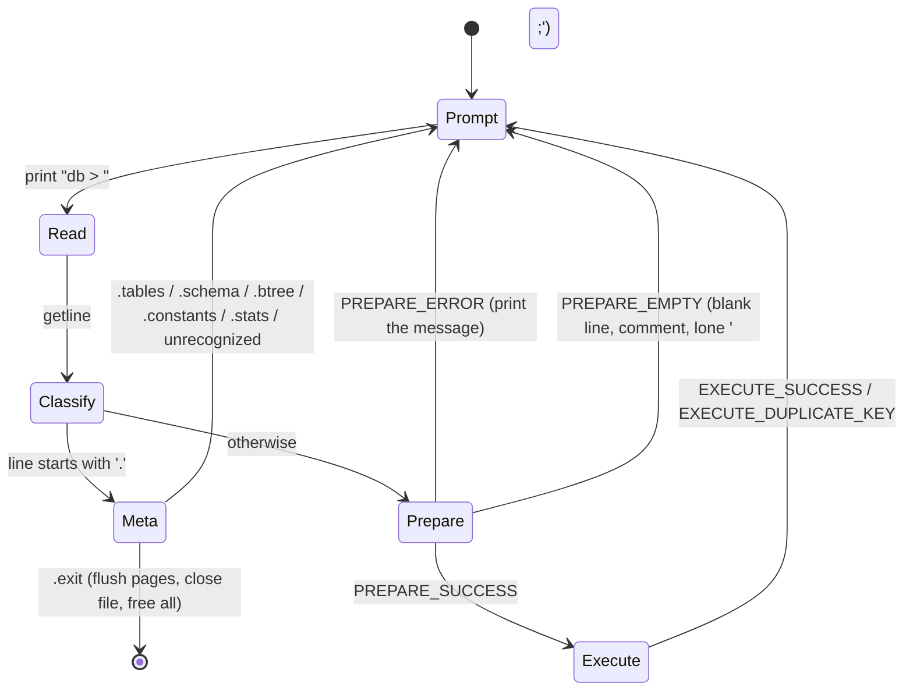
```mermaid
stateDiagram-v2
    [*] --> Prompt
    Prompt --> Read : print "db > "
    Read --> Classify : getline

    Classify --> Meta : line starts with '.'
    Classify --> Prepare : otherwise

    Meta --> Prompt : .tables / .schema / .btree / .constants / .stats / unrecognized
    Meta --> [*] : .exit (flush pages, close file, free all)

    Prepare --> Execute : PREPARE_SUCCESS
    Prepare --> Prompt : PREPARE_ERROR (print the message)
    Prepare --> Prompt : PREPARE_EMPTY (blank line, comment, lone ';')

    Execute --> Prompt : EXECUTE_SUCCESS / EXECUTE_DUPLICATE_KEY
```

The loop is infinite by construction; the only exit is `.exit`, which calls
`db_close` (flush + close file + free the pager, the catalog and every table) and
then `exit()` from inside `do_meta_command`. There is no fall-through cleanup path because control
never reaches the end of `main`.

---

## Parsing and validation

A line of SQL goes through three layers, each knowing only the one below it:

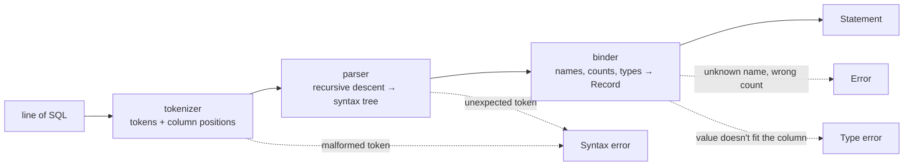
```mermaid
flowchart LR
    L["line of SQL"] --> T["tokenizer<br/>tokens + column positions"]
    T --> P["parser<br/>recursive descent → syntax tree"]
    P --> B["binder<br/>names, counts, types → Record"]
    B --> S["Statement"]
    T -.->|malformed token| E1["Syntax error"]
    P -.->|unexpected token| E1
    B -.->|unknown name, wrong count| E2["Error"]
    B -.->|value doesn't fit the column| E3["Type error"]
```

The parser knows nothing about schemas — a table name is just text to it — which is
what lets the catalog re-parse each stored `CREATE TABLE` while the table is still
being loaded. The binder knows nothing about token positions.

**Tokens.** The lexical rules cover every statement the engine is planned to
support, so later stages only add grammar:

| Class | Rule |
| --- | --- |
| Keywords (any case, reserved) | `SELECT INSERT INTO VALUES FROM WHERE CREATE TABLE DELETE AND OR NOT PRIMARY KEY INT TEXT EXPLAIN` |
| Identifier | `[A-Za-z_][A-Za-z0-9_]*`, not a keyword; compared ignoring case |
| Integer | `[0-9]+`; digits running into letters (`7x`) are a malformed number; overflow is flagged, never computed |
| String | `'…'`, with `''` for a quote inside it |
| Symbols | `( ) , ; * -` and `= != <> < <= > >=` |
| Skipped | spaces, tabs, `\r`, and `-- comments` to the end of the line |

**Grammar**, one parser function per rule:

```text
statement  := [ EXPLAIN ] ( insert | select | create | delete ) [ ';' ] END   (EXPLAIN only before select or delete)
insert     := INSERT INTO name [ '(' name { ',' name } ')' ] VALUES '(' literal { ',' literal } ')'
select     := SELECT ( '*' | name { ',' name } ) FROM name [ WHERE expr ]
create     := CREATE TABLE name '(' column_def { ',' column_def } ')'
column_def := name ( INT | TEXT '(' INTEGER ')' ) [ PRIMARY KEY ]
delete     := DELETE FROM name [ WHERE expr ]
expr       := and_expr { OR and_expr }
and_expr   := not_expr { AND not_expr }
not_expr   := NOT not_expr | primary
primary    := '(' expr ')' | operand compare_op operand
operand    := name | literal
compare_op := '=' | '!=' | '<>' | '<' | '<=' | '>' | '>='
literal    := [ '-' ] INTEGER | STRING
```

`NOT` binds tightest, then `AND`, then `OR`. An `AND` or `OR` node keeps a list of
its operands, so a long chain stays one level deep; `NOT` and parentheses may nest
64 levels, and a 65th is refused (`Syntax error: expression nested too deeply at
column N.`) rather than recursing until the stack runs out.

The parser stops at the first error and frees whatever it had built. Anything after
a complete statement — a second statement, or a clause that isn't supported — is a
syntax error, not something to ignore.

**Binding.** The binder's checks run from the statement's shape down to single
values, so the error reported is the most basic thing wrong, and every check runs
before the row is allocated:

1. the table exists;
2. a column list, if given, names only real columns, each once;
3. there are as many values as columns;
4. a column list leaves no column out — there are no NULLs or defaults;
5. each value fits its column: INT takes an integer within int32 — which, for
   the key column, can't be negative — and TEXT(n) takes a string of at most n
   bytes.

**Queries.** A `SELECT`'s column list must name real columns (repeats allowed).
Every comparison in its `WHERE` must have the same type on both sides — a column's
declared type, or a literal's own. Columns can be compared with each other and
literals with literals. INT values compare in 64 bits, so `id < 3000000000` holds
for every row rather than being an error; TEXT compares byte by byte and
case-sensitively, with a stored value ending at its first zero byte or at its
column's width, so `'n10' < 'n9'`.

**Defining tables.** `CREATE TABLE` is checked in the same spirit, most basic
problem first. The name must be free — the one check that needs the database —
and the rest belong to `table_definition`, which the catalog also uses on every
definition it reloads:

| Check | Message |
| --- | --- |
| name unused, ignoring case | `Error: table users already exists.` |
| name ≤ 64 bytes | `Error: table name 'nnnn…' is longer than 64 bytes.` |
| no column named twice | `Error: column 'A' is defined twice.` |
| TEXT at least one byte wide | `Error: column 's' must be TEXT(1) or wider.` |
| exactly one PRIMARY KEY | `Error: table t needs an INT PRIMARY KEY column.` / `Error: table t has more than one PRIMARY KEY.` |
| the key is INT | `Error: PRIMARY KEY column 'name' must be INT.` |
| a row fits three to a leaf | `Error: a row of table t would take 1357 bytes; at most 1356 fit.` |
| the definition fits the catalog | `Error: the definition of table t is 1535 bytes; at most 1024 fit.` |

Every message carries its category:

| Input | Message |
| --- | --- |
| `SELECT * FORM users` | `Syntax error: expected FROM near 'FORM' at column 10.` |
| `… VALUES (1, 'bob)` | `Syntax error: unterminated string starting at column 30.` |
| `… VALUES (7x, …)` | `Syntax error: malformed number '7x' at column 27.` |
| `SELECT * FROM users junk` | `Syntax error: expected end of statement near 'junk' at column 21.` |
| `INSERT INTO orders …` | `Error: no such table: orders.` |
| `… (id, email) VALUES (1, 'a@b')` | `Error: column 'username' has no value.` |
| `… VALUES (1, 'bob')` | `Error: 2 values for 3 columns.` |
| `… VALUES ('abc', …)` | `Type error: column 'id' is INT, but 'abc' is text.` |
| `… VALUES (3000000000, …)` | `Type error: 3000000000 is out of range for INT column 'id'.` |
| a 33-byte username | `Type error: column 'username' is TEXT(32), but the value is 33 bytes.` |
| `… VALUES (-1, …)` | `Error: column 'id' must not be negative.` |
| an id that's already stored | `Error: Duplicate key.` (from the executor) |
| `CREATE TABLE t (id INT(4) PRIMARY KEY)` | `Syntax error: expected ',' or ')' near '(' at column 23.` |
| `SELECT nick FROM users` | `Error: no such column: nick.` |
| `… WHERE id = 'abc'` | `Type error: cannot compare INT column 'id' with 'abc'.` |
| `… WHERE id = username` | `Type error: cannot compare INT column 'id' with TEXT column 'username'.` |
| `… WHERE id = 99999999999999999999` | `Type error: 99999999999999999999 is out of range for comparison with INT column 'id'.` |
| `… WHERE id 5` | `Syntax error: expected a comparison operator near '5' at column 30.` |
| `EXPLAIN INSERT …` | `Syntax error: expected SELECT or DELETE near 'INSERT' at column 9.` |
| `DELETE users` | `Syntax error: expected FROM near 'users' at column 8.` |

---

## Query planning

The only index is each table's primary-key B-tree, so a `SELECT` has four ways to
read its table. The planner picks one from the conditions on the key that the whole
`WHERE` depends on — the comparisons at its top level of `AND`s, in either order
(`5 < id` is read as `id > 5`) — narrowing an inclusive range that starts as every
possible key, `[0, 2147483647]`:

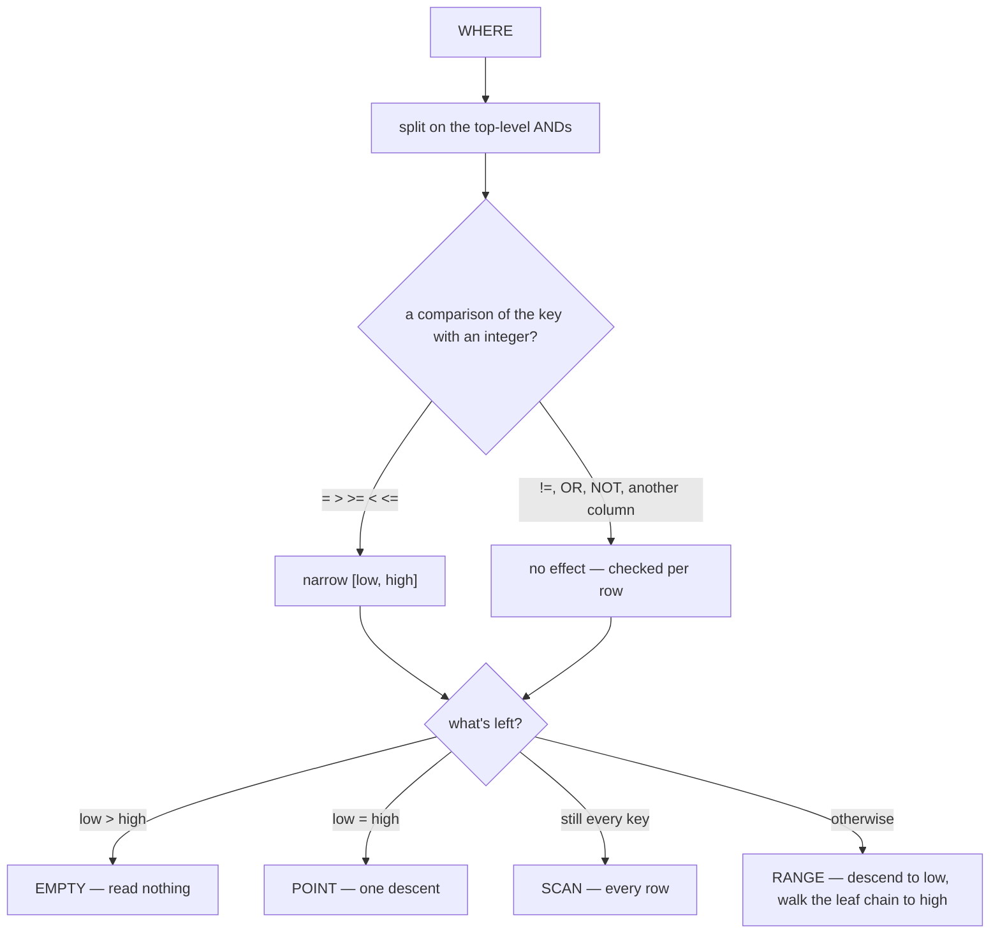
```mermaid
flowchart TD
    W["WHERE"] --> P["split on the top-level ANDs"]
    P --> K{"a comparison of the key with an integer?"}
    K -->|"= > >= < <="| N["narrow [low, high]"]
    K -->|"!=, OR, NOT, another column"| R["no effect — checked per row"]
    N --> D{"what's left?"}
    R --> D
    D -->|"low > high"| EMPTY["EMPTY — read nothing"]
    D -->|"low = high"| POINT["POINT — one descent"]
    D -->|"still every key"| SCAN["SCAN — every row"]
    D -->|"otherwise"| RANGE["RANGE — descend to low, walk the leaf chain to high"]
```

A range starts where one descent for `low` lands: the first key at or above it. That
rests on the separator invariant — each separator equals the largest key on its left
— which `btree_check` enforces and deletion will have to keep. The walk then follows
`next_leaf` and stops at the first key past `high` without decoding it.

A `DELETE` is planned the same way, and its `EXPLAIN` prints the same plans.

**The whole `WHERE` is still checked against every row read.** The range only decides
which rows are read, so `id > 990 AND username != 'x'` reads keys 991 onwards and
filters them, and conditions under `OR` or `NOT`, or on other columns, stay correct.

`EXPLAIN` prints the plan with its real bounds, and `.stats` how many rows the last
`SELECT` read — matching or not:

| `WHERE` | `EXPLAIN` | Rows read (1,000 rows) |
| --- | --- | ---: |
| *(none)* | `SCAN users` | 1,000 |
| `id = 500` | `SEARCH users USING PRIMARY KEY (id = 500)` | 1 |
| `id > 10 AND id <= 20` | `SEARCH users USING PRIMARY KEY (id >= 11 AND id <= 20)` | 10 |
| `id > 990 AND username != 'x'` | `SEARCH users USING PRIMARY KEY (id >= 991)` | 10 |
| `id > 5 AND id < 3` | `SEARCH users USING PRIMARY KEY (no row can match)` | 0 |
| `id = 5 OR id = 6` | `SCAN users` | 1,000 |
| `username = 'user7'` | `SCAN users` | 1,000 |

Bounds are worked in 64 bits and clamped to the keys that can exist, so `id < -5`
can match nothing, `id < 3000000000` doesn't narrow anything, and `id >= 2147483647`
is a point lookup.

---

## Memory ownership

Explicit ownership is the spine of a C codebase. The rules, drawn:

```mermaid
flowchart TD
    main ==>|db_open| db["Database"]
    main -.->|stack value| stmt["Statement"]

    db ==>|owns| pager["Pager"]
    pager ==>|owns| pagesfd["page cache + open fd"]
    db ==>|owns| catalog["catalog Table"]
    db ==>|owns| tables["tables[]"]
    tables ==>|each owns| tparts["name + Schema + CREATE TABLE text"]
    tables -.->|borrow| pager
    tparts ==>|Schema owns: malloc + strdup| cols["columns[] + names"]
    stmt ==>|owns: record_init| payload["Record.payload"]
    stmt ==>|owns until executed| def["TableDefinition"]
    stmt ==>|owns: SELECT| sel["column ids + bound WHERE"]
    def -.->|handed over by table_create| tables
    prep["prepare_statement"] ==>|owns, frees before returning| ast["Ast: names + literal text"]
```

Legend: **thick arrow = owns/frees**, **dotted arrow = borrows or stack**.

Lifecycle rules:

- `schema_create` deep-copies the caller's column array and `strdup`s each name, so
  `table_definition` can build the array on the stack.
- `db_open` opens the file (via `pager_open`). For a new file it writes the header
  on page 0 and an empty catalog on page 1; for an existing one it validates the
  header and every catalog entry, and exits without writing anything if the file
  isn't one it can read.
- A `SELECT`'s column list and bound `WHERE` belong to its `Statement`; the plan
  is a plain value. `statement_free` releases them. Binding a `WHERE` that fails
  partway frees what it had bound before returning.
- A `TableDefinition` belongs to its `Statement` until `database_create_table`
  hands its name, schema and text to the new `Table`; `statement_free` then frees
  nothing twice, and frees everything if the table was never created.
- New nodes get their page from `pager_allocate_page`, which returns it resident and
  zero-filled: the head of the free list if there is one, otherwise the page just
  past the end of the file. A fetch further past the end is refused as a bug.
- A page a delete empties goes back through `pager_free_page`, which zeroes it,
  marks it free and pushes it onto the free list. Each page is freed only by the
  merge or collapse that emptied it, and the list's head is written into the header
  on close.
- The page cache is an array of page pointers that doubles as the file grows. Only
  the array moves: each page is its own allocation, so a node pointer the B-tree
  holds stays valid while it fetches other pages.
- `db_close` is the single teardown path: it flushes every cached page, then
  `pager_close` (closes the fd + frees the cache), then frees every table, the
  catalog and the database. `.exit` is the only caller.
- `prepare_statement` owns the syntax tree for exactly one call: the parser frees a
  partly built tree itself when it hits an error, and `prepare_statement` frees a
  complete one after binding, whether binding succeeded or not. Everything the
  executor needs is copied into the `Statement` first.
- Each REPL iteration zero-initializes `Statement statement = {0}` and calls
  `statement_free` after execution — a no-op for `select`, the record's free for
  `insert`, and whatever a `CREATE TABLE` didn't hand over. The `Cursor` is `malloc`'d per statement and freed at the end of
  each execute, including on the duplicate-key path.

---

## Build system

CMake builds the engine twice from one source list, `MINI_SQL_SOURCES`: once as
shipped, and once as a test build whose internal nodes are capped at 3 keys.

```mermaid
flowchart LR
    subgraph src["MINI_SQL_SOURCES"]
        a[input_buffer.c]
        b[meta_command.c]
        k[tokenizer.c]
        l[parser.c]
        q[expression.c]
        r[planner.c]
        c[statement.c]
        d[executor.c]
        e[schema.c]
        f[record.c]
        n[table_definition.c]
        g[table.c]
        o[catalog.c]
        p[database.c]
        m[file_header.c]
        h[pager.c]
        i[cursor.c]
        j[btree.c]
    end
    src --> lib["mini_sql_lib (static)"]
    src -->|"MINI_SQL_INTERNAL_NODE_MAX_KEYS=3"| slib["mini_sql_small_fanout_lib (static)"]
    main_c[main.c] --> exe["mini_sql"]
    main_c --> sexe["mini_sql_small_fanout"]
    lib --> exe
    slib --> sexe
    exe -.->|driven by| tests["CTest suite"]
    sexe -.->|driven by| tests
```

Compiled with `-Wall -Wextra -Wpedantic` under strict C11 (`CMAKE_C_EXTENSIONS
OFF`), and emits `compile_commands.json` for clangd. The library/executable split
exists so the test and benchmark targets can link the engine in one line without
recompiling every source. The small-fan-out build exists only for the tests: with
510 keys per internal node, filling one takes thousands of rows, while 3 takes a
few dozen. (`pager.c` and `schema.c` define `_POSIX_C_SOURCE` so the POSIX file
calls and `strdup` resolve under strict C11.)

---

## Testing

Black-box, output-asserting tests in the style of the tutorial's rspec suite, but
implemented as a dependency-free bash script and registered with CTest — one entry
per case, so a failure names itself.

```mermaid
sequenceDiagram
    participant CT as ctest
    participant SH as run_tests.sh
    participant DB as mini_sql / mini_sql_small_fanout

    CT->>SH: MINI_SQL_BIN=... MINI_SQL_SMALL_FANOUT_BIN=... run_tests.sh <case>
    SH->>DB: printf "commands…" | <binary the case needs> <scratch.db>
    DB-->>SH: raw stdout
    SH->>SH: normalize (strip " (NN.NNN ms)" + trailing ws)
    SH->>SH: compare the tree / rows exactly
    SH-->>CT: exit 0 (pass) / 1 (fail)
```

Every case receives both binaries. The internal-split cases drive the 3-key test
build, and first check through `.constants` that it really got that build; the
rest drive the real `mini_sql`. Every case starts from a file that already holds
the `users` table, created by a separate run of the binary so its output never
mixes with the test's — except the `CREATE TABLE` cases that need an empty
database.

The 34 cases:

| Area | Cases |
| --- | --- |
| Basics | insert/select round trip; max-length strings; over-length strings in either column; negative id |
| SQL syntax | every syntax error, with its exact message and column: misspelled and missing keywords, unterminated strings, malformed numbers, stray characters, trailing tokens, unsupported clauses, reserved words as names, the tutorial's old syntax, and long tokens cut short in the message; none of them changes the table |
| Binding | unknown table and column, a column listed twice or left out, the wrong number of values, text in an INT column and an integer in a TEXT one, INT range edges (2147483647 and -0 accepted; 2147483648, -2147483649 and a 23-digit number rejected), negative values |
| Lexical rules | keywords and names in any case, reordered column lists, `''` inside strings, text holding spaces, commas, semicolons and `--`, tabs and extra whitespace, optional `;`, comments, silent blank lines, and a final line with no newline |
| Persistence | rows survive a reopen |
| Layout | `.constants` pins every size and offset, and the real 510-key internal capacity |
| Tree shape | one sorted leaf; a root split under four insertion orders; the split survives a reopen; inserts routed left and right after the split, including a key equal to the separator; four-leaf trees from splits below the root under ascending, descending and the tutorial's pseudorandom order, surviving a reopen |
| Internal splits | the tutorial's published three-level tree, line for line; trees four and five levels deep from 210 rows ascending, descending and scrambled, checked against the B+ tree invariants; a deep tree reopened and split all over again through parent pointers read from disk, then reopened once more |
| Duplicates | rejected in a single leaf, in either leaf of a split tree, and in a four-leaf tree for keys equal to a separator and just past the last one |
| Scans | every row in key order across leaves, for four insertion orders and across a reopen, and across four leaves and deep trees; an empty table |
| Large tables | on the real binary, 3,583 ascending rows fill a 510-key root exactly and row 3,584 splits it — the real fan-out's first internal split — with every row reachable before and after a reopen |
| File header | a new file's magic, format version, page size and root page; a header that stays byte-identical as the table grows and across a reopen, with its reserved bytes zero; two files built from the same statements, byte-identical |
| Refused files | a page of zeros, a file from before the header existed, a page of text, and good headers patched to format 1 and format 3, 8192-byte pages, catalog root page 0 and catalog root page 99 — each refused with its message and a failing exit status, and left byte for byte unchanged |
| Creating tables | tables of different shapes with the key in any position; negative values outside the key; duplicates caught by the key; names matched ignoring case; `.tables` and `.schema` with canonical definitions; all of it after a reopen |
| Refused definitions | every `CREATE TABLE` check, including the row-size boundary (`TEXT(1352)` accepted with exactly 3 rows to a leaf, `TEXT(1353)` refused), malformed column definitions, and `.btree` / `.schema` / `.constants` with a missing, unknown or extra table name |
| Many tables | three tables of different widths filled with interleaved inserts on the 3-key build, each a valid tree three or four levels deep holding exactly its rows after a reopen; then thirty more, splitting the catalog's root into an internal node, all found again in creation order |
| Damaged catalog | a stored definition that doesn't parse, one that parses but is invalid, a catalog name that doesn't match its definition, and a root page past the end — each refused, untouched |
| Column lists | chosen columns in any order and with repeats, on a table keyed by its second column; names ignoring case; unknown columns |
| `WHERE` results | 24 conditions on a 60-row table with negative values, each compared with the same condition evaluated independently by `awk`: every operator on INT and TEXT, precedence, parentheses, column against column, constant conditions, a literal wider than its column, case-sensitive text, and key ranges alongside other conditions |
| `WHERE` errors | every name, type and syntax error, `EXPLAIN` before anything but `SELECT`, and the nesting limit — 64 levels of `NOT` or parentheses accepted, the 65th refused at its column |
| Deleting | by key (reading one row), a missing key (reading none), a key range, other columns, and everything at once down to one empty root leaf; `EXPLAIN DELETE`; every error; the result surviving a reopen |
| Rebalancing | a four-level tree of 306 rows deleted to empty in ascending, descending and scrambled order, checked after every 30 deletes — balanced, half full, separators exact, exactly the remaining rows — with range queries midway |
| Random operations | 1,500 inserts and deletes from a fixed generator, compared every 150 operations with a model of the keys that should exist, duplicates included, and after a reopen |
| Page reuse | deleting 300 rows leaves the file its size with a free list whose head is marked free; reinserting them in the next session reuses those pages instead of growing the file |
| Plans and ranges | `EXPLAIN` for 21 conditions (merged, clamped, reversed, contradictory, and the ones that must scan); rows read for lookups, misses, ranges and scans on 1,000 rows; and 91 ranges over a four-level tree of scrambled even ids, many starting or ending exactly on its separators, each returning and reading exactly the ids inside it |

How the suite earns its trust:

- **Exact comparison.** Tree shapes and scan results are compared line for line
  (`btree_block`, `select_rows`), because a substring check can't tell `- 1` from
  `- 10`.
- **An invariant checker for trees too big to spell out.** `btree_check` reads a
  printed tree and fails on the first broken B+ tree rule: keys not strictly
  increasing, a separator that isn't the largest key on its left, a node whose size
  disagrees with its contents or whose children and keys don't alternate, a node
  over capacity or — other than the root — below half full, or leaves at different
  depths. It was itself tested against
  doctored trees breaking each rule. It catches damage a scan can't see: a
  misfiled subtree still returns every row through the leaf chain.
- **Insertion orders chosen to hit each branch.** The split tests insert the same
  14 keys ascending, descending, and with the splitting key landing as the left
  half's last cell and as the right half's first — the exact boundary where an
  off-by-one would hide.
- **Mutation checks.** Every B-tree stage was verified by deliberately breaking the
  code and confirming the suite fails:
  - an off-by-one at the split boundary
  - `>` instead of `>=` when routing past a separator
  - a missing sibling link
  - a skipped separator update
  - a new child that never takes over the right-child slot
  - a subtree maximum taken from the last separator
  - a pending child sent to the wrong half
  - parent pointers left stale by a root split, by moved children, or by an insert
  - three of the tutorial's own bugs:
    - its split bug reproduces the exact corrupted row, `(1919251317, 14,
      on14@example.com)`
    - its `internal_node_key` bug reproduces its published four-leaf tree, `key 1`
      and all
    - its parent-pointer overwrite misfiles a subtree under the scrambled insertion
      order, which only the invariant checker notices
- **Front-end mutation checks.** Matching keywords case-sensitively, leaving `''`
  unescaped, ignoring trailing tokens, skipping the binder's type check, lexing `7x`
  as `7`, and cutting the last byte of an unterminated final line each fail a test.
- **Storage mutation checks.** Capping the page cache at 100 pages again, skipping
  the version, page-size or root check, and ignoring the header's root page each
  fail a test. One change can't be caught on macOS: allocating new pages with
  `malloc` instead of `calloc`, because a fresh 4 KiB allocation there is zeroed
  anyway. The zeroing is a guarantee for platforms where it isn't.
- **Sanitizers.** The B-tree stages were each run under AddressSanitizer and
  UndefinedBehaviorSanitizer, which is what surfaced the misaligned loads in the
  tutorial's node layout.
- **Catalog mutation checks.** Skipping the "already exists" check, never writing
  the catalog entry, taking the key from the first column, rejecting negatives in
  every INT column again, letting the row limit slip by a byte, and loading every
  table from the first stored definition each fail a test.
- **Fuzzing and leak checks for the front end.** 20,000 lines of random token soup
  and byte-level mutations of valid statements ran through the sanitized binary
  without a single report, and `leaks --atExit` finds nothing after a script that
  hits every kind of error — including the partly built syntax trees freed on the
  way out. A second run mixed in `CREATE TABLE` fragments: the 74 tables it managed
  to create, some with mangled names, all loaded back from their stored definitions
  when the file was reopened. A third mixed in `WHERE` and `EXPLAIN` fragments and
  expressions nested 50 to 200 deep: 911 were refused at the nesting limit, and
  nothing reached a sanitizer. A fourth interleaved `DELETE`s with inserts: 15,117
  of its 20,000 lines ran, nothing reached a sanitizer, the reopened tree passed the
  checker, and `leaks` found nothing across sessions of deletes.
- **Query mutation checks.** Letting `OR` bind tighter than `AND`, planning `<` as
  `<=`, a range that ignores its high end, skipping the per-row `WHERE` inside a
  range, comparing text without regard to case, and removing the nesting limit
  each fail a test.
- **Delete mutation checks.** Turning off borrowing, skipping the separator fix
  when a leaf loses its largest key, never collapsing the root, not splicing the
  leaf chain around a merge, not re-pointing children after an internal merge, never
  reusing freed pages, and rebalancing only leaves each fail a test.
- **Timeouts.** Scans follow on-disk pointers, so each test has a 10-second limit
  that turns a pointer cycle into a fast failure instead of a hang.

```sh
ctest --test-dir build --output-on-failure
```

---

## Design decisions

**Schema-driven, not struct-driven.** The tutorial's `Row` struct bakes the row
layout into the compiler; `ALTER TABLE` is then impossible without changing C source.
`mini-sql` computes the layout in `schema_create`, so a row is just bytes plus a
ruler. Cost: a layer of indirection from the start. Payoff: when `CREATE TABLE`
arrived, `record` and `btree` didn't change at all — they had never known what a
row looked like.

**Storage behind a cursor.** `execute_insert` / `execute_select` reach rows only
through a cursor. That abstraction paid off when the table became a B-tree: the
executor's scan loop didn't change at all.

**One-way layering, mirroring SQLite.** `btree` works in pages and node bytes and
knows nothing about tables or cursors. Its search functions return *positions
within a node* (a cell index, a child index), and `cursor` chains them into
navigation with an iterative descent loop. Each layer can be tested and reasoned
about without the ones above it.

**Naturally aligned node layout.** An 8-byte common header and a cell size rounded
to a multiple of four keep every `uint32_t` field aligned, so reading a field
through a pointer is well-defined C on any architecture. Same capacity as the
packed layout.

**The root never moves.** A root split copies the old root out rather than moving
the new root in, so the root page the header records stays right forever and
nothing has to be updated when the tree grows a level.

**Refuse, never misread.** A file is checked against its header before a single
page is interpreted, and every format change bumps the version. The worst an old or
foreign file can get is a clear refusal — never wrong answers, and never a write.

**Invariants by construction, then asserted.** "A cursor always points into a leaf"
isn't checked in scattered places — the only two ways to create a cursor go through
the same descent that stops only at leaves, and the functions that rely on it assert
it.

**Test knobs live in a test build.** Reaching a full internal node at the real
fan-out takes thousands of rows, so the tutorial shrinks the engine's capacity to 3
"for testing". Here the engine keeps the capacity its page actually has, and the
small value is a compile-time option used only by a second, test-only binary —
the same approach SQLite takes with its `SQLITE_*` build options.

**One shape for every split.** Leaf or internal, a split happens in place, then
either grows a new root or lowers a separator and inserts the sibling one level up.
The two splits differ only in how they move cells, so the parent-update logic —
where most B-tree bugs live — exists once.

**Loud boundaries over wrong answers.** While a feature is missing, the code path
that would need it stops with a message naming it (`Need to implement …`) instead
of returning plausible-looking garbage. Tests pin each boundary, and the stage that
implements the feature deliberately flips the test.

**Address columns by stable `column_id`.** Never by name or ordinal. `RENAME` becomes
a metadata edit; `DROP` becomes a flag; neither disturbs other columns' data.

**Parse, then bind.** The parser turns text into a syntax tree without knowing any
schema; the binder checks that tree against the table. Syntax errors and schema
errors come from different layers with different information — a token's column,
or a column's type — and the parser can read a statement about a table that
doesn't exist yet, which the catalog relies on when it reloads definitions.

**Tables are described in exactly one way.** The catalog's own schema is a
`CREATE TABLE` statement, parsed at open like any other; the catalog stores each
table's definition as SQL and re-parses it on open; and a new `CREATE TABLE` and a
reloaded one pass through the same `table_definition` checks. There is no second,
binary description of a schema that could drift out of step with the first.

**Store a canonical definition, not the input.** The catalog keeps SQL regenerated
from the checked definition, so what's stored carries no comments or formatting
and is guaranteed to parse back to the same table.

**Every table has one INT primary key.** The key is what the B-tree orders rows
by, so requiring it keeps one key model through the engine: every table gets
lookups and range scans by key, and duplicates are caught by the tree itself.

**Plan from the key, check everything.** The planner only ever narrows which rows
are read; the whole `WHERE` is evaluated on every one of them. Correctness never
depends on the planner understanding a condition — a condition it can't use just
means more rows are read — so the planner can stay small and still be safe.

**Collect, then change.** A `DELETE` finishes choosing its rows — keeping only their
keys — before it removes any of them. Rebalancing moves cells, merges nodes, frees
pages and can replace the root, so a cursor that walked the tree while it changed
could skip rows or read a freed page. Separating the two phases rules that class of
bug out rather than guarding against it.

**Always at least half full.** Deletion repairs a node the moment it drops below
its minimum, by borrowing or merging, so no sequence of deletes can leave long
chains of nearly empty nodes. That is what keeps a lookup O(log n) in the number of
rows the table holds now, not the most it ever held.

**Flat chains, bounded nesting.** `AND` and `OR` hold a list of operands, so a
condition with a thousand terms is one level deep, and only `NOT` and parentheses
add depth — at most 64 levels. Parsing, binding, evaluating and freeing an
expression are recursive, and this bound is what makes that safe against any
input.

**Validate before allocate.** The binder proves the whole statement is valid before
calling `record_init`. Early returns can't leak, and there's no half-built record to
unwind.

**One error, the first one.** The parser stops at the first unexpected token, and
the binder checks from the statement's shape down to single values. The message
names the most basic problem rather than a cascade of consequences.

**`%.*s`, not `%s`, when printing text.** A maximum-width text field has no room for a
NUL terminator. Bounding the print to `column->size` means `mini-sql` never had the
"garbage bytes on max-length strings" bug the tutorial hits — and never needed the
"+1 byte" struct fix, because there is no struct.

---

## Where mini-sql diverges from the tutorial

| The tutorial | mini-sql | Why it matters |
| --- | --- | --- |
| A fixed `Row` struct with compile-time offsets | A runtime `Schema` computes every offset | `CREATE TABLE` defines tables at runtime |
| One table, compiled in | A catalog table listing every table, its root page and its `CREATE TABLE` text | Any number of tables in one file |
| `insert 1 user email` split on spaces (`sscanf`, later `strtok`), with a few fixed error messages | SQL through a tokenizer, a recursive-descent parser and a binder, with errors that name the problem and its column | Text can hold spaces and quotes; `insert abc …` is an error, not id 0 |
| Row text buffers need a `+1` for the NUL | Width-bounded printing (`%.*s`) | No struct, so the max-length-string bug never existed |
| Packed 6-byte node header | Aligned 8-byte header, 4-byte-multiple cells | `uint32_t` loads are UBSan-clean |
| The leaf split writes the new row at the start of the cell and never writes its key | Key and row go into their own slots | The corruption the tutorial discovers two parts later never happened here |
| `internal_node_key` adds 4 to a `uint32_t*` — 16 bytes, not 4 | Byte arithmetic | Separator keys sit at the right offset; the article's four-leaf tree prints `key 1` where mini-sql prints `key 7` |
| Internal nodes capped at 3 keys "for testing" | The real 510; a separate test binary is built with 3 | The engine uses the page it has, and tests still reach a full node cheaply |
| When the rightmost child splits, the separator update writes a key one past the node's last cell | Skipped — the rightmost child has no separator | No writes outside the node's live cells |
| A full parent's key count is bumped before aborting | Checked before anything changes | The count never disagrees with the cells |
| A root split creates the new root first and splits the copy; the sibling is built by re-inserting children one at a time | Split in place, then create the root; the upper half moves in one copy | One split shape; linear instead of quadratic in the node size |
| Needs special cases for an empty internal node | The sibling is created with all its cells, so an empty internal node never exists | Fewer states to get wrong |
| After inserting the new sibling into its parent, resets the sibling's parent pointer to the old node's | The insert that finally places the sibling sets its parent | The tutorial's pointer is wrong whenever the parent's own split separates the siblings, and a later split then misfiles a subtree |
| Mutual recursion between two search functions that return cursors | An iterative descent in `cursor`; `btree` returns indices | `btree` stays free of cursors; no recursion |
| As written in the articles, the duplicate check reads the root node | It reads the leaf the cursor landed in | Correct as soon as the root splits |
| A cursor leaks on a duplicate key | Freed | No leak per rejected insert |
| `select` after the first split prints a corrupted row until scans are implemented | It stopped with an explicit message until then | Missing features fail loudly |
| rspec tests; the deep-tree test compares its lines as an unordered set | bash + CTest, exact comparisons, an invariant checker, sanitizers, mutation checks | Tests that demonstrably catch the bugs above |

---

## Roadmap

Built bottom-up so something runs at every step. The tutorial's storage engine is
finished; what follows grows it into a small SQL database in six stages, each with
its own design review.

```mermaid
flowchart LR
    A["tutorial 1–14 · REPL, pager, cursor, B+ tree"] --> S1["1 · SQL tokenizer + parser"]
    S1 --> S2["2 · storage: growable pager, file header"]
    S2 --> S3["3 · catalog, CREATE TABLE, many tables"]
    S3 --> S4["4 · typed WHERE, range scans, EXPLAIN"]
    S4 --> S5["5 · DELETE with rebalancing"]
    S5 --> S6["6 · error audit, benchmark"]

    classDef done fill:#d6f5d6,stroke:#3a9a3a;
    classDef now fill:#fff2cc,stroke:#bba12a;

    class A,S1,S2,S3,S4,S5 done;
    class S6 now;
```

- **Done — the tutorial (1–14):** REPL, schema-driven rows, a file-backed pager, the
  cursor abstraction, and the whole B+ tree: sorted leaves with binary search,
  duplicate-key rejection, splits at every level cascading up to a new root, and
  leaf-chain scans.
- **Done — Stage 1, SQL front end:** a tokenizer, a recursive-descent parser and a
  binder for `INSERT` and `SELECT *`, with syntax and type errors that say what and
  where.
- **Done — Stage 2, storage foundation:** a page cache that grows with the file
  instead of stopping at 100 pages, and a versioned header on page 0 that refuses
  foreign, older or corrupt files cleanly. With the page limit gone, the real
  binary reaches its first 510-key internal split at 3,584 ascending rows.
- **Done — Stage 3, catalog and `CREATE TABLE`:** a catalog that is itself a
  B-tree table, holding each table's name, root page and canonical `CREATE TABLE`
  text, re-parsed and re-checked on open (file format 2). Any number of tables
  share one file, each with its INT primary key in any position; the hardcoded
  `users` table is gone.
- **Done — Stage 4, `SELECT` column lists, typed `WHERE`, range scans:** conditions
  on a table's primary key become a point lookup or a descent plus a bounded walk
  along the leaf chain, the whole `WHERE` is checked on every row read, `EXPLAIN`
  shows the plan and `.stats` the rows it read.
- **Done — Stage 5, `DELETE`:** `DELETE FROM t [WHERE …]` bound and planned by the
  same code; deletion that borrows from and merges with siblings, cascades up and
  collapses the root, so every node stays half full and every separator exact; and
  a free list that reuses emptied pages (file format 3).
- **Next — Stage 6, error audit and presentation:** every storage failure reports
  an error instead of ending the process, plus a benchmark of lookups against scans.
- **Later, perhaps:** dropping on-disk parent pointers for a path kept by the cursor,
  as SQLite does, which would save a split from fetching every child it moves.

---

## Project layout

```text
mini-sql/
├── CMakeLists.txt          # mini_sql_lib + mini_sql, and a 3-key-fan-out test build
├── include/
│   ├── input_buffer.h      # line reader
│   ├── meta_command.h      # dot-commands
│   ├── tokenizer.h         # TokenType, Token, Tokenizer
│   ├── parser.h            # syntax tree (Ast, Literal), SqlError, parse_statement
│   ├── schema.h            # ColumnType, ColumnDefinition, Schema
│   ├── record.h            # Record + (de)serialization
│   ├── pager.h             # Pager, PAGE_SIZE, the growable page cache, page allocation
│   ├── file_header.h       # page 0's layout, FILE_FORMAT_VERSION, header checks
│   ├── btree.h             # node formats, search, insert/split, tree printer
│   ├── table_definition.h  # TableDefinition: CREATE TABLE checks + canonical SQL
│   ├── table.h             # Table: one B-tree, its schema and key; table_insert
│   ├── catalog.h           # CATALOG_SQL, CatalogEntry, adding and loading entries
│   ├── database.h          # Database + db_open / db_close, finding and creating tables
│   ├── cursor.h            # Cursor + start/find/value/advance
│   ├── expression.h        # BoundExpr: binding and evaluating a WHERE
│   ├── planner.h           # Plan: POINT / RANGE / EMPTY / SCAN, and its EXPLAIN text
│   ├── statement.h         # Statement, PrepareResult, the binder's entry point
│   └── executor.h          # ExecuteResult, execute_statement
├── src/
│   ├── input_buffer.c
│   ├── meta_command.c
│   ├── tokenizer.c
│   ├── parser.c
│   ├── schema.c
│   ├── record.c
│   ├── pager.c
│   ├── file_header.c
│   ├── btree.c
│   ├── table_definition.c
│   ├── table.c
│   ├── catalog.c
│   ├── database.c
│   ├── cursor.c
│   ├── expression.c
│   ├── planner.c
│   ├── statement.c
│   ├── executor.c
│   └── main.c              # REPL — the only file with no header
└── tests/
    └── run_tests.sh        # black-box suite, driven by CTest
```

---

## Limitations & non-goals

This is a learning engine. Known gaps, most of them on the [roadmap](#roadmap):

- **Memory** — the page cache never evicts, so every page a session touches stays in
  memory until `.exit`: 4 KiB per page, which for 100,000 rows inserted in order is
  a 56 MB file and 58 MB of memory at peak. Close writes every loaded page, changed
  or not. Files over 4 GiB aren't supported (the file's length is read into 32
  bits), though memory runs out well before that.
- **Crash safety** — pages are flushed only on a clean `.exit`; kill the process, or
  hit a fatal error, and unsaved changes are lost. No rollback journal or WAL.
- **Older files** — files from before the header existed, format-1 files from
  before the catalog and format-2 files from before the free list are refused with
  a message; delete and recreate them.
- **The file never shrinks** — pages freed by deletes are reused, but not returned
  to the operating system; there is no `VACUUM`.
- **A small SQL dialect** — `CREATE TABLE`, `INSERT`, and `SELECT` with a column
  list and a `WHERE` of comparisons, and `DELETE` with the same `WHERE`, one
  statement per line; INT and TEXT(n) columns only, no NULLs or defaults. `UPDATE`,
  `DROP TABLE`, `ALTER TABLE`, `ORDER BY`, `LIMIT`, aggregates, `LIKE`, arithmetic,
  joins and subqueries are not. The keywords are reserved, so a table or column
  can't be named `key` or `text`.
- **One index per table** — only the primary key; a `WHERE` on any other column
  reads every row.
- **Table limits** — a table needs exactly one INT primary key; its name can be up
  to 64 bytes, a row up to 1,356 bytes, and its canonical definition up to 1,024.
  The catalog is visible only through `.tables` and `.schema`, not to `SELECT`.
- **A bytecode VM** — the binder hands the executor a ready-to-run statement; there
  is no code generator and no VDBE.
- **Concurrent** — single-threaded, no locking.

The aim is a correct, legible core that grows one well-understood layer at a time.

---

*Built by following cstack's tutorial, with a schema-driven spine bolted in from the
start.*
